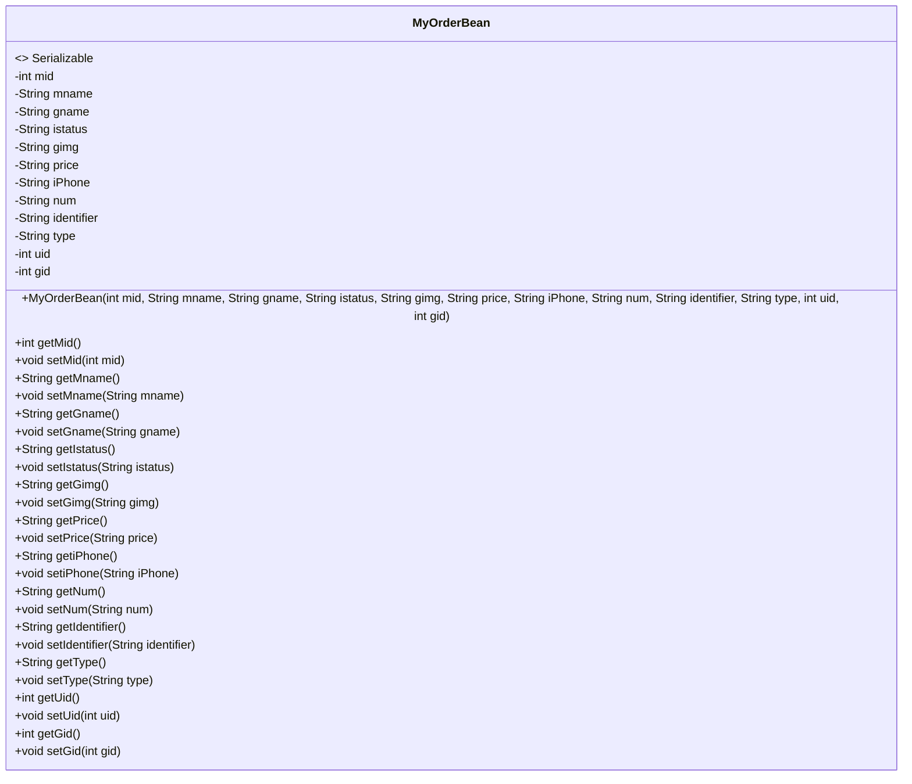
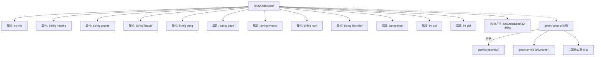

# 基础信息

|      |      |
|------|------|
| 名称 | MyOrderBean |
| 编码语言 | .java |
| 代码路径 | happycat/src/com/happycat/Bean/MyOrderBean.java |
| 包名 | com.happycat.Bean |
| 依赖项 | ['java.io.Serializable'] |
| 概述说明 | 这是一个Java类MyOrderBean，实现了Serializable接口，包含订单ID、商品名称、状态、图片、价格、数量等属性，提供构造方法和getter/setter方法。 |

# 说明

这是一个名为MyOrderBean的Java类，实现了Serializable接口。类中包含多个私有属性：mid、mname、gname、istatus、gimg、price、iPhone、num、identifier、type、uid和gid。提供了完整的构造方法和对应的getter、setter方法，用于获取和设置这些属性的值。该类主要用于订单信息的封装和序列化操作。

# 类列表 Class Summary

| 名称   | 类型  | 说明 |
|-------|------|-------------|
| MyOrderBean | class | MyOrderBean是一个可序列化的Java类，包含订单ID、商品名、状态、价格、数量等属性，提供getter和setter方法。 |

## 类 MyOrderBean

|      |      |
|------|------|
| 访问范围 | public |
| 类型 | class |
| 名称 | MyOrderBean |
| 说明 | MyOrderBean是一个可序列化的Java类，包含订单ID、商品名、状态、价格、数量等属性，提供getter和setter方法。 |

### UML类图

该类图展示了一个实现Serializable接口的订单数据模型MyOrderBean，包含12个私有字段（如订单ID、商品名称、价格等）及对应的getter/setter方法。该类的构造函数支持多参数初始化，主要用于封装电商系统中的订单信息，便于序列化传输或持久化存储。

### 内部方法调用关系图

这段代码定义了一个名为MyOrderBean的可序列化Java类，包含12个成员变量（9个String类型和3个int类型）及其对应的getter/setter方法。类结构采用标准JavaBean模式，通过全参数构造方法初始化对象，所有属性都提供完整的访问控制方法。流程图清晰展示了类成员、构造方法和访问方法的层级关系，其中getter/setter方法组用聚合方式表示以避免图表冗余。

### 字段列表 Field List

| 名称  | 类型  | 说明 |
|-------|-------|------|
| istatus | String | 声明了一个私有字符串变量istatus。 |
| gimg | String | 私有字符串变量gimg。 |
| type | String | 定义私有字符串变量type。 |
| num | String | 私有字符串变量num。 |
| iPhone | String | 声明了一个私有字符串变量iPhone。 |
| price | String | 私有字符串变量price。 |
| gname | String | 私有字符串变量gname。 |
| mid | int | 私有整型变量mid，用于存储中间值或标识符。 |
| uid | int | 私有整型变量uid，用于存储用户唯一标识。 |
| identifier | String | 私有字符串变量identifier。 |
| mname | String | 私有字符串变量mname。 |
| gid | int | 私有整型变量gid。 |

### 方法列表 Method List

| 名称  | 类型  | 说明 |
|-------|-------|------|
| getGname | String | 这是一个Java方法，返回字符串类型的成员变量gname的值。 |
| setType | void | 设置对象类型的方法，将输入参数赋值给内部变量type。 |
| getGid | int | 方法getGid返回整型变量gid的值。 |
| setMname | void | 这是一个Java方法，用于设置类成员变量mname的值。方法接受一个字符串参数mname，并将其赋值给当前对象的mname属性。 |
| getIdentifier | String | 方法返回字符串类型的identifier变量值。 |
| getMid | int | 方法返回整型变量mid的值。 |
| setUid | void | 
设置用户ID的方法，将参数uid赋值给类的成员变量uid。 |
| getType | String | 这是一个Java方法，返回字符串类型的变量"type"。 |
| setNum | void | 设置字符串类型的num变量值。 |
| setGimg | void | 这是一个Java方法，用于设置类中的gimg字符串变量。方法接收一个字符串参数gimg，并将其赋值给类的成员变量this.gimg。 |
| getiPhone | String | 方法getiPhone返回字符串类型变量iPhone的值。 |
| setIstatus | void | Java方法：设置字符串类型属性istatus的值。 |
| getMname | String | 方法getMname返回成员变量mname的值。 |
| getPrice | String | 获取价格的公共方法，返回字符串类型的price值。 |
| setiPhone | void | 这是一个Java方法，用于设置iPhone属性的值。方法名为setiPhone，接受一个字符串参数iPhone，并将其赋值给类的同名成员变量。 |
| setMid | void | 这是一个Java方法，用于设置类成员变量mid的值。方法接受一个整型参数mid，并将其赋值给当前对象的mid属性。 |
| getIstatus | String | 这是一个Java方法，返回字符串类型的istatus变量值。 |
| getUid | int | 方法返回整型变量uid的值。 |
| setIdentifier | void | 这是一个Java方法，用于设置类的标识符属性。方法名为setIdentifier，接受一个String类型参数identifier，并将其赋值给类的同名成员变量。 |
| getGimg | String | 方法getGimg返回字符串类型变量gimg的值。 |
| getNum | String | 方法返回字符串变量num的值。 |
| setPrice | void | 设置价格的方法，将输入字符串赋值给类变量price。 |
| setGname | void | 这是一个Java方法，用于设置类成员变量gname的值。方法接收一个字符串参数gname，并将其赋值给当前对象的gname属性。 |
| setGid | void | 这是一个Java方法，用于设置对象的gid属性值。方法接受一个整数参数gid，并将其赋值给对象的成员变量gid。 |

