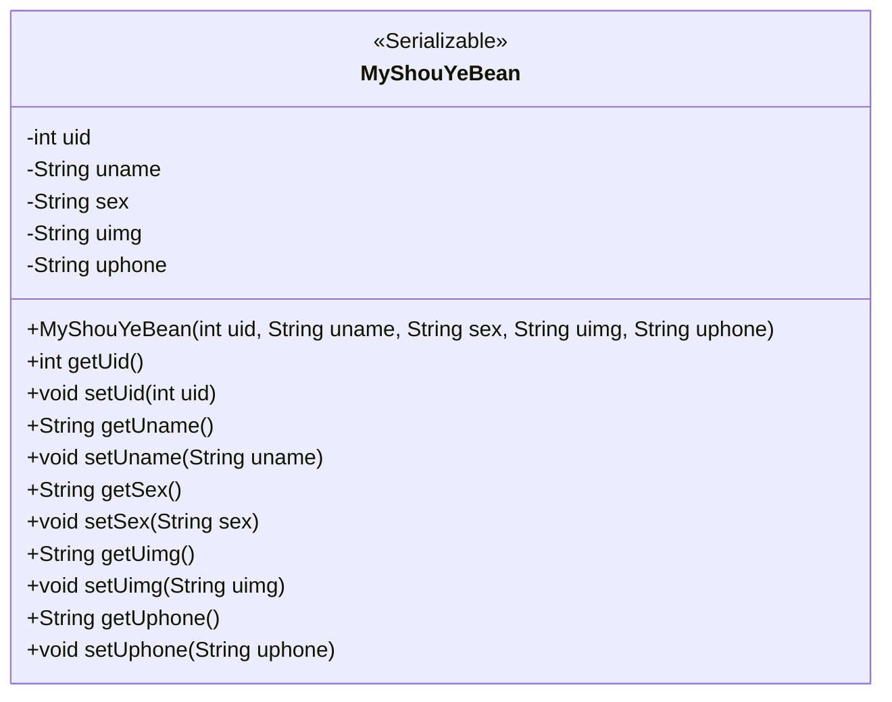

# 基础信息

|      |      |
|------|------|
| 名称 | MyShouYeBean |
| 编码语言 | .java |
| 代码路径 | happycat/src/com/happycat/Bean/MyShouYeBean.java |
| 包名 | com.happycat.Bean |
| 依赖项 | ['java.io.Serializable'] |
| 概述说明 | Java类MyShouYeBean实现Serializable，包含uid、uname、sex、uimg、uphone字段及对应getter/setter和构造方法。 |

# 说明

这是一个名为MyShouYeBean的Java类，实现了Serializable接口，用于存储用户主页信息。类中包含五个私有字段：uid（用户ID，整型）、uname（用户名，字符串）、sex（性别，字符串）、uimg（用户头像，字符串）、uphone（用户电话，字符串）。每个字段都有对应的getter和setter方法。类还提供了一个包含所有字段的构造方法，用于初始化对象。该类主要用于封装用户主页相关数据，支持序列化以便网络传输或持久化存储。

# 类列表 Class Summary

| 名称   | 类型  | 说明 |
|-------|------|-------------|
| MyShouYeBean | class | Java类MyShouYeBean实现Serializable接口，包含uid、uname、sex、uimg、uphone字段及对应getter/setter方法，提供带参构造方法。 |

## 类 MyShouYeBean

|      |      |
|------|------|
| 访问范围 | public |
| 类型 | class |
| 名称 | MyShouYeBean |
| 说明 | Java类MyShouYeBean实现Serializable接口，包含uid、uname、sex、uimg、uphone字段及对应getter/setter方法，提供带参构造方法。 |

### UML类图

该代码定义了一个名为MyShouYeBean的Java类，实现了Serializable接口，用于存储用户首页信息。类中包含五个私有字段：uid（用户ID）、uname（用户名）、sex（性别）、uimg（用户头像）和uphone（用户电话），并为每个字段提供了对应的getter和setter方法。此外，类还提供了一个构造方法，用于初始化所有字段。这个类主要用于数据的封装和传输，适合在网络请求或持久化存储时使用。

### 内部方法调用关系图

```mermaid
graph TD
    A["类MyShouYeBean"]
    B["属性: int uid"]
    C["属性: String uname"]
    D["属性: String sex"]
    E["属性: String uimg"]
    F["属性: String uphone"]
    G["构造方法: MyShouYeBean(int, String, String, String, String)"]
    H["方法: getUid()"]
    I["方法: setUid(int)"]
    J["方法: getUname()"]
    K["方法: setUname(String)"]
    L["方法: getSex()"]
    M["方法: setSex(String)"]
    N["方法: getUimg()"]
    O["方法: setUimg(String)"]
    P["方法: getUphone()"]
    Q["方法: setUphone(String)"]

    A --> B
    A --> C
    A --> D
    A --> E
    A --> F
    A --> G
    A --> H
    A --> I
    A --> J
    A --> K
    A --> L
    A --> M
    A --> N
    A --> O
    A --> P
    A --> Q
```

该流程图展示了MyShouYeBean类的完整结构，包含5个私有属性（uid、uname、sex、uimg、uphone）、1个全参数构造方法和10个getter/setter方法。类实现了Serializable接口，表明其实例可序列化。所有方法均直接关联到对应属性，形成标准的JavaBean模式，适用于数据封装和传输场景。流程箭头清晰体现了类成员与方法的从属关系。

### 字段列表 Field List

| 名称  | 类型  | 说明 |
|-------|-------|------|
| sex | String | 定义私有字符串变量sex。 |
| uphone | String | 私有字符串变量uphone。 |
| uname | String | 私有字符串变量uname。 |
| uid | int | 私有整型变量uid，用于存储用户唯一标识符。 |
| uimg | String | 私有字符串变量uimg，用于存储图像数据。 |

### 方法列表 Method List

| 名称  | 类型  | 说明 |
|-------|-------|------|
| getUimg | String | 方法getUimg返回字符串uimg的值。 |
| getUphone | String | 方法getUphone返回字符串uphone的值。 |
| setUname | void | 这是一个Java方法，用于设置类成员变量uname的值。方法接受一个字符串参数uname，并将其赋值给当前对象的uname属性。 |
| setSex | void | 设置性别属性的方法，将输入参数赋值给对象的sex变量。 |
| getUid | int | 方法getUid返回整型变量uid的值。 |
| getSex | String | 方法getSex返回字符串sex的值。 |
| getUname | String | 这是一个Java方法，返回字符串类型的成员变量uname的值。 |
| setUid | void | 方法setUid用于设置uid的值，参数为整型uid。 |
| setUimg | void | Java方法：设置uimg字符串属性。 |
| setUphone | void | 这是一个Java方法，用于设置uphone属性的值。方法名为setUphone，接受一个String类型参数uphone，并将其赋值给类的成员变量uphone。 |

