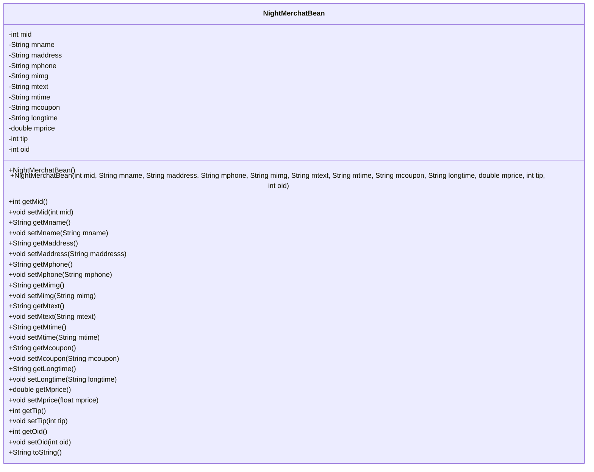

# 基础信息

|      |      |
|------|------|
| 名称 | NightMerchatBean |
| 编码语言 | .java |
| 代码路径 | happycat/src/com/happycat/Bean/NightMerchatBean.java |
| 包名 | com.happycat.Bean |
| 依赖项 | ['java.io.Serializable'] |
| 概述说明 | NightMerchatBean类实现Serializable接口，包含商户ID、名称、地址、电话、图片、描述、营业时间、优惠、时长、价格、小费、订单ID等属性及对应getter/setter方法。 |

# 说明

NightMerchatBean是一个实现Serializable接口的Java类，用于表示商户信息。包含商户ID、名称、地址、电话、图片、描述、营业时间、优惠券、营业时长、价格、小费和订单ID等属性。提供所有属性的getter和setter方法，以及带参和无参构造方法。toString方法返回所有属性的字符串表示。

# 类列表 Class Summary

| 名称   | 类型  | 说明 |
|-------|------|-------------|
| NightMerchatBean | class | NightMerchatBean类实现Serializable接口，包含商家ID、名称、地址、电话、图片、描述、营业时间、优惠、时长、价格、小费、订单ID等属性及对应getter/setter方法。 |

## 类 NightMerchatBean

|      |      |
|------|------|
| 访问范围 | public |
| 类型 | class |
| 名称 | NightMerchatBean |
| 说明 | NightMerchatBean类实现Serializable接口，包含商家ID、名称、地址、电话、图片、描述、营业时间、优惠、时长、价格、小费、订单ID等属性及对应getter/setter方法。 |

### UML类图

这段代码定义了一个名为NightMerchatBean的Java类，实现了Serializable接口，主要用于存储和操作夜间商家的相关信息。该类包含12个私有字段（如商家ID、名称、地址、电话等）及其对应的getter/setter方法，提供全参数和无参两种构造方式，并重写了toString()方法用于对象信息展示。这是一个典型的数据传输对象（DTO）设计，适用于电商系统中商家数据的封装和序列化传输。

### 内部方法调用关系图

```mermaid
graph TD
    A["类NightMerchatBean"]
    B["属性: int mid"]
    C["属性: String mname"]
    D["属性: String maddress"]
    E["属性: String mphone"]
    F["属性: String mimg"]
    G["属性: String mtext"]
    H["属性: String mtime"]
    I["属性: String mcoupon"]
    J["属性: String longtime"]
    K["属性: double mprice"]
    L["属性: int tip"]
    M["属性: int oid"]
    N["构造方法: NightMerchatBean()"]
    O["构造方法: NightMerchatBean(12参数)"]
    P["方法: getMid()/setMid()"]
    Q["方法: getMname()/setMname()"]
    R["方法: getMaddress()/setMaddress()"]
    S["方法: getMphone()/setMphone()"]
    T["方法: getMimg()/setMimg()"]
    U["方法: getMtext()/setMtext()"]
    V["方法: getMtime()/setMtime()"]
    W["方法: getMcoupon()/setMcoupon()"]
    X["方法: getLongtime()/setLongtime()"]
    Y["方法: getMprice()/setMprice()"]
    Z["方法: getTip()/setTip()"]
    AA["方法: getOid()/setOid()"]
    AB["重写方法: toString()"]

    A --> B
    A --> C
    A --> D
    A --> E
    A --> F
    A --> G
    A --> H
    A --> I
    A --> J
    A --> K
    A --> L
    A --> M
    A --> N
    A --> O
    A --> P
    A --> Q
    A --> R
    A --> S
    A --> T
    A --> U
    A --> V
    A --> W
    A --> X
    A --> Y
    A --> Z
    A --> AA
    A --> AB
```

该流程图展示了NightMerchatBean类的完整结构，包含12个私有属性、2个构造方法（无参和全参）、12对getter/setter方法以及重写的toString()方法。所有属性和方法都通过箭头与主类关联，清晰地呈现了这个JavaBean的数据封装特性。值得注意的是构造方法存在参数类型不匹配问题（setMprice接收float但属性为double），这是潜在的精度丢失风险点。

### 字段列表 Field List

| 名称  | 类型  | 说明 |
|-------|-------|------|
| oid | int | 私有整型变量oid。 |
| mname | String | 私有字符串变量mname |
| tip | int | 私有整型变量tip。 |
| mphone | String | 私有字符串类型变量mphone |
| mprice | double | 私有双精度浮点型变量mprice。 |
| mid | int | 定义私有整型变量mid。 |
| longtime | String | 私有字符串变量longtime。 |
| mcoupon | String | 声明一个私有字符串变量mcoupon。 |
| mtext | String | 声明一个私有字符串变量mtext。 |
| mtime | String | 定义私有字符串变量mtime。 |
| maddress | String | 私有字符串变量maddress，用于存储地址信息。 |
| mimg | String | 私有字符串变量mimg |

### 方法列表 Method List

| 名称  | 类型  | 说明 |
|-------|-------|------|
| getLongtime | String | 这是一个Java方法，返回字符串类型的longtime变量值。 |
| setMaddress | void | 这是一个Java方法，用于设置类成员变量maddress的值。方法名为setMaddress，接收一个字符串参数maddresss，并将其赋值给类的maddress属性。 |
| setTip | void | 这是一个Java方法，用于设置tip变量的值。方法接受一个整数参数tip，并将其赋值给类的成员变量tip。 |
| setMphone | void | 设置手机号方法，参数为mphone，赋值给当前对象同名属性。 |
| setMname | void | 设置类成员变量mname的方法，参数为String类型。 |
| setMtext | void | 设置类成员变量mtext的值。 |
| setMtime | void | Java方法：设置mtime属性值，参数为字符串类型。 |
| getMid | int | 方法返回整型变量mid的值。 |
| setLongtime | void | 设置长时间属性的方法，将输入字符串赋值给成员变量longtime。 |
| getTip | int | 这是一个Java方法，返回整数类型的tip值。方法名为getTip，访问修饰符为public。 |
| setMid | void | 设置成员ID的方法，将参数mid赋值给当前对象的mid属性。 |
| getMtime | String | Java方法：返回mtime字符串值。 |
| setMprice | void | 这是一个Java方法，用于设置类成员变量mprice的值。方法接受一个浮点数参数mprice，并将其赋值给当前对象的mprice属性。 |
| getMimg | String | 这是一个Java方法，返回字符串变量mimg的值。方法名为getMimg，无参数，直接返回成员变量mimg。 |
| setMimg | void | 
Java方法：设置mimg字符串变量的值。 |
| getOid | int | 方法返回整型变量oid的值。 |
| setMcoupon | void | 这是一个Java方法，用于设置成员变量mcoupon的值。方法名为setMcoupon，接受一个String类型参数。 |
| getMphone | String | 这是一个Java方法，返回字符串类型的mphone变量值。 |
| getMname | String | 这是一个Java方法，返回字符串类型的成员变量mname。 |
| getMprice | double | 方法getMprice返回mprice的值。 |
| getMaddress | String | 这是一个Java方法，返回字符串类型的成员变量maddress。 |
| getMtext | String | Java方法：返回字符串变量mtext的值。 |
| getMcoupon | String | 方法返回成员变量mcoupon的值。 |
| setOid | void | 设置对象ID的方法，将参数oid赋值给当前对象的oid成员变量。 |
| toString | String | MerchatBean类toString方法返回包含mid、mname、maddress等12个字段的字符串。 |

