# 基础信息

|      |      |
|------|------|
| 名称 | PingjiaBean |
| 编码语言 | .java |
| 代码路径 | happycat/src/com/happycat/Bean/PingjiaBean.java |
| 包名 | com.happycat.Bean |
| 依赖项 | ['java.io.Serializable'] |
| 概述说明 | PingjiaBean是一个Java序列化类，包含用户名、时间、图片和文本字段，提供构造方法和getter/setter。 |

# 说明

PingjiaBean是一个实现了Serializable接口的Java类，用于封装评价信息。包含四个私有字符串属性：uname（用户名）、ttime（时间）、cimg（图片）和ttext（文本内容）。提供无参构造器和带参构造器，以及各属性的getter和setter方法。序列化版本ID为1L。

# 类列表 Class Summary

| 名称   | 类型  | 说明 |
|-------|------|-------------|
| PingjiaBean | class | PingjiaBean是一个可序列化的Java类，包含用户名、时间、图片和文本字段，提供构造方法和getter/setter。 |


## 类 PingjiaBean

|      |      |
|------|------|
| 访问范围 | public |
| 类型 | class |
| 名称 | PingjiaBean |
| 说明 | PingjiaBean是一个可序列化的Java类，包含用户名、时间、图片和文本字段，提供构造方法和getter/setter。 |


### UML类图

```mermaid
classDiagram
    class PingjiaBean {
        -String uname
        -String ttime
        -String cimg
        -String ttext
        -long serialVersionUID = 1L
        +PingjiaBean()
        +PingjiaBean(String uname, String ttime, String cimg, String ttext)
        +String getUname()
        +void setUname(String uname)
        +String getTtime()
        +void setTtime(String ttime)
        +String getCimg()
        +void setCimg(String cimg)
        +String getTtext()
        +void setTtext(String ttext)
    }
```

该代码定义了一个名为PingjiaBean的Java类，实现了Serializable接口，用于存储评价信息。类中包含四个私有字符串属性：uname（用户名）、ttime（时间）、cimg（图片）和ttext（文本内容），以及对应的getter和setter方法。类提供了无参构造器和带参构造器，并声明了serialVersionUID用于序列化版本控制。这是一个典型的数据传输对象（DTO），用于封装和传递评价相关的数据。


### 内部方法调用关系图

```mermaid
graph TD
    A["类PingjiaBean"]
    B["静态属性: long serialVersionUID = 1L"]
    C["属性: String uname"]
    D["属性: String ttime"]
    E["属性: String cimg"]
    F["属性: String ttext"]
    G["构造方法: PingjiaBean()"]
    H["构造方法: PingjiaBean(String uname, String ttime, String cimg, String ttext)"]
    I["方法: String getUname()"]
    J["方法: void setUname(String uname)"]
    K["方法: String getTtime()"]
    L["方法: void setTtime(String ttime)"]
    M["方法: String getCimg()"]
    N["方法: void setCimg(String cimg)"]
    O["方法: String getTtext()"]
    P["方法: void setTtext(String ttext)"]

    A --> B
    A --> C
    A --> D
    A --> E
    A --> F
    A --> G
    A --> H
    A --> I
    A --> J
    A --> K
    A --> L
    A --> M
    A --> N
    A --> O
    A --> P
```



该流程图展示了PingjiaBean类的完整结构，这是一个实现了Serializable接口的Java Bean类。类包含4个字符串属性(uname, ttime, cimg, ttext)和对应的getter/setter方法，以及两个构造方法(无参构造和全参构造)。静态属性serialVersionUID用于序列化版本控制。所有方法都直接关联到主类，形成标准的Java Bean模式，适用于数据封装和传输场景。

### 字段列表 Field List

| 名称  | 类型  | 说明 |
|-------|-------|------|
| cimg | String | 私有字符串变量cimg。 |
| uname | String | 私有字符串变量uname。 |
| serialVersionUID = 1L | long | Java序列化ID，固定值1L，确保版本兼容性。 |
| ttext | String | 私有字符串变量ttext。 |
| ttime | String | 声明了一个私有字符串变量ttime。 |

### 方法列表 Method List

| 名称  | 类型  | 说明 |
|-------|-------|------|
| setTtime | void | 这是一个Java方法，用于设置类成员变量ttime的值。方法名为setTtime，接受一个String类型参数ttime。 |
| setUname | void | 设置用户名的Java方法，将输入字符串赋值给类成员变量uname。 |
| getUname | String | 这是一个Java方法，返回字符串类型的成员变量uname。 |
| getTtime | String | 获取ttime的字符串值的方法。 |
| getCimg | String | 这是一个Java方法，返回字符串类型的cimg变量值。 |
| setCimg | void | Java方法：设置cimg字符串变量值。 |
| getTtext | String | 这是一个Java方法，返回字符串类型的ttext变量值。 |
| setTtext | void | 这是一个Java方法，用于设置类成员变量ttext的值。方法接受一个字符串参数ttext，并将其赋值给当前对象的ttext属性。 |


