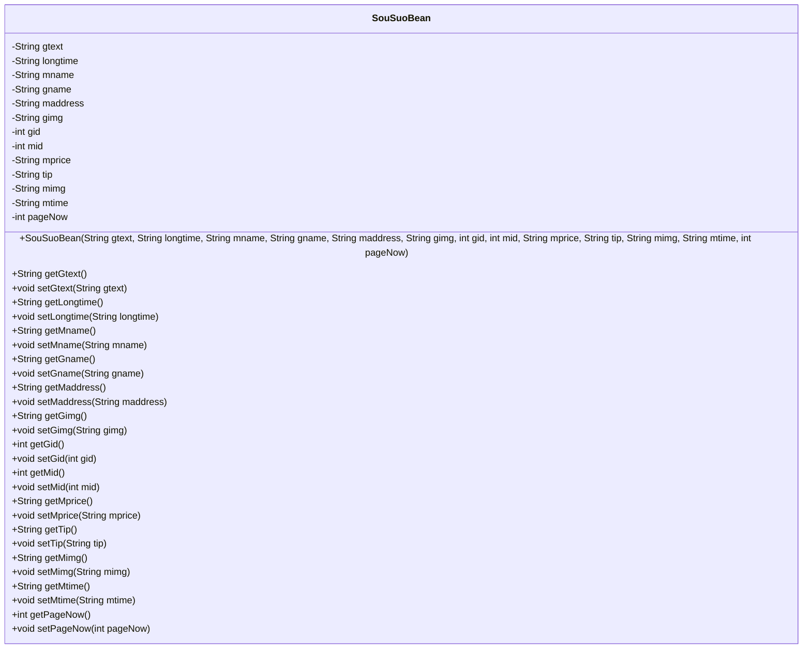

# 基础信息

|      |      |
|------|------|
| 名称 | SouSuoBean |
| 编码语言 | .java |
| 代码路径 | happycat/src/com/happycat/Bean/SouSuoBean.java |
| 包名 | com.happycat.Bean |
| 依赖项 | ['java.io.Serializable'] |
| 概述说明 | SouSuoBean是一个Java类，实现了Serializable接口，包含gtext、longtime、mname等字符串属性，gid、mid等整型属性，以及对应的getter和setter方法。 |

# 说明

SouSuoBean是一个实现了Serializable接口的Java类，用于封装搜索相关的数据。类中包含多个私有字段，包括gtext、longtime、mname、gname、maddress、gimg、gid、mid、mprice、tip、mimg、mtime和pageNow，分别表示搜索文本、时长、名称、地址、图片、ID、价格、提示信息、图片、时间和当前页码。类提供了这些字段的getter和setter方法，以及一个包含所有字段的构造方法。该类主要用于数据传输和序列化操作。

# 类列表 Class Summary

| 名称   | 类型  | 说明 |
|-------|------|-------------|
| SouSuoBean | class | SouSuoBean是一个实现Serializable的Java类，包含gtext、longtime、mname等12个属性及对应的getter/setter方法，用于封装搜索相关数据。 |

## 类 SouSuoBean

|      |      |
|------|------|
| 访问范围 | public |
| 类型 | class |
| 名称 | SouSuoBean |
| 说明 | SouSuoBean是一个实现Serializable的Java类，包含gtext、longtime、mname等12个属性及对应的getter/setter方法，用于封装搜索相关数据。 |

### UML类图

这段代码定义了一个名为`SouSuoBean`的Java类，实现了`Serializable`接口，主要用于封装搜索相关的数据。类中包含多个私有字段，如`gtext`、`longtime`、`mname`等，分别表示搜索文本、长时间、商家名称等信息。每个字段都有对应的getter和setter方法，用于获取和设置字段值。构造函数用于初始化所有字段。这个类通常用于在应用程序中传递和存储搜索结果的详细信息。

### 内部方法调用关系图

```mermaid
graph TD
    A["类SouSuoBean"]
    B["属性: String gtext"]
    C["属性: String longtime"]
    D["属性: String mname"]
    E["属性: String gname"]
    F["属性: String maddress"]
    G["属性: String gimg"]
    H["属性: int gid"]
    I["属性: int mid"]
    J["属性: String mprice"]
    K["属性: String tip"]
    L["属性: String mimg"]
    M["属性: String mtime"]
    N["属性: int pageNow"]
    O["构造方法: SouSuoBean(12参数)"]
    P["Getter/Setter方法组"]

    A --> B
    A --> C
    A --> D
    A --> E
    A --> F
    A --> G
    A --> H
    A --> I
    A --> J
    A --> K
    A --> L
    A --> M
    A --> N
    A --> O
    A --> P
```

该流程图展示了SouSuoBean类的完整结构，包含12个私有属性和1个构造方法。所有属性均为私有字段，并通过对应的getter和setter方法提供访问接口。构造方法接收12个参数用于初始化对象状态，实现了Serializable接口表明该类支持序列化操作。类结构清晰体现了JavaBean的设计规范，属性涵盖文本、ID、图片路径等多种数据类型。

### 字段列表 Field List

| 名称  | 类型  | 说明 |
|-------|-------|------|
| serialVersionUID = 1L | long | Java序列化ID，固定值1L，确保版本兼容性。 |
| mid | int | 私有整型变量mid。 |
| mprice | String | 私有字符串变量mprice，用于存储价格信息。 |
| gname | String | 私有字符串变量gname。 |
| gid | int | 私有整型变量gid。 |
| mimg | String | 私有字符串变量mimg。 |
| mtime | String | 声明私有字符串变量mtime。 |
| longtime | String | 私有字符串变量longtime。 |
| tip | String | 私有字符串变量tip。 |
| pageNow | int | 声明一个整型变量pageNow。 |
| maddress | String | 私有字符串变量maddress，用于存储地址信息。 |
| gimg | String | 私有字符串变量gimg。 |
| mname | String | 私有字符串变量mname。 |
| gtext | String | 私有字符串变量gtext。 |

### 方法列表 Method List

| 名称  | 类型  | 说明 |
|-------|-------|------|
| getGid | int | 方法返回整型变量gid的值。 |
| setGtext | void | 这是一个Java方法，用于设置类中的gtext变量值。方法接收一个字符串参数gtext，并将其赋值给类的成员变量this.gtext。 |
| setMimg | void | 这是一个Java方法，用于设置类成员变量mimg的值。方法名为setMimg，接受一个String类型参数mimg，并将其赋值给当前对象的mimg属性。 |
| getMtime | String | 获取mtime字符串值的方法。 |
| setMtime | void | 设置mtime属性的方法，接受字符串参数并赋值给成员变量mtime。 |
| getPageNow | int | 方法getPageNow返回当前页码pageNow的整数值。 |
| setPageNow | void | 设置当前页码的方法，参数为整型pageNow。 |
| setMname | void | Java方法：设置成员变量mname的值。 |
| setMaddress | void | 这是一个Java方法，用于设置成员变量maddress的值。方法接收一个字符串参数maddress，并将其赋值给当前对象的maddress属性。 |
| setGid | void | 方法setGid用于设置gid的值，参数为整型gid。 |
| getMimg | String | 获取mimg字符串的方法。 |
| getGtext | String | 这是一个Java方法，返回字符串类型变量gtext的值。 |
| setGimg | void | 这是一个Java方法，用于设置gimg变量的值。方法接受一个字符串参数gimg，并将其赋值给类的成员变量this.gimg。 |
| getLongtime | String | 获取longtime字符串的方法。 |
| getMprice | String | 获取mprice值的公开方法。 |
| setTip | void | 设置提示信息的方法，将参数tip赋值给类成员变量tip。 |
| setMprice | void | Java方法：设置mprice字符串属性值。 |
| getMid | int | 方法返回整型变量mid的值。 |
| setMid | void | 设置成员变量mid的值。 |
| getGimg | String | 方法返回字符串类型变量gimg的值。 |
| getMaddress | String | 获取maddress字符串的方法。 |
| getMname | String | 方法getMname返回成员变量mname的值。 |
| getTip | String | Java方法：返回字符串类型变量tip的值。 |
| getGname | String | 这是一个Java方法，返回字符串类型的成员变量gname的值。 |
| setLongtime | void | Java方法：设置longtime字符串变量值。 |
| setGname | void | 这是一个Java方法，用于设置类成员变量gname的值。方法接受一个字符串参数gname，并将其赋值给当前对象的gname属性。 |

