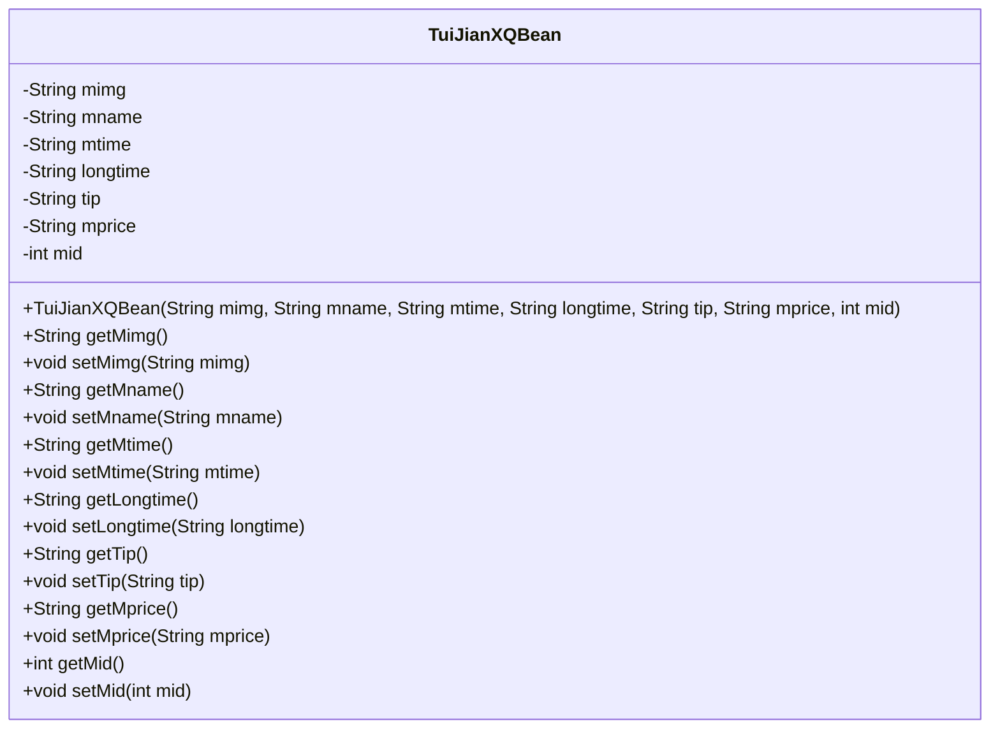

# 基础信息

|      |      |
|------|------|
| 名称 | TuiJianXQBean |
| 编码语言 | .java |
| 代码路径 | happycat/src/com/happycat/Bean/TuiJianXQBean.java |
| 包名 | com.happycat.Bean |
| 依赖项 | ['java.io.Serializable'] |
| 概述说明 | Java类TuiJianXQBean实现Serializable接口，包含图片、名称、时间、时长、提示、价格和ID字段及其getter/setter方法。 |

# 说明

该内容定义了一个名为TuiJianXQBean的Java类，实现了Serializable接口以确保可序列化。类中包含七个私有成员变量：mimg（图片链接）、mname（名称）、mtime（时间）、longtime（时长）、tip（提示信息）、mprice（价格）和mid（ID，整型）。为每个变量提供了对应的getter和setter方法，以及一个包含所有参数的构造方法。类通过serialVersionUID维护序列化版本控制。

# 类列表 Class Summary

| 名称   | 类型  | 说明 |
|-------|------|-------------|
| TuiJianXQBean | class | Java类TuiJianXQBean实现Serializable接口，包含图片、名称、时间、时长、提示、价格和ID字段及其getter/setter方法。 |

## 类 TuiJianXQBean

|      |      |
|------|------|
| 访问范围 | public |
| 类型 | class |
| 名称 | TuiJianXQBean |
| 说明 | Java类TuiJianXQBean实现Serializable接口，包含图片、名称、时间、时长、提示、价格和ID字段及其getter/setter方法。 |

### UML类图

这段代码定义了一个名为TuiJianXQBean的Java类，实现了Serializable接口，表明该类的对象可以被序列化。类中包含7个私有字段（mimg、mname、mtime、longtime、tip、mprice、mid）以及对应的getter和setter方法，用于封装和访问这些字段的值。此外，还提供了一个全参数构造函数用于初始化对象。这个类很可能用于表示某种推荐信息的数据模型，包含图片、名称、时间、时长、提示、价格和ID等信息。

### 内部方法调用关系图

```mermaid
graph TD
    A["类TuiJianXQBean"]
    B["属性: String mimg"]
    C["属性: String mname"]
    D["属性: String mtime"]
    E["属性: String longtime"]
    F["属性: String tip"]
    G["属性: String mprice"]
    H["属性: int mid"]
    I["方法: getMimg()"]
    J["方法: setMimg(String mimg)"]
    K["方法: getMname()"]
    L["方法: setMname(String mname)"]
    M["方法: getMtime()"]
    N["方法: setMtime(String mtime)"]
    O["方法: getLongtime()"]
    P["方法: setLongtime(String longtime)"]
    Q["方法: getTip()"]
    R["方法: setTip(String tip)"]
    S["方法: getMprice()"]
    T["方法: setMprice(String mprice)"]
    U["方法: getMid()"]
    V["方法: setMid(int mid)"]
    W["构造方法: TuiJianXQBean(String mimg, String mname, String mtime, String longtime, String tip, String mprice, int mid)"]

    A --> B
    A --> C
    A --> D
    A --> E
    A --> F
    A --> G
    A --> H
    A --> I
    A --> J
    A --> K
    A --> L
    A --> M
    A --> N
    A --> O
    A --> P
    A --> Q
    A --> R
    A --> S
    A --> T
    A --> U
    A --> V
    A --> W
```

这段代码定义了一个名为TuiJianXQBean的Java类，实现了Serializable接口，用于数据序列化。类中包含7个私有属性（mimg、mname、mtime、longtime、tip、mprice、mid）及其对应的getter和setter方法，以及一个全参数构造方法。该类的设计模式是典型的Java Bean，用于封装推荐详情数据，便于在不同层之间传递。流程图清晰展示了类结构与各方法间的关联关系，符合面向对象封装原则。

### 字段列表 Field List

| 名称  | 类型  | 说明 |
|-------|-------|------|
| tip | String | 私有字符串变量tip。 |
| longtime | String | 私有字符串变量longtime。 |
| serialVersionUID = 1L | long | Java序列化ID，固定为1L，确保版本兼容性。 |
| mname | String | 私有字符串变量mname。 |
| mimg | String | 私有字符串变量mimg声明。 |
| mid | int | 私有整型变量mid。 |
| mprice | String | 私有字符串变量mprice，用于存储价格信息。 |
| mtime | String | 定义私有字符串变量mtime。 |

### 方法列表 Method List

| 名称  | 类型  | 说明 |
|-------|-------|------|
| getMimg | String | 获取mimg字符串的方法。 |
| getMprice | String | 这是一个Java方法，返回字符串类型的mprice值。 |
| getTip | String | Java方法：返回字符串类型变量tip的值。 |
| setMname | void | 这是一个Java方法，用于设置成员变量mname的值。方法接受一个字符串参数mname，并将其赋值给当前对象的mname属性。 |
| getLongtime | String | 获取longtime字符串的方法。 |
| getMid | int | 方法getMid返回整型变量mid的值。 |
| setMid | void | 设置成员变量mid的方法。 |
| getMname | String | 方法getMname返回成员变量mname的值。 |
| setMprice | void | Java方法：设置mprice字符串值。 |
| setMimg | void | 这是一个Java方法，用于设置成员变量mimg的值。方法名为setMimg，接收一个String类型参数。 |
| getMtime | String | 获取mtime字符串值的方法。 |
| setLongtime | void | Java方法：设置longtime字符串属性。 |
| setMtime | void | 设置mtime属性的方法，接受字符串参数并赋值给成员变量。 |
| setTip | void | 这是一个Java方法，用于设置类的tip属性值。方法接收一个字符串参数tip，并将其赋值给类的成员变量tip。 |

