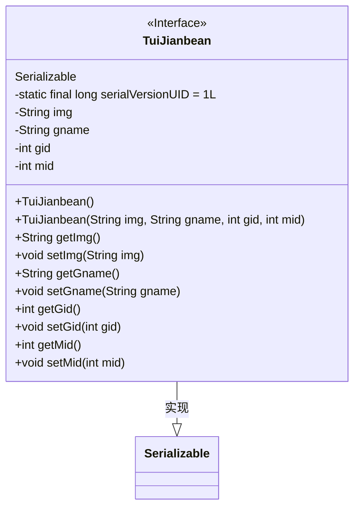
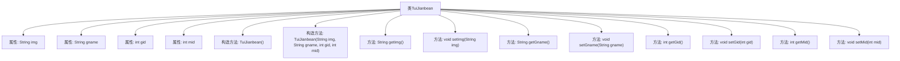

# 基础信息

|      |      |
|------|------|
| 名称 | TuiJianbean |
| 编码语言 | .java |
| 代码路径 | happycat/src/com/happycat/Bean/TuiJianbean.java |
| 包名 | com.happycat.Bean |
| 依赖项 | ['java.io.Serializable'] |
| 概述说明 | 这是一个Java类TuiJianbean，实现Serializable接口，包含img、gname、gid、mid属性和对应的getter/setter方法。 |

# 说明

这是一个名为TuiJianbean的Java类，实现了Serializable接口用于序列化。类中包含四个私有属性：字符串类型的img和gname，整型的gid和mid。提供了无参构造器和带参构造器，以及各属性的getter和setter方法。serialVersionUID设置为1L用于版本控制。该类主要用于存储推荐相关的数据，包括图片路径、名称、商品ID和模块ID。

# 类列表 Class Summary

| 名称   | 类型  | 说明 |
|-------|------|-------------|
| TuiJianbean | class | TuiJianbean是一个Java序列化类，包含img、gname、gid、mid属性和对应的getter/setter方法。 |

## 类 TuiJianbean

|      |      |
|------|------|
| 访问范围 | public |
| 类型 | class |
| 名称 | TuiJianbean |
| 说明 | TuiJianbean是一个Java序列化类，包含img、gname、gid、mid属性和对应的getter/setter方法。 |

### UML类图

这段代码定义了一个名为TuiJianbean的JavaBean类，实现了Serializable接口以实现序列化功能。类中包含四个私有字段（img、gname、gid、mid）及其对应的getter和setter方法，提供了无参构造器和全参构造器。serialVersionUID字段用于版本控制，确保序列化兼容性。该类设计用于封装推荐相关的数据，包含图片路径、名称及两个ID字段，适合在网络传输或持久化场景中使用。

### 内部方法调用关系图

该流程图展示了TuiJianbean类的完整结构，包含4个私有属性（img、gname、gid、mid）、2个构造方法（无参构造和全参构造）以及8个getter/setter方法。类实现了Serializable接口，表明其实例可序列化。所有方法均直接关联到类主体，形成标准JavaBean结构，用于封装推荐数据。属性通过getter/setter提供安全访问，构造方法支持不同初始化方式。

### 字段列表 Field List

| 名称  | 类型  | 说明 |
|-------|-------|------|
| gname | String | 私有字符串变量gname。 |
| img | String | 私有字符串变量img |
| gid | int | 私有整型变量gid。 |
| mid | int | 私有整型变量mid |
| serialVersionUID = 1L | long | 私有静态长整型常量serialVersionUID值为1L，用于序列化版本控制。 |

### 方法列表 Method List

| 名称  | 类型  | 说明 |
|-------|-------|------|
| getGid | int | 方法getGid返回整型变量gid的值。 |
| setImg | void | 这是一个Java方法，用于设置对象的img属性。方法名为setImg，接受一个String类型参数img，并将其赋值给当前对象的img成员变量。 |
| setGname | void | 这是一个Java方法，用于设置类中的gname变量值。方法接受一个字符串参数gname，并将其赋值给类的成员变量this.gname。 |
| getGname | String | 获取gname字符串值的方法。 |
| getImg | String | 这是一个Java方法，返回字符串类型的img变量值。 |
| setGid | void | 设置对象gid属性的方法，参数为整型gid。 |
| getMid | int | 这是一个Java方法，返回私有成员变量mid的整数值。 |
| setMid | void | Java方法：设置成员变量mid的值。 |

