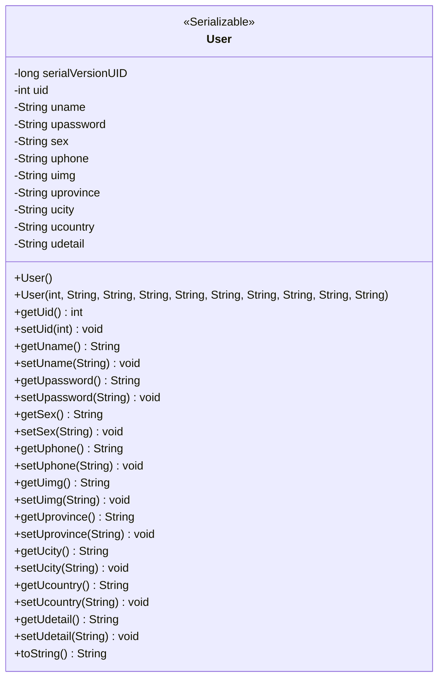

# 基础信息

|      |      |
|------|------|
| 名称 | User |
| 编码语言 | .java |
| 代码路径 | happycat/src/com/happycat/Bean/User.java |
| 包名 | com.happycat.Bean |
| 依赖项 | ['java.io.Serializable'] |
| 概述说明 | User类实现Serializable接口，包含用户ID、姓名、密码、性别、电话、头像、省份、城市、国家和详细地址等属性，提供构造方法和getter/setter。 |

# 说明

这是一个名为User的Java类，实现了Serializable接口以便序列化。类中包含用户ID、姓名、密码、性别、电话、头像图片路径、省份、城市、国家和详细地址等属性。每个属性都有对应的getter和setter方法。类提供了两个构造方法：一个无参构造方法和一个全参数构造方法。还重写了toString方法以格式化输出用户信息。serialVersionUID用于控制序列化版本兼容性。

# 类列表 Class Summary

| 名称   | 类型  | 说明 |
|-------|------|-------------|
| User | class | Java用户类，包含ID、姓名、密码、性别、电话、头像、省市区及详细地址等属性，提供构造方法和getter/setter。 |

## 类 User

|      |      |
|------|------|
| 访问范围 | public |
| 类型 | class |
| 名称 | User |
| 说明 | Java用户类，包含ID、姓名、密码、性别、电话、头像、省市区及详细地址等属性，提供构造方法和getter/setter。 |

### UML类图

这段代码定义了一个名为User的类，该类实现了Serializable接口，表明其实例可以被序列化。类中包含多个私有字段，如用户ID、姓名、密码、性别、电话、头像、地址信息等，并为每个字段提供了公有的getter和setter方法。此外，类中还包含两个构造函数（一个无参构造和一个全参构造）以及一个toString方法用于输出对象信息。该类主要用于表示用户实体，适用于需要存储和传输用户信息的场景。

### 内部方法调用关系图

```mermaid
graph TD
    A["类User"]
    B["属性: int uid"]
    C["属性: String uname"]
    D["属性: String upassword"]
    E["属性: String sex"]
    F["属性: String uphone"]
    G["属性: String uimg"]
    H["属性: String uprovince"]
    I["属性: String ucity"]
    J["属性: String ucountry"]
    K["属性: String udetail"]
    L["方法: getUid()/setUid()"]
    M["方法: getUname()/setUname()"]
    N["方法: getUpassword()/setUpassword()"]
    O["方法: getSex()/setSex()"]
    P["方法: getUphone()/setUphone()"]
    Q["方法: getUimg()/setUimg()"]
    R["方法: getUprovince()/setUprovince()"]
    S["方法: getUcity()/setUcity()"]
    T["方法: getUcountry()/setUcountry()"]
    U["方法: getUdetail()/setUdetail()"]
    V["构造方法: User()"]
    W["构造方法: User(全参数)"]
    X["重写方法: toString()"]

    A --> B
    A --> C
    A --> D
    A --> E
    A --> F
    A --> G
    A --> H
    A --> I
    A --> J
    A --> K
    A --> L
    A --> M
    A --> N
    A --> O
    A --> P
    A --> Q
    A --> R
    A --> S
    A --> T
    A --> U
    A --> V
    A --> W
    A --> X
```

这段代码定义了一个可序列化的User类，包含10个私有属性及其对应的getter/setter方法，两个构造方法（无参和全参数），以及重写的toString()方法。流程图展示了类结构与成员关系，其中属性包括用户ID、姓名、密码等基本信息，方法则围绕这些属性的访问和修改展开。该类设计用于存储和传输用户数据，通过实现Serializable接口支持对象序列化。

### 字段列表 Field List

| 名称  | 类型  | 说明 |
|-------|-------|------|
| uname | String | 声明一个私有字符串变量uname。 |
| uphone | String | 私有字符串变量uphone，用于存储电话号码。 |
| ucountry | String | 声明一个私有字符串变量ucountry。 |
| uid | int | 私有整型变量uid，用于存储唯一标识符。 |
| ucity | String | 声明私有字符串变量ucity。 |
| serialVersionUID = 1L | long | 私有静态常量序列化ID，值为1L。 |
| uprovince | String | 私有字符串变量uprovince，用于存储省份信息。 |
| uimg | String | 私有字符串变量uimg |
| sex | String | 声明私有字符串变量sex |
| udetail | String | 私有字符串变量udetail，用于存储详细信息。 |
| upassword | String | 私有字符串类型变量upassword。 |

### 方法列表 Method List

| 名称  | 类型  | 说明 |
|-------|-------|------|
| setSex | void | 设置性别属性的方法，参数为字符串类型sex，将输入值赋给当前对象的sex属性。 |
| getUimg | String | 方法getUimg返回字符串uimg。 |
| getUphone | String | 方法getUphone返回字符串uphone的值。 |
| setUid | void | 设置用户ID的方法，将参数uid赋值给类的成员变量uid。 |
| setUimg | void | 这是一个Java方法，用于设置对象的uimg属性值。方法接受一个字符串参数uimg，并将其赋值给当前对象的uimg成员变量。 |
| setUcity | void | 这是一个Java方法，用于设置成员变量ucity的值。方法名为setUcity，接收一个String类型参数ucity。 |
| setUprovince | void | Java方法：设置用户省份属性，参数为字符串uprovince。 |
| getUprovince | String | 方法getUprovince返回字符串类型的uprovince值。 |
| setUphone | void | 这是一个Java方法，用于设置类的uphone属性值。方法接收一个字符串参数uphone，并将其赋值给类的成员变量this.uphone。 |
| getUname | String | 这是一个Java方法，返回字符串类型的成员变量uname。 |
| getUid | int | 方法返回整型变量uid的值。 |
| getUpassword | String | 获取用户密码的方法，返回字符串类型密码值。 |
| setUpassword | void | 这是一个Java方法，用于设置用户密码。方法名为setUpassword，接受一个字符串参数upassword，并将其赋值给类的成员变量upassword。 |
| setUname | void | 设置用户名的公共方法，将参数u_name赋值给成员变量uname。 |
| getUcity | String | 方法getUcity返回字符串类型变量ucity的值。 |
| getSex | String | 方法getSex返回字符串类型变量sex的值。 |
| getUcountry | String | 这是一个Java方法，返回字符串类型的ucountry变量值。 |
| setUcountry | void | 设置用户国家字段的方法，将参数ucountry赋值给类成员变量ucountry。 |
| getUdetail | String | 获取udetail字符串的方法。 |
| setUdetail | void | 这是一个Java方法，用于设置类成员变量udetail的值。方法接受一个字符串参数udetail，并将其赋值给当前对象的udetail属性。 |
| getSerialversionuid | long | 这是一个Java方法，返回静态长整型常量serialVersionUID的值，用于序列化版本控制。 |
| toString | String | 重写toString方法，返回包含用户ID、姓名、密码、性别、电话、头像、省市区及详细地址的字符串。 |

