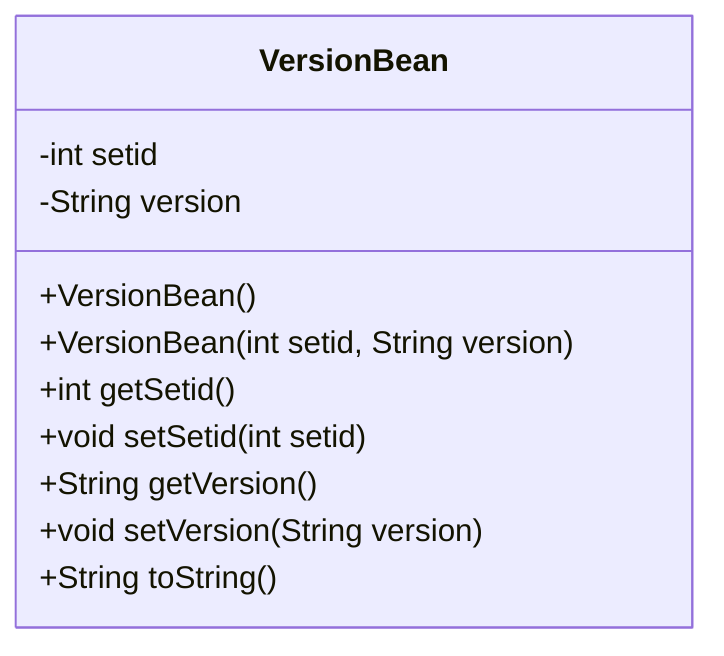
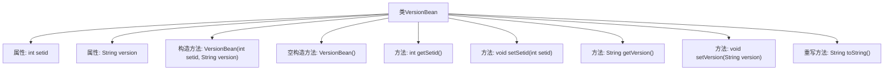

# 基础信息

|      |      |
|------|------|
| 名称 | VersionBean |
| 编码语言 | .java |
| 代码路径 | happycat/src/com/happycat/Bean/VersionBean.java |
| 包名 | com.happycat.Bean |
| 依赖项 | [] |
| 概述说明 | VersionBean类包含setid和version属性，提供getter/setter方法，支持有参和无参构造，重写toString方法。 |

# 说明

该内容定义了一个名为VersionBean的Java类，用于存储版本信息。类包含两个私有字段：整型的setid和字符串型的version。提供了这两个字段的getter和setter方法。类有两个构造函数：一个无参构造函数和一个带setid和version参数的构造函数。还重写了toString方法，以特定格式返回对象字符串表示。该类主要用于封装版本相关数据，支持数据存取和对象初始化。

# 类列表 Class Summary

| 名称   | 类型  | 说明 |
|-------|------|-------------|
| VersionBean | class | VersionBean类包含setid和version属性，提供getter/setter方法，支持带参和无参构造，重写toString方法。 |

## 类 VersionBean

|      |      |
|------|------|
| 访问范围 | public |
| 类型 | class |
| 名称 | VersionBean |
| 说明 | VersionBean类包含setid和version属性，提供getter/setter方法，支持带参和无参构造，重写toString方法。 |

### UML类图

这段代码定义了一个名为VersionBean的Java类，主要用于存储和操作版本信息数据。该类包含两个私有字段：setid（整型）和version（字符串型），提供了完整的getter/setter方法对这两个字段进行封装。类中实现了两个构造函数（默认构造器和带参数构造器）以及重写了toString()方法用于对象字符串表示。这是一个典型的数据承载类（POJO），常用于数据传输或配置存储场景。

### 内部方法调用关系图

这段代码定义了一个名为VersionBean的Java类，主要用于封装版本信息数据。该类包含两个私有属性：setid（整型）和version（字符串类型），提供了完整的getter/setter方法对这两个属性进行访问和修改。类中包含两个构造方法：一个带参数的构造方法用于初始化所有属性，另一个无参构造方法用于默认初始化。最后重写了toString()方法以提供标准化的对象字符串表示形式。这是一个典型的数据封装类（Java Bean），常用于存储和传递版本相关的配置信息。

### 字段列表 Field List

| 名称  | 类型  | 说明 |
|-------|-------|------|
| version | String | 声明一个私有字符串变量version。 |
| setid | int | 私有整型变量setid |

### 方法列表 Method List

| 名称  | 类型  | 说明 |
|-------|-------|------|
| setSetid | void | Java方法：设置setid变量值。 |
| getSetid | int | 该方法返回整型变量setid的值。 |
| getVersion | String | 这是一个Java方法，返回字符串类型的版本信息。方法名为getVersion，无参数，直接返回成员变量version的值。 |
| setVersion | void | 设置版本号的方法，将输入参数version赋值给当前对象的version属性。 |
| toString | String | 重写toString方法，返回包含setid和version的字符串。 |

