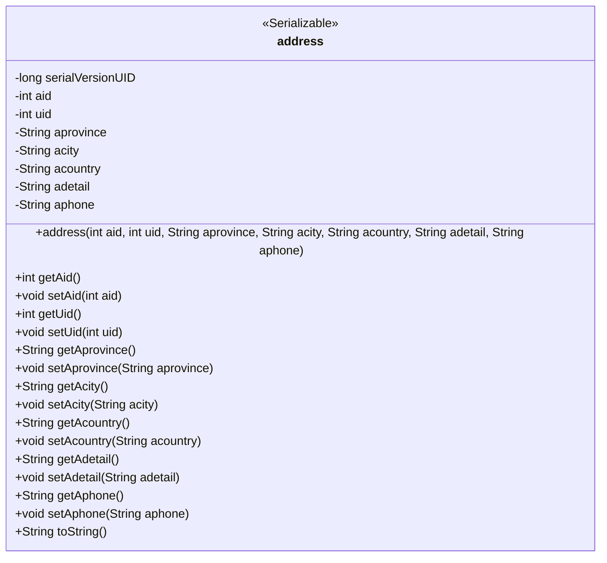

# 基础信息

|      |      |
|------|------|
| 名称 | address |
| 编码语言 | .java |
| 代码路径 | happycat/src/com/happycat/Bean/address.java |
| 包名 | com.happycat.Bean |
| 依赖项 | ['java.io.Serializable'] |
| 概述说明 | Java类address实现Serializable接口，包含地址ID、用户ID、省、市、国家、详细地址和电话字段，提供getter和setter方法。 |

# 说明

这是一个名为address的Java类，实现了Serializable接口用于序列化。类中包含七个私有字段：aid（地址ID）、uid（用户ID）、aprovince（省份）、acity（城市）、acountry（国家）、adetail（详细地址）和aphone（电话）。提供了全字段构造函数、各字段的getter和setter方法，以及重写的toString方法用于输出对象信息。serialVersionUID设置为1L用于版本控制。

# 类列表 Class Summary

| 名称   | 类型  | 说明 |
|-------|------|-------------|
| address | class | Java类address实现Serializable接口，包含地址ID、用户ID、省、市、国家、详细地址和电话字段，提供构造方法和getter/setter。 |

## 类 address

|      |      |
|------|------|
| 访问范围 | public |
| 类型 | class |
| 名称 | address |
| 说明 | Java类address实现Serializable接口，包含地址ID、用户ID、省、市、国家、详细地址和电话字段，提供构造方法和getter/setter。 |

### UML类图

这段代码定义了一个名为`address`的类，实现了`Serializable`接口，用于表示地址信息。该类包含多个私有字段，如`aid`、`uid`、`aprovince`等，分别表示地址ID、用户ID、省份、城市、国家、详细地址和电话号码。类中提供了这些字段的getter和setter方法，以及一个构造方法和重写的`toString`方法。该类主要用于存储和操作地址数据，支持序列化以便于网络传输或持久化存储。

### 内部方法调用关系图

```mermaid
graph TD
    A["类address"]
    B["属性: int aid"]
    C["属性: int uid"]
    D["属性: String aprovince"]
    E["属性: String acity"]
    F["属性: String acountry"]
    G["属性: String adetail"]
    H["属性: String aphone"]
    I["构造方法: address(int aid, int uid, String aprovince, String acity, String acountry, String adetail, String aphone)"]
    J["方法: int getAid()"]
    K["方法: void setAid(int aid)"]
    L["方法: int getUid()"]
    M["方法: void setUid(int uid)"]
    N["方法: String getAprovince()"]
    O["方法: void setAprovince(String aprovince)"]
    P["方法: String getAcity()"]
    Q["方法: void setAcity(String acity)"]
    R["方法: String getAcountry()"]
    S["方法: void setAcountry(String acountry)"]
    T["方法: String getAdetail()"]
    U["方法: void setAdetail(String adetail)"]
    V["方法: String getAphone()"]
    W["方法: void setAphone(String aphone)"]
    X["重写方法: String toString()"]

    A --> B
    A --> C
    A --> D
    A --> E
    A --> F
    A --> G
    A --> H
    A --> I
    A --> J
    A --> K
    A --> L
    A --> M
    A --> N
    A --> O
    A --> P
    A --> Q
    A --> R
    A --> S
    A --> T
    A --> U
    A --> V
    A --> W
    A --> X
```

该流程图展示了address类的完整结构，包含7个私有属性、1个构造方法和14个成员方法（7对getter/setter和1个toString）。类实现了Serializable接口，通过序列化版本UID控制版本兼容性。所有方法均围绕地址核心属性（省/市/国家/详情/电话等）展开，形成标准的数据封装结构。

### 字段列表 Field List

| 名称  | 类型  | 说明 |
|-------|-------|------|
| uid | int | 私有整型变量aid和uid。 |
| aphone | String | 私有字符串变量：省份、城市、国家、详细地址、电话。 |
| serialVersionUID = 1L | long | Java序列化ID，固定值1L，确保版本兼容性。 |

### 方法列表 Method List

| 名称  | 类型  | 说明 |
|-------|-------|------|
| toString | String | Java重写toString方法，返回包含aid、uid、省份、城市、国家、详细地址和电话的字符串。 |
| setAid | void | 设置aid属性的方法，将参数aid赋值给类的aid成员变量。 |
| setAprovince | void | Java方法：设置省份属性，参数为字符串aprovince。 |
| getAcountry | String | Java方法：返回字符串变量acountry的值。 |
| getAprovince | String | 方法getAprovince返回私有成员变量aprovince的值。 |
| getUid | int | 方法返回整型变量uid的值。 |
| setUid | void | 设置用户ID的方法，将参数uid赋值给类的uid成员变量。 |
| getAdetail | String | 获取adetail的字符串值的方法。 |
| getAid | int | 方法返回整型变量aid的值。 |
| setAcountry | void | Java方法：设置acountry属性值。参数为字符串acountry，无返回值。 |
| setAcity | void | 这是一个Java方法，用于设置类成员变量acity的值。方法接收一个字符串参数acity，并将其赋值给当前对象的acity属性。 |
| getAcity | String | 获取字符串类型变量acity的值的方法。 |
| setAdetail | void | 这是一个Java方法，用于设置类成员变量adetail的值。方法接收一个字符串参数adetail，并将其赋值给当前对象的同名成员变量。 |
| getAphone | String | 这是一个Java方法，返回字符串类型的私有变量aphone值。 |
| setAphone | void | 这是一个Java方法，用于设置类成员变量aphone的值。方法名为setAphone，接收一个字符串参数aphone。 |

