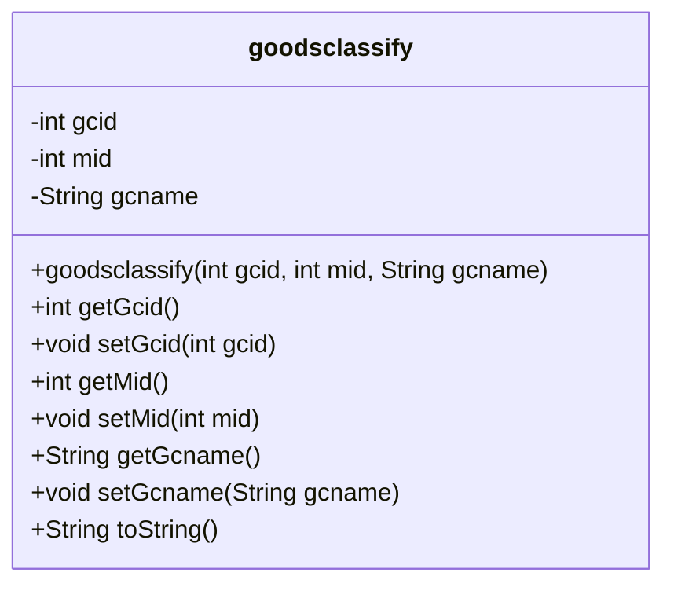
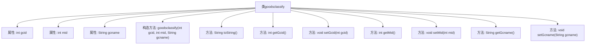

# 基础信息

|      |      |
|------|------|
| 名称 | goodsclassify |
| 编码语言 | .java |
| 代码路径 | happycat/src/com/happycat/Bean/goodsclassify.java |
| 包名 | com.happycat.Bean |
| 依赖项 | ['java.io.Serializable'] |
| 概述说明 | 商品分类类，含ID、名称和商户ID字段，实现序列化接口。 |

# 说明

这是一个名为goodsclassify的Java类，实现了Serializable接口以确保可序列化。类中包含三个私有字段：整型的gcid和mid，以及字符串类型的gcname。提供了这些字段的getter和setter方法，并重写了toString方法以返回包含所有字段值的字符串表示。类还包含一个带参数的构造函数，用于初始化所有字段。serialVersionUID被设置为1L以支持版本控制。

# 类列表 Class Summary

| 名称   | 类型  | 说明 |
|-------|------|-------------|
| goodsclassify | class | 商品分类类，实现序列化，含ID、名称及关联ID字段，提供getter/setter方法。 |

## 类 goodsclassify

|      |      |
|------|------|
| 访问范围 | public |
| 类型 | class |
| 名称 | goodsclassify |
| 说明 | 商品分类类，实现序列化，含ID、名称及关联ID字段，提供getter/setter方法。 |

### UML类图

这段代码定义了一个名为`goodsclassify`的Java类，实现了`Serializable`接口，表明其实例可序列化。类包含三个私有字段：`gcid`（商品分类ID）、`mid`（关联的模块ID）和`gcname`（分类名称），提供了完整的构造方法和getter/setter方法，并重写了`toString()`方法用于输出对象信息。类图清晰地展示了其结构，包括字段的私有性、方法的公有性以及构造函数的参数列表。

### 内部方法调用关系图

这段代码定义了一个名为`goodsclassify`的可序列化Java类，包含三个私有属性（gcid、mid、gcname）及其对应的getter/setter方法。类通过构造方法初始化属性，并重写了toString()方法用于格式化输出对象内容。流程图清晰展示了类结构，包括属性声明、构造方法和所有成员方法的层级关系，体现了标准的Java Bean设计模式。

### 字段列表 Field List

| 名称  | 类型  | 说明 |
|-------|-------|------|
| gcid | int | 私有整型变量gcid。 |
| gcname | String | 变量gcname的类型为String。 |
| serialVersionUID = 1L | long | Java序列化ID，固定值1L用于版本控制。 |
| mid | int | 私有整型变量mid。 |

### 方法列表 Method List

| 名称  | 类型  | 说明 |
|-------|-------|------|
| setGcid | void | 这是一个Java方法，用于设置类成员变量gcid的值。方法名为setGcid，接受一个整型参数gcid。 |
| toString | String | 重写toString方法，返回包含gcid、mid、gcname的字符串。 |
| setMid | void | 设置成员变量mid的值。 |
| getGcid | int | 方法返回整型变量gcid的值。 |
| getMid | int | 方法getMid返回整型变量mid的值。 |
| getGcname | String | 获取gcname字符串的方法。 |
| setGcname | void | 这是一个Java方法，用于设置类成员变量gcname的值。方法名为setGcname，接受一个String类型参数。 |

