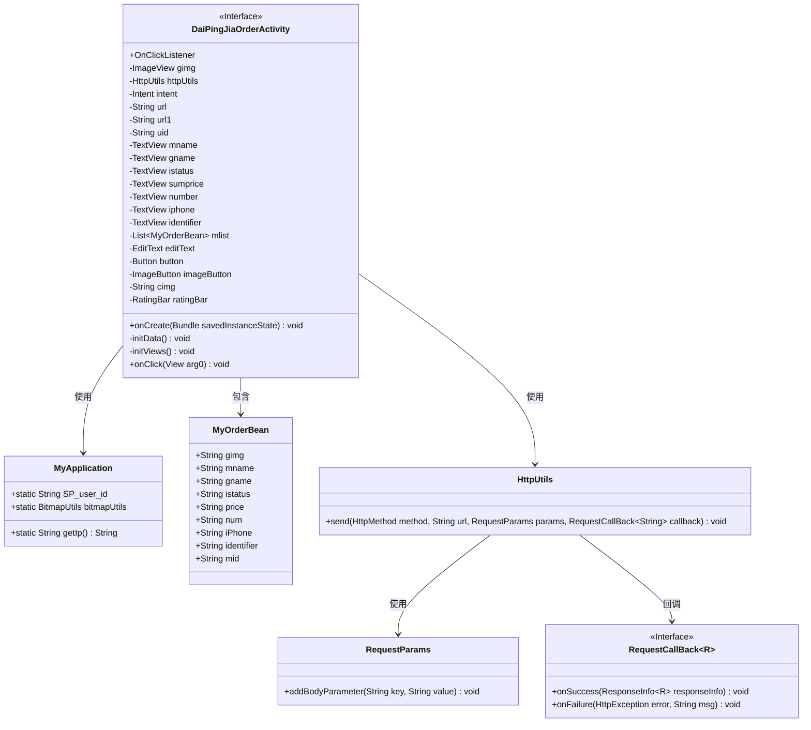
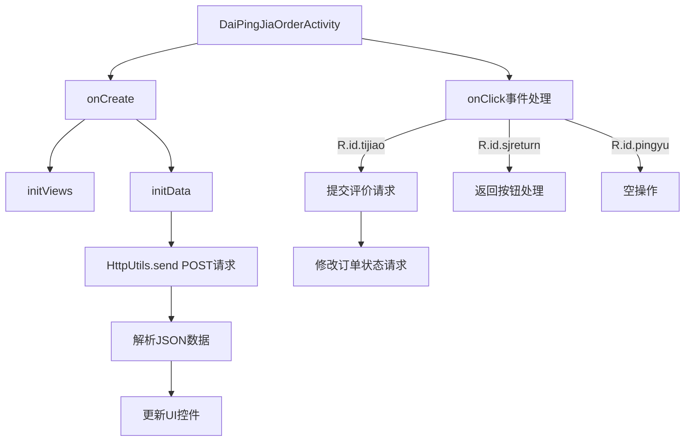

# 基础信息

|      |      |
|------|------|
| 名称 | DaiPingJiaOrderActivity |
| 编码语言 | .java |
| 代码路径 | happycat/src/com/happycat/DaiPingJiaOrderActivity.java |
| 包名 | com.happycat |
| 依赖项 | ['java.io.UnsupportedEncodingException', 'java.lang.reflect.Type', 'java.net.URLEncoder', 'java.util.LinkedList', 'java.util.List', 'com.example.happucat.R', 'com.example.happucat.R.layout', 'com.example.happucat.R.menu', 'com.google.gson.Gson', 'com.google.gson.reflect.TypeToken', 'com.happycat.Bean.MerchatXqBean', 'com.happycat.Bean.MyOrderBean', 'com.happycat.Bean.SouSuoBean', 'com.happycat.global.GlobalContacts', 'com.happycat.util.MyApplication', 'com.lidroid.xutils.HttpUtils', 'com.lidroid.xutils.exception.HttpException', 'com.lidroid.xutils.http.RequestParams', 'com.lidroid.xutils.http.ResponseInfo', 'com.lidroid.xutils.http.callback.RequestCallBack', 'com.lidroid.xutils.http.client.HttpRequest.HttpMethod', 'android.os.Bundle', 'android.app.ActionBar', 'android.app.Activity', 'android.content.Intent', 'android.util.Log', 'android.view.Menu', 'android.view.View', 'android.view.View.OnClickListener', 'android.widget.Button', 'android.widget.EditText', 'android.widget.ImageButton', 'android.widget.ImageView', 'android.widget.RatingBar', 'android.widget.RatingBar.OnRatingBarChangeListener', 'android.widget.TextView', 'android.widget.Toast'] |
| 概述说明 | 这是一个Android订单评价页面代码，主要功能包括：获取订单数据、显示商品信息、提交评价内容（含星级评分）并更新订单状态。通过HTTP请求与服务器交互，支持返回按钮和评价提交操作。 |

# 说明

DaiPingJiaOrderActivity是一个Android订单评价页面，继承Activity并实现点击监听。主要功能包括：初始化视图组件（图片、文本、编辑框、按钮等）；通过HTTP请求获取订单数据并展示；提供星级评分和评语输入功能；提交评价时验证评语长度并通过POST请求更新服务器数据；包含返回按钮处理逻辑。使用Gson解析JSON数据，XUtils框架处理网络请求，支持中文编码转换。

# 类列表 Class Summary

| 名称   | 类型  | 说明 |
|-------|------|-------------|
| DaiPingJiaOrderActivity | class | DaiPingJiaOrderActivity是一个Android订单评价页面，包含订单详情展示、星级评分和评语提交功能，通过HTTP请求与服务器交互完成评价操作。 |

## 类 DaiPingJiaOrderActivity

|      |      |
|------|------|
| 访问范围 | public |
| 类型 | class |
| 名称 | DaiPingJiaOrderActivity |
| 说明 | DaiPingJiaOrderActivity是一个Android订单评价页面，包含订单详情展示、星级评分和评语提交功能，通过HTTP请求与服务器交互完成评价操作。 |

### UML类图

该代码是一个Android订单评价活动类，主要功能包括：1) 初始化界面组件和网络请求工具；2) 从服务器获取订单数据并展示；3) 处理用户评分和评语提交。通过HttpUtils进行POST请求交互，使用Gson解析JSON数据，实现了订单详情展示、星级评分和评价提交功能。类图中清晰展示了与MyApplication、HttpUtils等辅助类的依赖关系，以及回调接口RequestCallBack的使用方式。

### 内部方法调用关系图

这段代码是Android平台上的订单评价活动类，主要实现了以下功能：1) 初始化界面控件和网络请求工具；2) 从服务器获取订单数据并展示；3) 处理用户点击事件，包括提交评价、修改订单状态和返回操作。代码使用了HttpUtils进行网络请求，Gson解析JSON数据，并通过RatingBar获取用户评分。特别注意处理了网络请求失败、评价内容验证等边界情况，整体流程清晰但存在部分重复代码可以优化。

### 字段列表 Field List

| 名称  | 类型  | 说明 |
|-------|-------|------|
| imageButton | ImageButton | 图片按钮组件。 |
| button | Button | 按钮组件实例。 |
| ratingBar | RatingBar | 定义了一个名为ratingBar的RatingBar类型变量。 |
| intent | Intent | 定义意图变量intent。 |
| mlist | List<MyOrderBean> | 变量mlist是MyOrderBean类型的列表。 |
| url1 = "http://" + MyApplication.getIp() + ":8080/happycat/MG" | String | 代码拼接URL，使用应用IP和固定路径生成完整地址。 |
| gimg | ImageView | 图片视图组件，用于显示图像内容。 |
| identifier | TextView | 文本视图包含名称、组名、状态、总价、数量、电话和标识符字段。 |
| editText | EditText | 定义了一个EditText类型的变量editText。 |
| uid = MyApplication.SP_user_id + "" | String | 代码定义字符串变量uid，值为用户ID的字符串形式。 |
| url = "http://" + MyApplication.getIp() + ":8080/happycat/myServlet" | String | 创建URL字符串，拼接IP地址和端口8080，路径为happycat/myServlet。 |
| httpUtils | HttpUtils | 声明一个HttpUtils类型的变量httpUtils。 |
| cimg | String | 字符串变量cimg的声明。 |

### 方法列表 Method List

| 名称  | 类型  | 说明 |
|-------|-------|------|
| onCreate | void | Android Activity初始化代码：隐藏标题栏、设置布局、初始化视图和数据。 |
| initData | void | 初始化数据方法：发送POST请求获取订单数据，解析JSON后显示订单详情，包括图片、名称、商品、订单号、价格、数量、电话和标识符。失败时记录日志。 |
| initViews | void | 初始化视图组件并设置点击监听器，根据评分设置对应图片。 |
| onClick | void | 点击事件处理：根据ID执行不同操作。评语提交时检查长度，通过HTTP POST发送数据到服务器，包括评语、用户ID等。成功或失败有对应回调。订单状态变更同样通过POST请求处理。输入为空时提示，返回按钮处理页面跳转或关闭。 |

