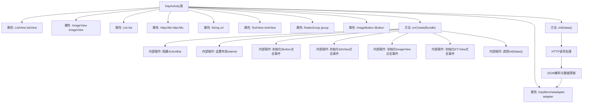

# 基础信息

|      |      |
|------|------|
| 名称 | DayActivity |
| 编码语言 | .java |
| 代码路径 | happycat/src/com/happycat/DayActivity.java |
| 包名 | com.happycat |
| 依赖项 | ['java.lang.reflect.Type', 'java.util.ArrayList', 'java.util.List', 'com.example.happucat.R', 'com.google.gson.Gson', 'com.google.gson.reflect.TypeToken', 'com.happycat.Bean.DayMerchatBean', 'com.happycat.adapter.DayMerchatadapter', 'com.happycat.util.MyApplication', 'com.lidroid.xutils.HttpUtils', 'com.lidroid.xutils.exception.HttpException', 'com.lidroid.xutils.http.ResponseInfo', 'com.lidroid.xutils.http.callback.RequestCallBack', 'com.lidroid.xutils.http.client.HttpRequest.HttpMethod', 'android.os.Bundle', 'android.app.ActionBar', 'android.app.Activity', 'android.content.Intent', 'android.util.Log', 'android.view.View', 'android.view.View.OnClickListener', 'android.widget.AdapterView', 'android.widget.BaseAdapter', 'android.widget.ImageButton', 'android.widget.ImageView', 'android.widget.ListAdapter', 'android.widget.ListView', 'android.widget.RadioGroup', 'android.widget.TextView', 'android.widget.AdapterView.OnItemClickListener'] |
| 概述说明 | DayActivity是一个Android活动类，包含列表视图、图片视图等控件，通过HTTP请求获取数据并显示，支持点击列表项跳转详情页，以及多个按钮点击跳转不同URL页面。 |

# 说明

DayActivity是一个Android活动类，主要功能包括：隐藏标题栏并设置布局；初始化ListView和适配器，监听列表项点击事件并跳转至MerchatDataActivity传递商户数据；设置ImageView点击跳转至SyJsActivity；六个按钮分别设置不同URL参数并跳转至WaiMAIMainActivity；通过HttpUtils发送GET请求获取商户数据，使用Gson解析JSON并更新适配器；若适配器为空则显示错误提示。

# 类列表 Class Summary

| 名称   | 类型  | 说明 |
|-------|------|-------------|
| DayActivity | class | DayActivity类实现外卖功能界面，包含列表展示、点击跳转及分类按钮，通过HTTP请求获取数据并解析展示。 |


## 类 DayActivity

|      |      |
|------|------|
| 访问范围 | public |
| 类型 | class |
| 名称 | DayActivity |
| 说明 | DayActivity类实现外卖功能界面，包含列表展示、点击跳转及分类按钮，通过HTTP请求获取数据并解析展示。 |


### UML类图

```mermaid
classDiagram
    class Activity {
        <<android.app.Activity>>
    }
    
    class DayActivity {
        -ListView listView
        -ImageView imageView
        -List~DayMerchatBean~ list
        -DayMerchatadapter adapter
        -HttpUtils httpUtils
        -String url
        -TextView textView
        -RadioGroup group
        -ImageButton iButton
        +onCreate(Bundle savedInstanceState) void
        -initDatas() void
    }
    
    class DayMerchatadapter {
        <<Adapter>>
        +DayMerchatadapter(List~DayMerchatBean~ list, Context context)
        +notifyDataSetChanged() void
    }
    
    class DayMerchatBean {
        <<DataBean>>
        +getMid() int
        +getMname() String
        +getTip() double
        +getLongtime() String
        +getMprice() double
        +getMtime() String
        +getMimg() String
    }
    
    class HttpUtils {
        +send(HttpMethod method, String url, RequestCallBack~String~ callback) void
    }
    
    class RequestCallBack~T~ {
        <<Interface>>
        +onFailure(HttpException e, String msg) void
        +onSuccess(ResponseInfo~T~ info) void
    }
    
    class Gson {
        +fromJson(String json, Type typeOfT) Object
    }
    
    class TypeToken~T~ {
        +getType() Type
    }
    
    Activity <|-- DayActivity
    RequestCallBack~String~ <|.. DayActivity
    DayActivity --> DayMerchatadapter : 使用
    DayActivity --> DayMerchatBean : 包含数据
    DayActivity --> HttpUtils : 网络请求
    HttpUtils --> RequestCallBack~String~ : 回调
    DayActivity --> Gson : JSON解析
    Gson --> TypeToken~List~DayMerchatBean~~ : 类型转换
```

这段代码描述了一个Android活动类DayActivity，主要功能是展示外卖商家列表并处理用户交互。该活动包含列表视图、图片按钮等UI组件，通过HttpUtils进行网络请求获取商家数据，使用Gson解析JSON数据并绑定到自定义适配器DayMerchatadapter。类图展示了核心组件关系，包括数据实体DayMerchatBean、网络工具HttpUtils及其回调接口RequestCallBack，以及JSON处理相关的Gson和TypeToken类。活动通过多种点击事件处理用户交互，包括列表项点击和底部导航按钮点击。


### 内部方法调用关系图



这段代码展示了一个Android活动类DayActivity的实现流程。主要功能包括界面初始化、多个控件的点击事件处理、网络数据请求和JSON解析。流程图清晰地展示了从类属性定义到onCreate方法执行的完整过程，包括隐藏标题栏、设置布局、初始化各种点击监听器，最后通过initDatas方法发起网络请求并处理返回数据。整个过程涉及UI交互、网络通信和数据绑定等多个Android开发核心环节。

### 字段列表 Field List

| 名称  | 类型  | 说明 |
|-------|-------|------|
| imageView | ImageView | 图片视图控件。 |
| iButton | ImageButton | 图像按钮iButton |
| group | RadioGroup | 单选按钮组控件，用于创建一组互斥的单选按钮。 |
| listView | ListView | 定义ListView控件实例listView。 |
| url | String | 私有字符串变量url |
| textView | TextView | 定义TextView变量textView。 |
| adapter | DayMerchatadapter | DayMerchatadapter适配器实例声明。 |
| list = new ArrayList<DayMerchatBean>() | List<DayMerchatBean> | 创建了一个存储DayMerchatBean对象的动态数组列表。 |
| httpUtils | HttpUtils | 声明一个HttpUtils类型的变量httpUtils。 |

### 方法列表 Method List

| 名称  | 类型  | 说明 |
|-------|-------|------|
| initDatas | void | 初始化数据方法：创建适配器并设置到列表视图，通过HTTP GET请求从指定URL获取数据，使用Gson解析返回的JSON数据并更新适配器。 |
| onCreate | void | 代码实现外卖应用界面功能，包括隐藏标题栏、设置点击事件、列表项跳转及多个分类按钮跳转，最后检查数据适配器状态。 |


