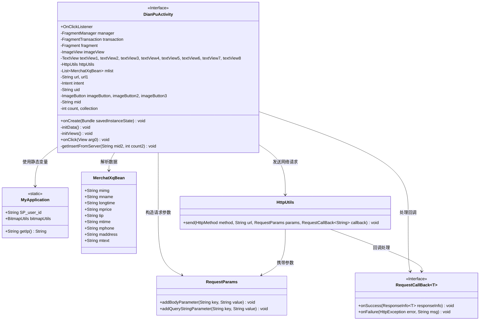
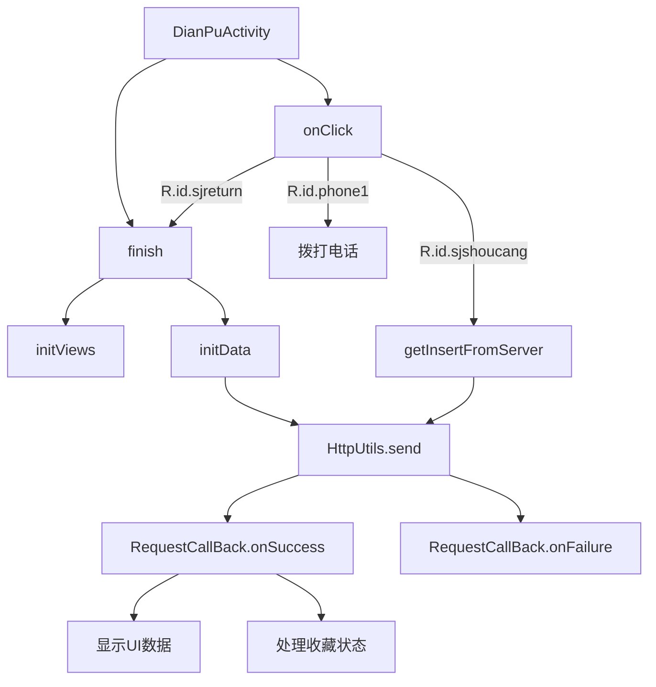

# 基础信息

|      |      |
|------|------|
| 名称 | DianPuActivity |
| 编码语言 | .java |
| 代码路径 | happycat/src/com/happycat/DianPuActivity.java |
| 包名 | com.happycat |
| 依赖项 | ['java.lang.reflect.Type', 'java.util.ArrayList', 'java.util.LinkedList', 'java.util.List', 'com.example.happucat.R', 'com.google.gson.Gson', 'com.google.gson.reflect.TypeToken', 'com.happycat.Bean.MerchatXqBean', 'com.happycat.global.GlobalContacts', 'com.happycat.util.MyApplication', 'com.lidroid.xutils.HttpUtils', 'com.lidroid.xutils.exception.HttpException', 'com.lidroid.xutils.http.RequestParams', 'com.lidroid.xutils.http.ResponseInfo', 'com.lidroid.xutils.http.callback.RequestCallBack', 'com.lidroid.xutils.http.client.HttpRequest.HttpMethod', 'android.R.integer', 'android.R.string', 'android.net.Uri', 'android.os.Bundle', 'android.app.ActionBar', 'android.app.Activity', 'android.content.Intent', 'android.support.v4.app.Fragment', 'android.support.v4.app.FragmentManager', 'android.support.v4.app.FragmentPagerAdapter', 'android.support.v4.app.FragmentTransaction', 'android.support.v4.view.PagerAdapter', 'android.support.v4.view.ViewPager', 'android.util.Log', 'android.view.Menu', 'android.view.View', 'android.view.View.OnClickListener', 'android.widget.ImageButton', 'android.widget.ImageView', 'android.widget.LinearLayout', 'android.widget.RadioGroup', 'android.widget.TextView', 'android.widget.Toast'] |
| 概述说明 | DianPuActivity是一个Android店铺详情页，包含商家信息展示、收藏功能和电话拨打功能，通过HTTP请求获取数据并处理用户交互。 |

# 说明

DianPuActivity是一个Android活动类，用于展示商家详情页面。它包含多个TextView和ImageView用于显示商家信息，如名称、营业时间、价格、电话、地址等。通过HttpUtils发送POST请求获取商家数据，使用Gson解析JSON响应并更新UI。活动还实现了收藏功能，用户可点击按钮收藏或取消收藏商家，并通过服务器更新状态。此外，活动提供返回首页和拨打电话的功能。所有网络请求均通过MyApplication获取服务器IP地址。

# 类列表 Class Summary

| 名称   | 类型  | 说明 |
|-------|------|-------------|
| DianPuActivity | class | DianPuActivity是一个Android活动类，用于显示店铺详情，包括图片、名称、价格、营业时间、电话、地址等信息。支持收藏功能，通过HTTP请求与服务器交互，实现数据加载和收藏状态管理。包含返回、收藏和拨打电话的按钮点击事件处理。 |

## 类 DianPuActivity

|      |      |
|------|------|
| 访问范围 | public |
| 类型 | class |
| 名称 | DianPuActivity |
| 说明 | DianPuActivity是一个Android活动类，用于显示店铺详情，包括图片、名称、价格、营业时间、电话、地址等信息。支持收藏功能，通过HTTP请求与服务器交互，实现数据加载和收藏状态管理。包含返回、收藏和拨打电话的按钮点击事件处理。 |

### UML类图

类图描述：
该图展示了一个Android店铺详情页面(DianPuActivity)的类结构，主要包含Activity主体、网络请求工具(HttpUtils)、数据模型(MerchatXqBean)和回调接口(RequestCallBack)等组件。DianPuActivity继承Activity并实现点击监听接口，通过HttpUtils与服务器交互，使用RequestParams构建请求参数，利用RequestCallBack处理响应结果，同时依赖MyApplication获取全局配置。MerchatXqBean存储店铺详情数据，包含图片、名称、价格等字段。整体结构展现了典型的Android MVC模式实现。

### 内部方法调用关系图

流程图描述：该流程图展示了DianPuActivity的主要执行流程。从onCreate开始初始化视图和数据，通过HttpUtils发送网络请求获取商家详情和收藏状态。用户点击事件处理包括返回、收藏/取消收藏操作以及拨打电话功能。网络请求成功后回调onSuccess更新UI显示数据或收藏状态，失败时调用onFailure处理错误。整个流程清晰展示了Activity的生命周期和用户交互处理逻辑。

### 字段列表 Field List

| 名称  | 类型  | 说明 |
|-------|-------|------|
| url1 | String | 声明两个私有字符串变量url和url1。 |
| imageButton3 | ImageButton | 定义三个图像按钮变量：imageButton、imageButton2、imageButton3。 |
| manager | FragmentManager | FragmentManager用于管理Fragment的添加、移除和替换操作。 |
| intent | Intent | 定义意图变量intent。 |
| transaction | FragmentTransaction | 定义Fragment事务对象transaction。 |
| imageView | ImageView | 显示图片视图控件。 |
| uid=MyApplication.SP_user_id+"" | String | 代码定义字符串uid，值为用户ID转字符串。 |
| collection | int | 私有整型变量count和collection。 |
| textView8 | TextView | 定义了8个TextView变量：textView1至textView8。 |
| fragment | Fragment | 片段对象。 |
| mlist | List<MerchatXqBean> | 这是一个名为mlist的列表变量，存储MerchatXqBean类型的数据。 |
| mid | String | 字符串变量mid的声明。 |
| httpUtils | HttpUtils | 声明了一个HttpUtils类型的变量httpUtils。 |

### 方法列表 Method List

| 名称  | 类型  | 说明 |
|-------|-------|------|
| onClick | void | 点击事件处理：返回首页执行finish()；收藏/取消收藏切换count值并提交服务器；点击phone1拨打电话；其他情况默认无操作。 |
| onCreate | void | 安卓Activity初始化代码：隐藏标题栏、加载布局、初始化视图和数据。 |
| initData | void | 该方法通过XUtils框架从服务器获取商家详情数据，解析JSON并显示到界面，同时检查收藏状态并更新UI。失败时记录日志。 |
| initViews | void | 初始化视图组件：绑定ImageView、8个TextView和3个ImageButton，并设置点击监听器。 |
| getInsertFromServer | void | 该方法通过HTTP POST请求向服务器发送收藏操作，参数包括用户ID和商品ID，根据返回结果更新UI显示收藏状态或提示登录。 |

