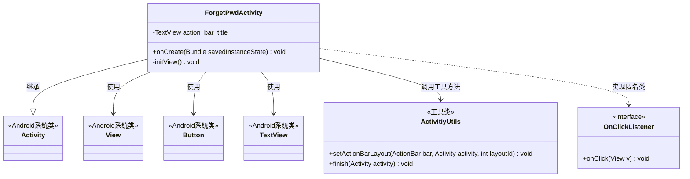
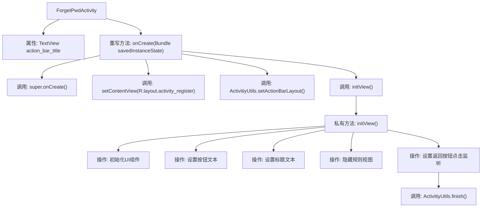

# 基础信息

|      |      |
|------|------|
| 名称 | ForgetPwdActivity |
| 编码语言 | .java |
| 代码路径 | happycat/src/com/happycat/ForgetPwdActivity.java |
| 包名 | com.happycat |
| 依赖项 | ['com.example.happucat.R', 'com.happycat.util.ActivitiyUtils', 'android.app.Activity', 'android.os.Bundle', 'android.view.View', 'android.view.View.OnClickListener', 'android.widget.Button', 'android.widget.TextView'] |
| 概述说明 | ForgetPwdActivity是找回密码界面，初始化视图包括设置标题、按钮文本及返回按钮点击事件，隐藏注册规则视图。 |

# 说明

该代码定义了一个名为ForgetPwdActivity的Android活动类，用于实现找回密码功能。在onCreate方法中设置了布局文件activity_register，并初始化了自定义标题栏。initView方法初始化界面元素：设置标题文本为"找回密码"，将按钮文本改为"重设密码"，隐藏注册规则视图，并为返回按钮添加点击事件监听器，点击时关闭当前活动。整个类主要处理找回密码页面的UI展示和基本交互逻辑。

# 类列表 Class Summary

| 名称   | 类型  | 说明 |
|-------|------|-------------|
| ForgetPwdActivity | class | 这是一个Android的忘记密码活动类，继承自Activity。在onCreate中设置布局并初始化视图。initView方法初始化界面元素，包括设置标题、按钮文本和返回按钮点击事件。 |

## 类 ForgetPwdActivity

|      |      |
|------|------|
| 访问范围 | public |
| 类型 | class |
| 名称 | ForgetPwdActivity |
| 说明 | 这是一个Android的忘记密码活动类，继承自Activity。在onCreate中设置布局并初始化视图。initView方法初始化界面元素，包括设置标题、按钮文本和返回按钮点击事件。 |

### UML类图

该代码展示了一个Android密码找回界面（ForgetPwdActivity）的类结构，继承自Activity基类。主要功能包括初始化界面元素（标题、按钮）、设置点击监听器，并依赖ActivitiyUtils工具类进行界面布局和活动管理。通过匿名内部类实现OnClickListener接口处理返回按钮点击事件，典型展示了Android活动的基本生命周期控制和视图交互模式。类图清晰呈现了与Android框架类的关系和工具类依赖。

### 内部方法调用关系图

这段代码展示了一个Android找回密码界面的实现流程。ForgetPwdActivity继承自Activity，在onCreate方法中完成布局加载和初始化工作。通过initView方法初始化界面元素，包括设置标题文本、修改按钮文字、隐藏不需要的视图组件，并为返回按钮设置点击事件监听器。当点击返回按钮时，会调用ActivitiyUtils.finish()方法关闭当前Activity。整个流程清晰地展现了从Activity创建到UI初始化的完整过程。

### 字段列表 Field List

| 名称  | 类型  | 说明 |
|-------|-------|------|
| action_bar_title | TextView | 私有TextView控件，变量名为action_bar_title。 |

### 方法列表 Method List

| 名称  | 类型  | 说明 |
|-------|-------|------|
| onCreate | void | Android Activity的onCreate方法，调用父类方法，设置布局和标题栏，初始化视图。 |
| initView | void | 初始化界面：设置标题为"找回密码"，按钮显示"重设密码"，隐藏注册规则，返回按钮点击关闭当前页面。 |

