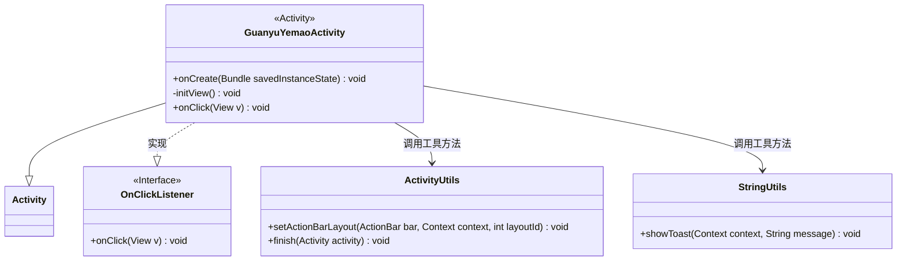
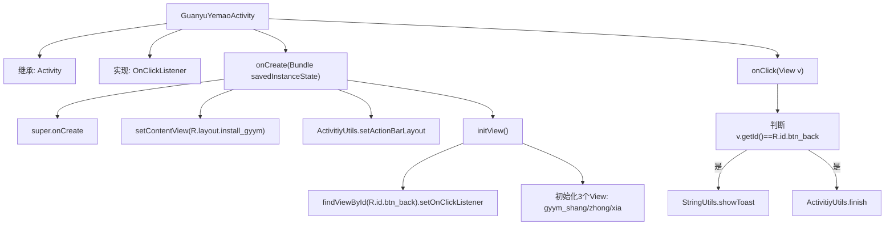

# 基础信息

|      |      |
|------|------|
| 名称 | GuanyuYemaoActivity |
| 编码语言 | .java |
| 代码路径 | happycat/src/com/happycat/GuanyuYemaoActivity.java |
| 包名 | com.happycat |
| 依赖项 | ['com.example.happucat.R', 'com.happycat.util.ActivitiyUtils', 'com.happycat.util.StringUtils', 'android.app.Activity', 'android.os.Bundle', 'android.view.View', 'android.view.View.OnClickListener'] |
| 概述说明 | Android活动类GuanyuYemaoActivity实现点击监听，初始化布局和视图，包含返回按钮和三个视图组件，点击返回按钮显示提示并关闭活动。 |

# 说明

该代码定义了一个名为GuanyuYemaoActivity的Android活动类，用于展示关于夜猫的界面。类继承自Activity并实现了OnClickListener接口。在onCreate方法中设置了布局文件install_gyym，并通过ActivitiyUtils设置了自定义标题栏title_bar_yemao。initView方法初始化了返回按钮和三个界面元素gyym_shang、gyym_zhong、gyym_xia的点击监听。点击返回按钮时显示"返回"提示并结束当前活动。整个类主要处理界面初始化和返回按钮的点击事件。

# 类列表 Class Summary

| 名称   | 类型  | 说明 |
|-------|------|-------------|
| GuanyuYemaoActivity | class | Android活动类GuanyuYemaoActivity实现点击监听，初始化视图并设置返回按钮点击事件。 |

## 类 GuanyuYemaoActivity

|      |      |
|------|------|
| 访问范围 | public |
| 类型 | class |
| 名称 | GuanyuYemaoActivity |
| 说明 | Android活动类GuanyuYemaoActivity实现点击监听，初始化视图并设置返回按钮点击事件。 |

### UML类图

这段代码展示了一个Android活动类`GuanyuYemaoActivity`，它继承自`Activity`并实现了`OnClickListener`接口。主要功能包括初始化界面视图（通过`initView`方法）和处理点击事件（通过`onClick`方法）。该类依赖于`ActivityUtils`和`StringUtils`两个工具类来设置动作栏布局和显示Toast提示。整体结构体现了Android典型的MVC模式，其中活动类负责视图控制和用户交互。

### 内部方法调用关系图

这段代码描述了一个Android活动类GuanyuYemaoActivity，它继承自Activity并实现了OnClickListener接口。主要流程包括：在onCreate方法中初始化布局和视图，通过initView方法设置返回按钮的点击监听器并初始化三个视图组件。当点击返回按钮时，会显示提示信息并结束当前活动。流程图清晰地展示了从活动创建到视图初始化再到点击事件处理的完整流程，突出了关键的方法调用和条件判断。

### 字段列表 Field List

| 名称  | 类型  | 说明 |
|-------|-------|------|

### 方法列表 Method List

| 名称  | 类型  | 说明 |
|-------|-------|------|
| onCreate | void | Android Activity的onCreate方法，设置布局R.layout.install_gyym，自定义标题栏R.layout.title_bar_yemao，并初始化视图initView()。 |
| onClick | void | Android点击事件处理：当按钮ID为btn_back时，显示"返回"提示并关闭当前Activity。 |
| initView | void | 初始化视图：设置返回按钮点击监听，加载上、中、下三个视图组件。 |

