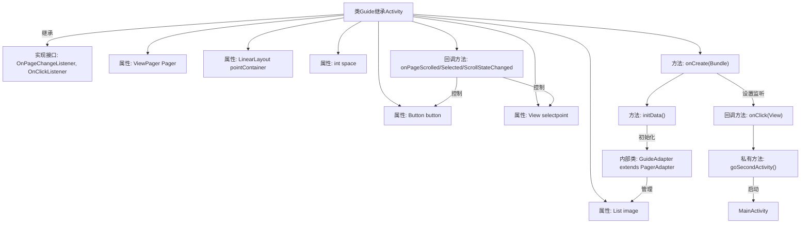
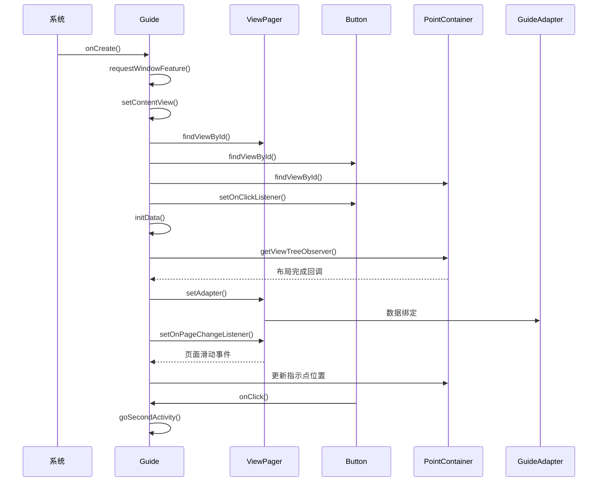

# 基础信息

|      |      |
|------|------|
| 名称 | Guide |
| 编码语言 | .java |
| 代码路径 | happycat/src/com/happycat/Guide.java |
| 包名 | com.happycat |
| 依赖项 | ['java.util.ArrayList', 'java.util.List', 'javax.security.auth.PrivateCredentialPermission', 'com.example.happucat.R', 'com.happycat.util.CacheUtils', 'android.app.Activity', 'android.content.Intent', 'android.os.Bundle', 'android.support.v4.view.PagerAdapter', 'android.support.v4.view.ViewPager', 'android.support.v4.view.ViewPager.OnPageChangeListener', 'android.view.View', 'android.view.View.OnClickListener', 'android.view.ViewGroup', 'android.view.ViewTreeObserver.OnGlobalLayoutListener', 'android.view.Window', 'android.widget.Button', 'android.widget.ImageView', 'android.widget.ImageView.ScaleType', 'android.widget.LinearLayout', 'android.widget.RelativeLayout', 'android.widget.RelativeLayout.LayoutParams'] |
| 概述说明 | Android引导页实现，包含ViewPager、圆点指示器及跳转按钮，适配器管理图片切换，监听滑动事件控制按钮显示，首次登录后跳转主页。 |

# 说明

该代码实现了一个引导页Activity，包含ViewPager展示多张引导图片，底部有点状指示器和启动按钮。主要功能包括：初始化时去除标题栏并设置布局；通过ViewPager加载三张预设图片；动态计算指示器圆点间距；滑动时实时更新选中圆点位置；最后一页显示启动按钮，点击后跳转至主页面并标记非首次登录。采用PagerAdapter管理图片视图，通过监听页面滑动和点击事件实现交互逻辑。

# 类列表 Class Summary

| 名称   | 类型  | 说明 |
|-------|------|-------------|
| Guide | class | Android引导页实现，包含ViewPager、圆点指示器及跳转按钮，适配图片滑动与状态切换。 |


## 类 Guide

|      |      |
|------|------|
| 访问范围 | public |
| 类型 | class |
| 名称 | Guide |
| 说明 | Android引导页实现，包含ViewPager、圆点指示器及跳转按钮，适配图片滑动与状态切换。 |


### UML类图

```mermaid
classDiagram
    class Activity
    <<Interface>> OnPageChangeListener {
        +onPageScrolled(int position, float positionOffset, int positionOffsetPixels) void
        +onPageSelected(int position) void
        +onPageScrollStateChanged(int state) void
    }
    <<Interface>> OnClickListener {
        +onClick(View v) void
    }
    class Guide {
        -ViewPager Pager
        -Button button
        -LinearLayout pointContainer
        -View selectpoint
        -List~ImageView~ image
        -int space
        +onCreate(Bundle savedInstanceState) void
        -initData() void
        +onPageScrolled(int position, float positionOffset, int positionOffsetPixels) void
        +onPageSelected(int position) void
        +onPageScrollStateChanged(int state) void
        +onClick(View v) void
        -goSecondActivity() void
    }
    class GuideAdapter {
        +getCount() int
        +isViewFromObject(View view, Object object) boolean
        +instantiateItem(ViewGroup container, int position) Object
        +destroyItem(ViewGroup container, int position, Object object) void
    }
    Activity <|-- Guide
    OnPageChangeListener <|.. Guide
    OnClickListener <|.. Guide
    Guide --> GuideAdapter : 包含
    Guide --> ViewPager : 使用
    Guide --> Button : 使用
    Guide --> LinearLayout : 使用
    Guide --> ImageView : 使用
```

类图描述：该图展示了一个Android引导页Activity（Guide）的结构，它继承自Activity类并实现了OnPageChangeListener和OnClickListener接口。Guide类包含ViewPager、Button等UI组件，通过内部类GuideAdapter管理图片展示。主要功能包括初始化引导图片、处理页面滑动事件、按钮点击跳转等，核心逻辑集中在页面切换时的圆点指示器动画和末页按钮显示控制上。


### 内部方法调用关系图





这段代码实现了一个Android引导页功能，主要包含ViewPager图片轮播、底部圆点指示器和开始按钮。流程图展示了类结构和主要方法调用关系，时序图描述了从Activity创建到用户交互的完整过程。代码通过ViewPager展示多张引导图片，底部圆点会随页面滑动而移动，在最后一页显示开始按钮，点击后跳转至主界面并标记首次启动完成。

### 字段列表 Field List

| 名称  | 类型  | 说明 |
|-------|-------|------|
| selectpoint | View | 私有视图组件selectpoint。 |
| button | Button | 声明一个私有按钮变量。 |
| pointContainer | LinearLayout | 私有线性布局控件pointContainer。 |
| space | int | 私有整型变量space。 |
| image | List<ImageView> | 私有图像视图列表。 |
| Pager | ViewPager | 私有视图分页控件实例。 |

### 方法列表 Method List

| 名称  | 类型  | 说明 |
|-------|-------|------|
| initData | void | 初始化数据方法：创建图片数组和ImageView列表，设置图片资源与缩放类型，添加导航圆点并设置间距，最后为ViewPager配置适配器和页面切换监听。 |
| onPageScrolled | void | 方法重写，处理页面滑动时更新选中点的左边距，通过计算位置和偏移量实现平滑移动。 |
| onCreate | void | Android Activity初始化代码：去除标题、设置布局、绑定ViewPager和按钮控件，初始化数据并计算导航点间距。 |
| onPageSelected | void | 页面切换时，若为最后一项则显示按钮，否则隐藏。代码简化使用三元运算符实现。 |
| onPageScrollStateChanged | void | 页面滚动状态改变时的空实现方法。 |
| onClick | void | 重写点击事件方法，当点击按钮时跳转到第二个活动。 |
| goSecondActivity | void | 方法goSecondActivity用于跳转至MainActivity，同时通过CacheUtils设置首次登录标识为false。 |


