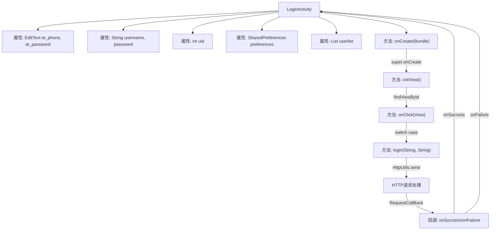
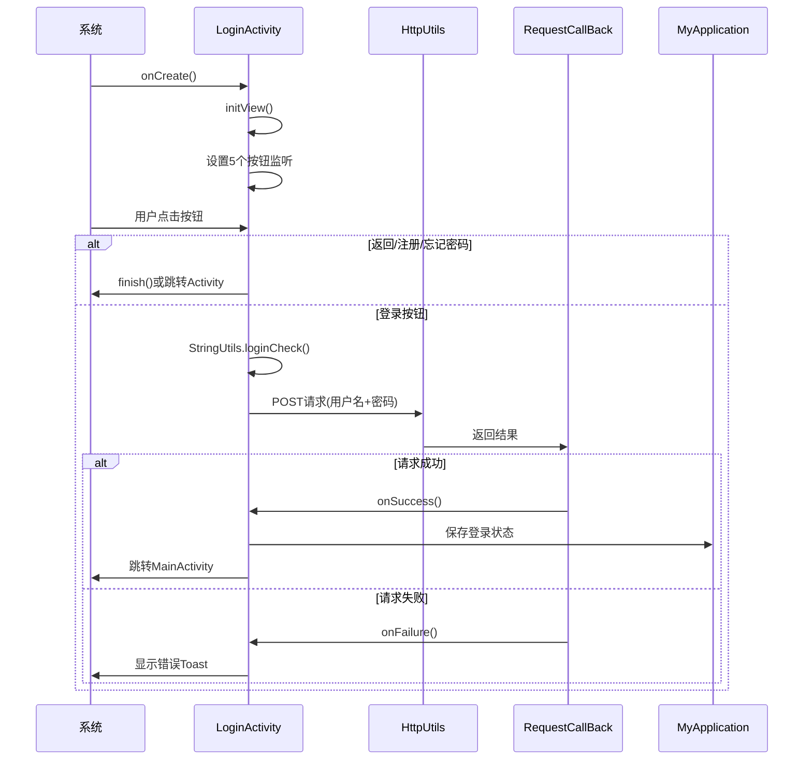

# 基础信息

|      |      |
|------|------|
| 名称 | LoginActivity |
| 编码语言 | .java |
| 代码路径 | happycat/src/com/happycat/LoginActivity.java |
| 包名 | com.happycat |
| 依赖项 | ['java.lang.reflect.Type', 'java.util.ArrayList', 'java.util.List', 'android.R.string', 'android.app.Activity', 'android.content.Intent', 'android.content.SharedPreferences', 'android.os.Bundle', 'android.util.Log', 'android.view.View', 'android.view.View.OnClickListener', 'android.widget.Button', 'android.widget.EditText', 'android.widget.Toast', 'com.example.happucat.R', 'com.google.gson.Gson', 'com.google.gson.reflect.TypeToken', 'com.happycat.Bean.User', 'com.happycat.Bean.goodsclassify', 'com.happycat.global.GlobalContacts', 'com.happycat.util.ActivitiyUtils', 'com.happycat.util.MyApplication', 'com.happycat.util.StringUtils', 'com.lidroid.xutils.HttpUtils', 'com.lidroid.xutils.exception.HttpException', 'com.lidroid.xutils.http.RequestParams', 'com.lidroid.xutils.http.ResponseInfo', 'com.lidroid.xutils.http.callback.RequestCallBack', 'com.lidroid.xutils.http.client.HttpRequest.HttpMethod'] |
| 概述说明 | 登录活动类，实现点击事件，包含手机号和密码输入框，处理返回、注册、忘记密码和登录操作。登录时验证用户信息，成功跳转主界面，失败提示错误。 |

# 说明

该代码定义了一个名为LoginActivity的安卓登录界面活动类，继承自Activity并实现了点击监听接口。类中包含用户名、密码输入框及用户列表等成员变量。在onCreate方法中初始化视图并设置标题栏布局，initView方法绑定各UI组件的点击事件。点击事件处理包括返回、注册、忘记密码和登录功能。登录时验证输入有效性，通过HttpUtils发送POST请求到服务器验证用户信息。验证成功后将用户数据保存至MyApplication，跳转到MainActivity并关闭当前界面；失败则提示错误信息。登录过程使用Gson解析服务器返回的JSON数据。

# 类列表 Class Summary

| 名称   | 类型  | 说明 |
|-------|------|-------------|
| LoginActivity | class | 登录页面代码，包含用户输入验证、注册/忘记密码跳转及登录功能，通过HTTP请求验证用户信息，成功登录后跳转至主页面。 |


## 类 LoginActivity

|      |      |
|------|------|
| 访问范围 | public |
| 类型 | class |
| 名称 | LoginActivity |
| 说明 | 登录页面代码，包含用户输入验证、注册/忘记密码跳转及登录功能，通过HTTP请求验证用户信息，成功登录后跳转至主页面。 |


### UML类图

```mermaid
classDiagram
    class LoginActivity {
        -EditText et_phone
        -EditText et_password
        -String username
        -String password
        -int uid
        -SharedPreferences preferences
        -SharedPreferences.Editor editor
        -List~User~ userlist
        +onCreate(Bundle savedInstanceState) void
        -initView() void
        +onClick(View v) void
        -login(String username, String password) void
    }
    <<Interface>> LoginActivity {
        <<OnClickListener>>
    }
    class User {
        // 假设User类有相关属性和方法
    }
    class HttpUtils {
        +send(HttpMethod method, String url, RequestParams params, RequestCallBack~String~ callback) void
    }
    class RequestParams {
        +addQueryStringParameter(String name, String value) void
    }
    class RequestCallBack~T~ {
        <<Interface>>
        +onFailure(HttpException e, String msg) void
        +onSuccess(ResponseInfo~T~ responseInfo) void
    }
    class MyApplication {
        +saveLoginStatus(String status, int uid, String phone, String password, String address) void
        +String myflag
        +int SP_user_id
    }

    LoginActivity --> User : 包含
    LoginActivity --> HttpUtils : 使用
    LoginActivity --> RequestParams : 使用
    LoginActivity --> MyApplication : 使用
    HttpUtils --> RequestCallBack~String~ : 回调
    LoginActivity ..|> OnClickListener : 实现
```

这段代码描述了一个Android登录界面(LoginActivity)的类结构，该类继承Activity并实现点击监听接口。主要功能包括初始化视图、处理按钮点击事件、执行登录验证等。通过HttpUtils发送POST请求到服务器验证用户信息，使用Gson解析返回数据，并通过MyApplication保存登录状态。类图中清晰展示了LoginActivity与User、HttpUtils等辅助类的关系，以及实现的OnClickListener接口。整个流程涉及UI交互、网络请求和数据处理等多个环节。


### 内部方法调用关系图





该流程图展示了Android登录功能的完整处理逻辑。LoginActivity初始化时设置界面元素和点击监听，用户操作触发不同分支：返回/注册类操作直接跳转或关闭页面，登录操作会验证输入后发起网络请求。HTTP请求通过回调处理成功/失败两种情况，成功时保存用户状态并跳转主界面，失败则提示错误。时序图详细描述了从Activity创建到网络请求响应的完整交互过程，突出了关键的状态转换和组件协作。

### 字段列表 Field List

| 名称  | 类型  | 说明 |
|-------|-------|------|
| username | String | 声明一个名为username的字符串变量。 |
| password | String | 声明一个字符串变量password。 |
| et_password | EditText | 定义两个私有EditText变量：et_phone和et_password。 |
| editor | SharedPreferences.Editor | SharedPreferences.Editor用于编辑SharedPreferences数据，提供键值对存储操作。 |
| userlist = new ArrayList<User>() | List<User> | 创建名为userlist的ArrayList，用于存储User对象。 |
| preferences | SharedPreferences | 声明一个SharedPreferences类型的变量preferences。 |
| uid | int | 声明一个整型变量uid。 |

### 方法列表 Method List

| 名称  | 类型  | 说明 |
|-------|-------|------|
| initView | void | 初始化视图组件并设置点击监听器，包括电话输入框、密码输入框、返回按钮、注册按钮、忘记密码和登录按钮。 |
| onCreate | void | Android登录Activity的onCreate方法：调用父类方法、设置布局、初始化标题栏和视图。 |
| onClick | void | 代码实现了一个点击事件处理逻辑，根据点击的按钮ID执行不同操作：返回按钮关闭当前页面；注册和忘记密码按钮跳转对应页面并关闭当前页；登录按钮验证输入后执行登录。 |
| login | void | 登录功能：获取用户名密码，POST请求验证，成功跳转主界面并保存用户信息，失败提示错误。 |


