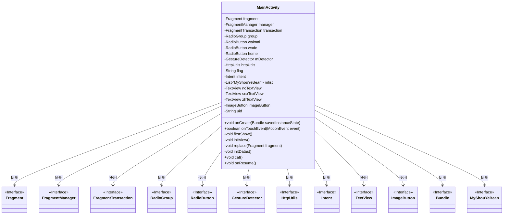
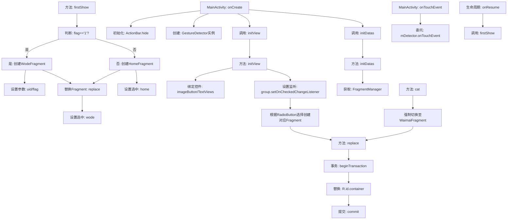
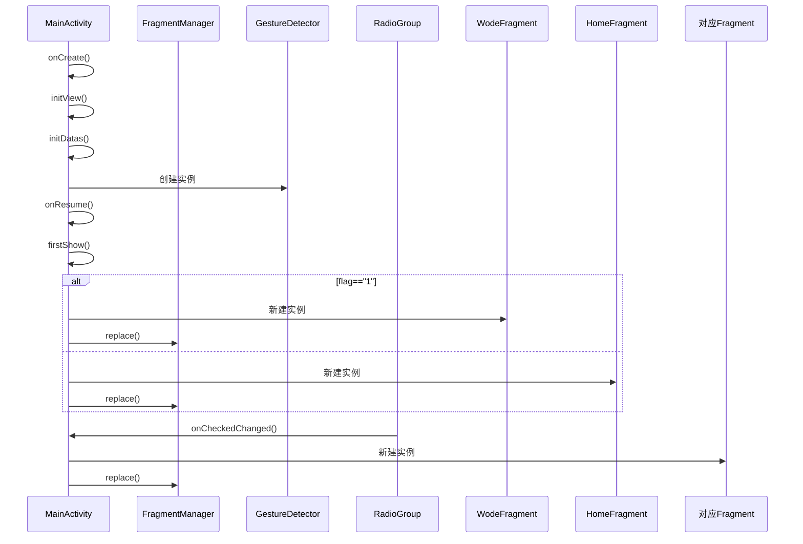

# 基础信息

|      |      |
|------|------|
| 名称 | MainActivity |
| 编码语言 | .java |
| 代码路径 | happycat/src/com/happycat/MainActivity.java |
| 包名 | com.happycat |
| 依赖项 | ['java.util.List', 'com.example.happucat.R', 'com.happycat.Bean.MyShouYeBean', 'com.happycat.global.GlobalContacts', 'com.happycat.util.DanjiUtils', 'com.happycat.util.MyApplication', 'com.happycay.fragments.HomeFragment', 'com.happycay.fragments.WaimaiFragment', 'com.happycay.fragments.WodeFragment', 'com.happycay.fragments.XiaoxiFragment', 'com.lidroid.xutils.HttpUtils', 'android.os.Bundle', 'android.app.ActionBar', 'android.content.Intent', 'android.support.v4.app.Fragment', 'android.support.v4.app.FragmentActivity', 'android.support.v4.app.FragmentManager', 'android.support.v4.app.FragmentTransaction', 'android.util.Log', 'android.view.GestureDetector', 'android.view.MotionEvent', 'android.widget.ImageButton', 'android.widget.RadioButton', 'android.widget.RadioGroup', 'android.widget.RadioGroup.OnCheckedChangeListener', 'android.widget.TextView'] |
| 概述说明 | MainActivity继承FragmentActivity，管理多个Fragment切换，包含底部导航栏和手势检测。根据标志位flag初始化显示不同Fragment，支持动态替换和状态保存。 |

# 说明

该代码描述了一个名为MainActivity的Android FragmentActivity类，主要功能包括：初始化视图组件（如RadioGroup、ImageButton、TextView等），管理多个Fragment（如HomeFragment、WaimaiFragment、WodeFragment等）的切换，处理底部导航栏的点击事件，以及实现手势检测功能。通过Bundle传递用户ID和标志位参数，根据标志位动态显示不同Fragment。还包含Fragment替换逻辑和Activity生命周期管理，如onCreate和onResume方法。整体实现了一个具有底部导航、Fragment动态加载和用户交互功能的主界面。

# 类列表 Class Summary

| 名称   | 类型  | 说明 |
|-------|------|-------------|
| MainActivity | class | MainActivity继承FragmentActivity，管理多个Fragment切换，包含底部导航栏和手势检测，根据标志位显示不同Fragment，支持用户信息传递和界面更新。 |

## 类 MainActivity

|      |      |
|------|------|
| 访问范围 | public |
| 类型 | class |
| 名称 | MainActivity |
| 说明 | MainActivity继承FragmentActivity，管理多个Fragment切换，包含底部导航栏和手势检测，根据标志位显示不同Fragment，支持用户信息传递和界面更新。 |

### UML类图

这段代码描述了一个Android应用的主活动（MainActivity），它继承自FragmentActivity，负责管理多个Fragment的切换和界面交互。MainActivity通过RadioGroup实现底部导航栏功能，根据用户选择加载不同的Fragment（如HomeFragment、WaimaiFragment等）。类图中展示了MainActivity的私有成员变量和公有方法，以及它与Android系统组件（如Fragment、Bundle等）的依赖关系。该活动还处理手势检测、数据初始化和生命周期回调，整体结构体现了典型的Android多Fragment架构模式。

### 内部方法调用关系图

流程图描述：该流程图描述了Android MainActivity的核心逻辑，包含初始化视图和数据、手势检测处理、根据标志位动态加载不同Fragment的流程。重点展示了firstShow()的分支判断逻辑，以及RadioGroup切换Fragment的交互过程，同时体现了Fragment事务管理的标准操作模式。时序图则补充展示了各组件间的调用顺序和条件分支。

### 字段列表 Field List

| 名称  | 类型  | 说明 |
|-------|-------|------|
| mDetector | GestureDetector | 声明一个手势检测器对象mDetector。 |
| httpUtils | HttpUtils | 声明一个HttpUtils类型的变量httpUtils。 |
| home | RadioButton | 单选按钮选项：外卖、我的、首页 |
| group | RadioGroup | 单选按钮组组件，用于创建一组互斥的单选选项。 |
| flag | String | 声明一个字符串变量flag。 |
| imageButton | ImageButton | 图像按钮控件。 |
| transaction | FragmentTransaction | 定义Fragment事务对象transaction。 |
| fragment | Fragment | 片段对象。 |
| zhTextView | TextView | 定义三个文本视图变量：ncTextView、sexTextView、zhTextView。 |
| mlist | List<MyShouYeBean> | 定义了一个名为mlist的列表变量，类型为MyShouYeBean。 |
| uid=MyApplication.SP_user_id+"" | String | 代码片段定义字符串变量uid，值为应用全局变量SP_user_id转为字符串。 |
| intent | Intent | 声明一个名为intent的Intent类型变量。 |
| manager | FragmentManager | Fragment管理器实例声明。 |

### 方法列表 Method List

| 名称  | 类型  | 说明 |
|-------|-------|------|
| initDatas | void | 初始化数据方法，获取FragmentManager支持。 |
| onResume | void | 重写onResume方法，先调用firstShow()，再执行父类onResume()。 |
| onTouchEvent | boolean | Android触摸事件处理方法，调用mDetector处理触摸事件并返回结果。 |
| initView | void | 初始化视图组件，包括按钮和文本控件，设置底部导航栏切换监听，根据选中项切换对应Fragment。 |
| replace | void | 替换Fragment方法：开启事务，替换容器内Fragment，提交事务。 |
| firstShow | void | 方法firstShow检查MyApplication.myflag，若为1则跳转WodeFragment并传参uid和flag，否则跳转HomeFragment。执行后更新界面选中状态。 |
| cat | void | 代码片段功能：创建外卖Fragment，替换当前视图，并设置外卖选项为选中状态。 |
| onCreate | void | Android Activity初始化代码：隐藏标题栏、设置布局、初始化手势检测器及视图数据。 |

