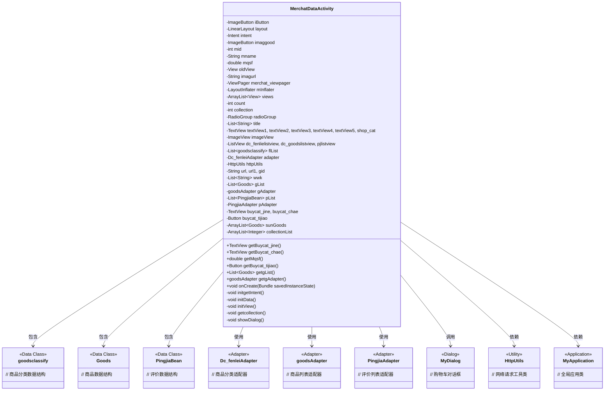
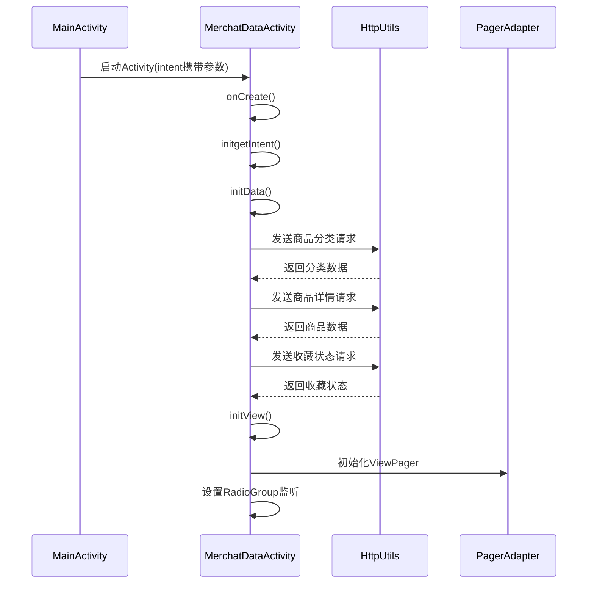

# 基础信息

|      |      |
|------|------|
| 名称 | MerchatDataActivity |
| 编码语言 | .java |
| 代码路径 | happycat/src/com/happycat/MerchatDataActivity.java |
| 包名 | com.happycat |
| 依赖项 | ['java.lang.reflect.Type', 'java.util.ArrayList', 'java.util.List', 'com.example.happucat.R', 'com.google.gson.Gson', 'com.google.gson.reflect.TypeToken', 'com.happycat.Bean.CountDto', 'com.happycat.Bean.Goods', 'com.happycat.Bean.MerchatBean', 'com.happycat.Bean.PingjiaBean', 'com.happycat.Bean.goodsclassify', 'com.happycat.adapter.Dc_fenleiAdapter', 'com.happycat.adapter.DingDan_indentAdapter', 'com.happycat.adapter.PingjiaAdapter', 'com.happycat.adapter.goodsAdapter', 'com.happycat.global.GlobalContacts', 'com.happycat.util.MyApplication', 'com.lidroid.xutils.HttpUtils', 'com.lidroid.xutils.exception.HttpException', 'com.lidroid.xutils.http.RequestParams', 'com.lidroid.xutils.http.ResponseInfo', 'com.lidroid.xutils.http.callback.RequestCallBack', 'com.lidroid.xutils.http.client.HttpRequest.HttpMethod', 'android.R.integer', 'android.annotation.SuppressLint', 'android.app.Activity', 'android.app.AlertDialog', 'android.content.DialogInterface', 'android.content.Intent', 'android.os.Bundle', 'android.support.v4.view.PagerAdapter', 'android.support.v4.view.ViewPager', 'android.support.v4.view.ViewPager.OnPageChangeListener', 'android.util.Log', 'android.view.LayoutInflater', 'android.view.View', 'android.view.View.OnClickListener', 'android.view.Window', 'android.widget.AdapterView', 'android.widget.AdapterView.OnItemClickListener', 'android.widget.RadioGroup.OnCheckedChangeListener', 'android.widget.Button', 'android.widget.ImageButton', 'android.widget.ImageView', 'android.widget.LinearLayout', 'android.widget.ListView', 'android.widget.RadioGroup', 'android.widget.TextView', 'android.widget.Toast'] |
| 概述说明 | MerchatDataActivity是一个商家数据展示页面，包含商品分类、商品列表、评价和购物车功能，支持ViewPager切换视图，通过HTTP请求获取数据并处理用户交互。 |

# 说明

MerchatDataActivity是一个Android商家数据展示页面，主要功能包括商家信息展示、商品分类浏览、购物车管理和用户评价查看。页面采用ViewPager实现订餐和评价双标签页切换，顶部显示商家名称、配送费、起送价等基本信息。订餐页包含商品分类列表和对应商品列表，支持分类切换和购物车功能，可计算订单金额并校验起送价。评价页展示用户评论列表。页面通过HTTP请求获取商家商品分类、商品详情和评价数据，使用Gson解析JSON数据。购物车功能支持商品增减、金额计算和订单提交，通过自定义Dialog展示购物车内容。页面还包含返回按钮和收藏功能逻辑（部分代码被注释）。整体采用MVC架构，通过适配器绑定数据到ListView实现动态展示。

# 类列表 Class Summary

| 名称   | 类型  | 说明 |
|-------|------|-------------|
| MerchatDataActivity | class | MerchatDataActivity是一个商家详情页，包含商品分类、商品列表、评价、购物车功能，支持分类切换、商品收藏、订单提交及购物车管理。 |


## 类 MerchatDataActivity

|      |      |
|------|------|
| 访问范围 | @SuppressLint("InflateParams");public |
| 类型 | class |
| 名称 | MerchatDataActivity |
| 说明 | MerchatDataActivity是一个商家详情页，包含商品分类、商品列表、评价、购物车功能，支持分类切换、商品收藏、订单提交及购物车管理。 |


### UML类图



这段代码描述了一个Android商详页Activity，主要功能包括：1) 展示商家基本信息；2) 通过ViewPager实现"订餐/评价"双页签切换；3) 商品分类列表联动商品列表展示；4) 购物车功能实现；5) 网络数据加载与JSON解析。类图清晰展示了核心数据类(goodsclassify/Goods/PingjiaBean)、适配器类(Dc_fenleiAdapter/goodsAdapter/PingjiaAdapter)与工具类(HttpUtils/MyApplication)之间的关联关系，整体采用MVC架构模式，通过多个ListView展示分层数据，并包含完整的购物车业务逻辑。


### 内部方法调用关系图

```mermaid
graph TD
    A["MerchatDataActivity"]
    B["属性: ImageButton iButton"]
    C["属性: LinearLayout layout"]
    D["属性: Intent intent"]
    E["属性: ViewPager merchat_viewpager"]
    F["方法: onCreate"]
    G["方法: initgetIntent"]
    H["方法: initData"]
    I["方法: initView"]
    J["方法: showDialog"]
    K["方法: getcollection"]
    L["内部类: PagerAdapter实现"]

    A --> B
    A --> C
    A --> D
    A --> E
    A --> F
    F --> G
    F --> H
    F --> I
    H --> K
    H --> J
    I --> L
    H -.->|HTTP请求| "HttpUtils"
    K -.->|HTTP请求| "HttpUtils"
```



流程图展示了MerchatDataActivity的核心结构和调用关系，包含4个主要属性和6个关键方法。类通过HttpUtils进行网络通信获取商品数据，使用PagerAdapter管理ViewPager页面，并通过RadioGroup实现页面切换功能。时序图详细描述了从Activity启动到数据加载的完整过程，包括3次网络请求和界面初始化的时序关系，重点突出了数据加载和界面渲染的先后依赖关系。

### 字段列表 Field List

| 名称  | 类型  | 说明 |
|-------|-------|------|
| buycat_chae | TextView | 购买猫的金额和差价信息。 |
| flList = new ArrayList<goodsclassify>() | List<goodsclassify> | 创建一个存储商品分类的列表对象flList。 |
| shop_cat | TextView | 
定义了6个TextView控件，包括textView1到5和shop_cat。 |
| collection | int | 私有整型变量count和collection。 |
| mInflater | LayoutInflater | 声明私有布局填充器变量mInflater。 |
| pjlistview | ListView | 列表视图组件包含dc_fenlielistview、dc_goodslistview和pjlistview三个部分。 |
| mid = 1 | int | 定义整型变量mid并初始化为1。 |
| iButton | ImageButton | 图像按钮iButton |
| views | ArrayList<View> | 私有视图列表变量views，类型为ArrayList。 |
| gAdapter | goodsAdapter | 定义了一个名为gAdapter的goodsAdapter类型变量。 |
| title = new ArrayList<String>() | List<String> | 创建一个名为title的字符串类型ArrayList对象。 |
| mqsf | double | 声明双精度浮点变量mqsf。 |
| gList = new ArrayList<Goods>() | List<Goods> | 创建了一个存储Goods类型对象的动态数组gList。 |
| mname | String | 声明一个名为mname的字符串变量。 |
| pAdapter | PingjiaAdapter | 定义PingjiaAdapter类型的变量pAdapter。 |
| imagurl = "http://" + MyApplication.getIp()			+ ":8080/happycat/upimage/" | String | 代码片段定义字符串变量imagurl，拼接基础URL与动态IP地址，指向happycat服务的图片上传路径。 |
| oldView = null | View | 声明一个名为oldView的视图变量并初始化为null。 |
| adapter | Dc_fenleiAdapter | Dc_fenleiAdapter适配器实例化声明。 |
| httpUtils | HttpUtils | 声明一个HttpUtils类型的变量httpUtils。 |
| collectionList | ArrayList<Integer> | 保护型整数数组列表collectionList。 |
| radioGroup | RadioGroup | 定义了一个名为radioGroup的单选按钮组变量。 |
| layout | LinearLayout | 线性布局容器，用于水平或垂直排列子视图。 |
| buycat_tijiao | Button | 按钮：提交购买猫的请求 |
| wwk | List<String> | 私有字符串列表变量wwk。 |
| imageView | ImageView | 图片视图控件。 |
| intent | Intent | 定义意图变量intent。 |
| pList = new ArrayList<PingjiaBean>() | List<PingjiaBean> | 创建存储评价对象的动态数组。 |
| merchat_viewpager | ViewPager | 私有视图分页组件merchat_viewpager |
| gid | String | 变量声明：字符串类型的url、url1和gid。 |
| sunGoods | ArrayList<Goods> | 私有商品列表sunGoods，类型为ArrayList，存储Goods对象。 |
| imaggood | ImageButton | 图片按钮（imaggood） |

### 方法列表 Method List

| 名称  | 类型  | 说明 |
|-------|-------|------|
| showDialog | void | 方法showDialog筛选gList中gnum大于0的元素加入sunGoods，创建并显示MyDialog对话框。 |
| getBuycat_tijiao | Button | 获取buycat_tijiao按钮实例的方法。 |
| getgList | List<Goods> | 获取商品列表的方法，返回gList集合。 |
| getgAdapter | goodsAdapter | 获取公共物品适配器的方法，返回gAdapter实例。 |
| getBuycat_jine | TextView | 获取buycat_jine的TextView对象。 |
| getMqsf | double | 这是一个Java方法，返回名为mqsf的double类型变量值。 |
| getBuycat_chae | TextView | 获取buycat_chae的TextView对象。 |
| onCreate | void | Android Activity初始化代码：设置无标题窗口、加载布局、初始化数据视图，并为图片按钮添加点击关闭事件。 |
| initgetIntent | void | 方法initgetIntent从Intent获取数据并初始化UI，包括商家ID、名称、配送费、平均速度、起送价、图片和营业时间，设置对应TextView和ImageView显示内容。 |
| initData | void | 初始化商家数据，包括商品列表、评价、购物车功能，实现页面切换和分类展示，处理网络请求获取商品和评价信息。 |
| getcollection | void | 该方法通过HTTP POST请求获取用户收藏列表。拼接URL后，使用Gson将收藏商品ID列表转为JSON参数发送。成功响应后解析返回数据并更新适配器显示。失败时无处理。 |
| initView | void | 初始化视图方法，设置ViewPager适配器，处理页面数量、视图绑定、页面销毁与创建，并返回页面标题。 |


