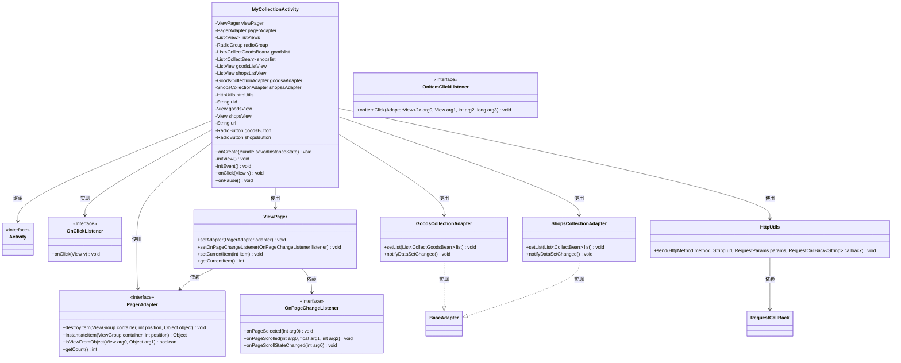
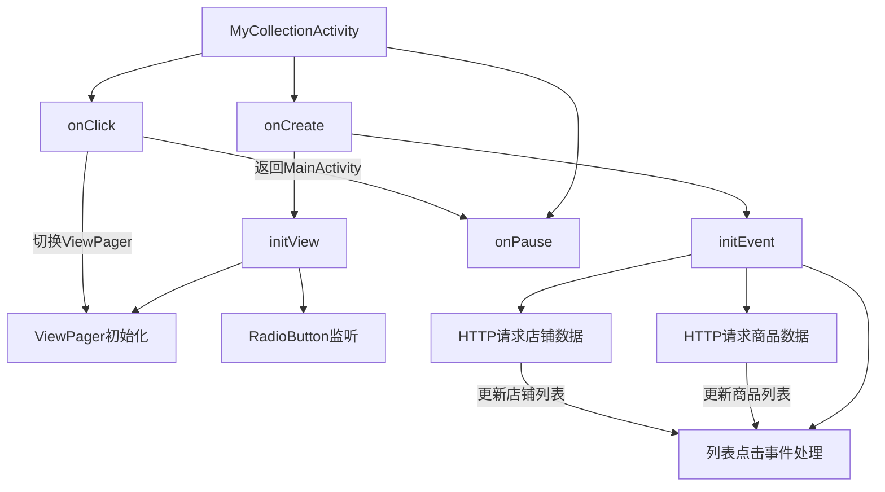

# 基础信息

|      |      |
|------|------|
| 名称 | MyCollectionActivity |
| 编码语言 | .java |
| 代码路径 | happycat/src/com/happycat/MyCollectionActivity.java |
| 包名 | com.happycat |
| 依赖项 | ['java.lang.reflect.Type', 'java.util.ArrayList', 'java.util.List', 'com.example.happucat.R', 'com.google.gson.Gson', 'com.google.gson.reflect.TypeToken', 'com.happycat.Bean.CollectBean', 'com.happycat.Bean.CollectGoodsBean', 'com.happycat.adapter.GoodsCollectionAdapter', 'com.happycat.adapter.ShopsCollectionAdapter', 'com.happycat.util.ActivitiyUtils', 'com.happycat.util.MyApplication', 'com.happycat.util.StringUtils', 'com.lidroid.xutils.HttpUtils', 'com.lidroid.xutils.exception.HttpException', 'com.lidroid.xutils.http.RequestParams', 'com.lidroid.xutils.http.ResponseInfo', 'com.lidroid.xutils.http.callback.RequestCallBack', 'com.lidroid.xutils.http.client.HttpRequest.HttpMethod', 'android.R.integer', 'android.app.Activity', 'android.content.Intent', 'android.os.Bundle', 'android.support.v4.view.PagerAdapter', 'android.support.v4.view.ViewPager', 'android.support.v4.view.ViewPager.OnPageChangeListener', 'android.util.Log', 'android.view.LayoutInflater', 'android.view.View', 'android.view.ViewGroup', 'android.view.View.OnClickListener', 'android.widget.AdapterView', 'android.widget.AdapterView.OnItemClickListener', 'android.widget.ListView', 'android.widget.RadioButton', 'android.widget.RadioGroup', 'android.widget.TextView'] |
| 概述说明 | MyCollectionActivity是一个Android收藏页面，包含商品和店铺两个标签页，使用ViewPager切换，通过HTTP请求获取数据并展示列表，点击可跳转详情页。 |

# 说明

该代码描述了一个Android应用中的收藏功能活动类MyCollectionActivity。活动包含商品和店铺两个收藏页面，使用ViewPager实现滑动切换，并通过RadioButton进行页面导航。商品和店铺数据分别通过HTTP请求从服务器获取，使用Gson解析JSON数据并展示在ListView中。点击商品或店铺项会跳转到详情页，点击返回按钮则回到主界面。代码还实现了页面滑动与RadioButton状态的同步，以及网络请求失败的处理逻辑。

# 类列表 Class Summary

| 名称   | 类型  | 说明 |
|-------|------|-------------|
| MyCollectionActivity | class | MyCollectionActivity是一个商品和店铺收藏页面，包含ViewPager切换展示商品和店铺列表，支持点击跳转详情页，通过HTTP请求获取数据并更新UI。 |

## 类 MyCollectionActivity

|      |      |
|------|------|
| 访问范围 | public |
| 类型 | class |
| 名称 | MyCollectionActivity |
| 说明 | MyCollectionActivity是一个商品和店铺收藏页面，包含ViewPager切换展示商品和店铺列表，支持点击跳转详情页，通过HTTP请求获取数据并更新UI。 |

### UML类图

这段代码展示了一个Android活动类`MyCollectionActivity`，它管理商品和店铺的收藏功能。该类继承自`Activity`并实现了`OnClickListener`接口，通过`ViewPager`展示两个标签页（商品和店铺），使用自定义适配器`GoodsCollectionAdapter`和`ShopsCollectionAdapter`显示数据。网络请求通过`HttpUtils`处理，支持点击事件和页面切换监听。整体实现了收藏数据的获取、展示和交互功能，结构清晰但存在一些冗余代码。

### 内部方法调用关系图

这段代码是Android平台下的收藏功能实现类，主要包含商品和店铺两个收藏页面的管理。通过ViewPager实现页面滑动切换，使用RadioButton作为导航标签。核心流程包括：初始化视图组件、设置网络请求回调、处理列表点击事件以及页面状态管理。代码采用XUtils框架进行网络通信，Gson解析JSON数据，并实现了完整的收藏数据加载-展示-跳转链路。特别注意处理了两种不同的收藏数据类型（商品/店铺）以及它们的适配器更新逻辑。

### 字段列表 Field List

| 名称  | 类型  | 说明 |
|-------|-------|------|
| shopsButton | RadioButton | 单选按钮组件，包含商品按钮和店铺按钮两个选项。 |
| url = "http://" + MyApplication.getIp() + ":8080/happycat/GetUpload" | String | 代码拼接URL：使用应用IP和端口8080，路径为/happycat/GetUpload。 |
| goodslist | List<CollectGoodsBean> | 这是一个商品列表变量，类型为List<CollectGoodsBean>，用于存储商品数据集合。 |
| shopslist | List<CollectBean> | 这是一个名为shopslist的列表，存储CollectBean类型的数据。 |
| listViews = new ArrayList<View>() | List<View> | 创建存储View对象的动态数组listViews。 |
| pagerAdapter | PagerAdapter | 定义了一个PagerAdapter类型的变量pagerAdapter。 |
| goodsaAdapter | GoodsCollectionAdapter | 定义GoodsCollectionAdapter类型的变量goodsaAdapter。 |
| radioGroup | RadioGroup | 定义了一个名为radioGroup的单选按钮组变量。 |
| viewPager | ViewPager | 声明一个ViewPager控件变量viewPager。 |
| uid = MyApplication.SP_user_id + "" | String | 代码片段定义字符串变量uid，值为应用用户ID转字符串。 |
| shopsaAdapter | ShopsCollectionAdapter | 定义了一个名为shopsaAdapter的ShopsCollectionAdapter类型变量。 |
| goodsView | View | 私有视图对象goodsView。 |
| shopsListView | ListView | 定义了两个列表视图组件：goodsListView和shopsListView。 |
| httpUtils | HttpUtils | 声明一个HttpUtils类型的变量httpUtils。 |
| shopsView | View | 私有视图变量shopsView。 |

### 方法列表 Method List

| 名称  | 类型  | 说明 |
|-------|-------|------|
| onPause | void | 

代码重写onPause方法，调用父类方法后设置MyApplication.myflag为"1"。 |
| onCreate | void | 重写onCreate方法，初始化布局、标题栏、视图和事件。 |
| onClick | void | 点击事件处理：根据视图ID切换页面或返回主页。点击商品收藏切到第一页，店铺收藏切到第二页，返回按钮跳转至主页并结束当前活动。 |
| initView | void | 初始化视图，设置按钮点击监听，配置ViewPager适配器，管理商品和店铺页面切换。 |
| initEvent | void | 初始化商品和店铺收藏界面，设置点击事件，通过HTTP请求获取数据并展示，支持页面切换。 |

