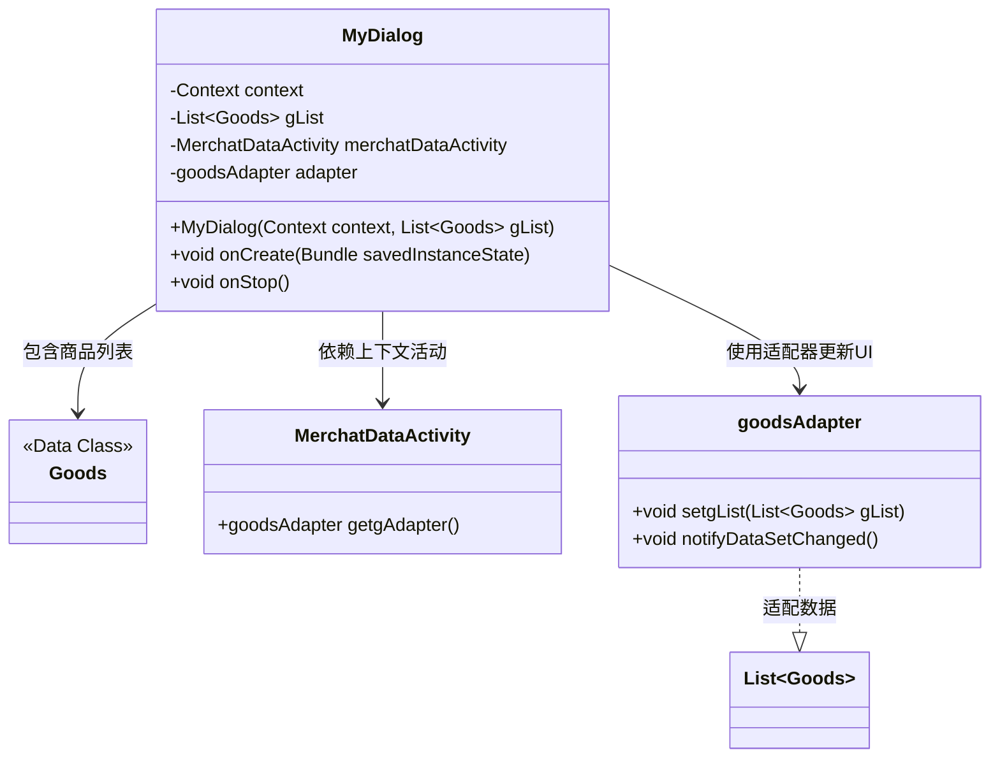

# 基础信息

|      |      |
|------|------|
| 名称 | MyDialog |
| 编码语言 | .java |
| 代码路径 | happycat/src/com/happycat/MyDialog.java |
| 包名 | com.happycat |
| 依赖项 | ['java.util.List', 'com.example.happucat.R', 'com.happycat.Bean.Goods', 'com.happycat.adapter.goodsAdapter', 'android.annotation.SuppressLint', 'android.app.Dialog', 'android.content.Context', 'android.os.Bundle', 'android.view.LayoutInflater', 'android.view.View', 'android.widget.ListView'] |
| 概述说明 | 自定义对话框类MyDialog，继承Dialog，用于显示购物车商品列表。构造函数接收上下文和商品列表，初始化适配器。onCreate中设置标题、布局和列表适配器。onStop时通知适配器更新。 |

# 说明

该代码定义了一个名为MyDialog的自定义对话框类，继承自Dialog类。主要功能是显示购物车商品列表。构造函数接收上下文和商品列表参数，并将上下文转换为MerchatDataActivity类型以获取适配器。在onCreate方法中设置对话框标题为"购物车"，通过布局填充器加载shopcat_alterdialog布局文件，初始化ListView并设置自定义goodsAdapter适配器来显示商品数据。当对话框停止时，会调用notifyDataSetChanged方法刷新适配器数据。整个类实现了购物车对话框的基本显示和更新功能。

# 类列表 Class Summary

| 名称   | 类型  | 说明 |
|-------|------|-------------|
| MyDialog | class | 自定义对话框类MyDialog，继承Dialog，用于显示购物车列表。构造函数接收上下文和商品列表，初始化适配器。onCreate中设置标题、布局和列表适配器。onStop时刷新适配器数据。 |

## 类 MyDialog

|      |      |
|------|------|
| 访问范围 | @SuppressLint("InflateParams");public |
| 类型 | class |
| 名称 | MyDialog |
| 说明 | 自定义对话框类MyDialog，继承Dialog，用于显示购物车列表。构造函数接收上下文和商品列表，初始化适配器。onCreate中设置标题、布局和列表适配器。onStop时刷新适配器数据。 |

### UML类图

这段代码展示了一个自定义对话框`MyDialog`的实现，主要用于显示购物车商品列表。类图中包含四个主要部分：`MyDialog`作为核心组件，管理商品数据列表`Goods`，依赖`MerchatDataActivity`获取上下文和适配器，并通过`goodsAdapter`实现列表数据的绑定与更新。对话框在`onCreate`时初始化视图，在`onStop`时触发数据刷新，体现了典型的Android对话框与列表视图的交互模式。

### 内部方法调用关系图

```mermaid
graph TD
    A["类MyDialog extends Dialog"]
    B["属性: Context context"]
    C["属性: List<Goods> gList"]
    D["属性: MerchatDataActivity merchatDataActivity"]
    E["属性: goodsAdapter adapter"]
    F["构造方法: MyDialog(Context context, List<Goods> gList)"]
    G["重写方法: onCreate(Bundle savedInstanceState)"]
    H["重写方法: onStop()"]
    I["初始化: this.context = context"]
    J["初始化: this.gList = gList"]
    K["类型转换: merchatDataActivity = (MerchatDataActivity)context"]
    L["获取适配器: adapter = merchatDataActivity.getgAdapter()"]
    M["调用父类构造: super(context)"]
    N["设置标题: setTitle('购物车')"]
    O["布局填充: LayoutInflater.from(context)"]
    P["加载视图: inflate(R.layout.shopcat_alterdialog, null)"]
    Q["获取ListView: findViewById(R.id.dingdan_deta)"]
    R["创建适配器: goodsAdapter sAdapter"]
    S["设置数据: sAdapter.setgList(gList)"]
    T["绑定适配器: catListView.setAdapter(sAdapter)"]
    U["设置内容视图: setContentView(view)"]
    V["通知数据更新: adapter.notifyDataSetChanged()"]
    W["调用父类方法: super.onCreate()"]
    X["调用父类方法: super.onStop()"]

    A --> B
    A --> C
    A --> D
    A --> E
    A --> F
    A --> G
    A --> H
    F --> I
    F --> J
    F --> K
    F --> L
    F --> M
    G --> W
    G --> N
    G --> O
    O --> P
    G --> Q
    G --> R
    R --> S
    G --> T
    G --> U
    H --> X
    H --> V
```

这段代码实现了一个自定义对话框MyDialog，继承自Android的Dialog类。主要功能包括：通过构造函数初始化上下文和商品列表，在onCreate中创建购物车界面并绑定适配器，在onStop时通知数据更新。流程图清晰展示了从构造初始化、视图创建到数据绑定的完整生命周期，特别突出了与MerchatDataActivity的交互及适配器的双重管理机制（既有Activity的适配器引用，又新建了对话框专用适配器）。

### 字段列表 Field List

| 名称  | 类型  | 说明 |
|-------|-------|------|
| gList | List<Goods> | 定义了一个商品列表变量gList。 |
| adapter | goodsAdapter | 定义了一个名为goodsAdapter的适配器变量。 |
| context | Context | Context context; 表示声明一个Context类型的变量context，用于存储上下文信息。 |
| merchatDataActivity | MerchatDataActivity | MerchatDataActivity是一个商户数据活动对象。 |

### 方法列表 Method List

| 名称  | 类型  | 说明 |
|-------|-------|------|
| onCreate | void | Android Activity创建时初始化购物车界面，设置标题，加载布局，绑定ListView并适配商品数据。 |
| onStop | void | 重写onStop方法，调用父类方法并通知适配器数据变更。 |

