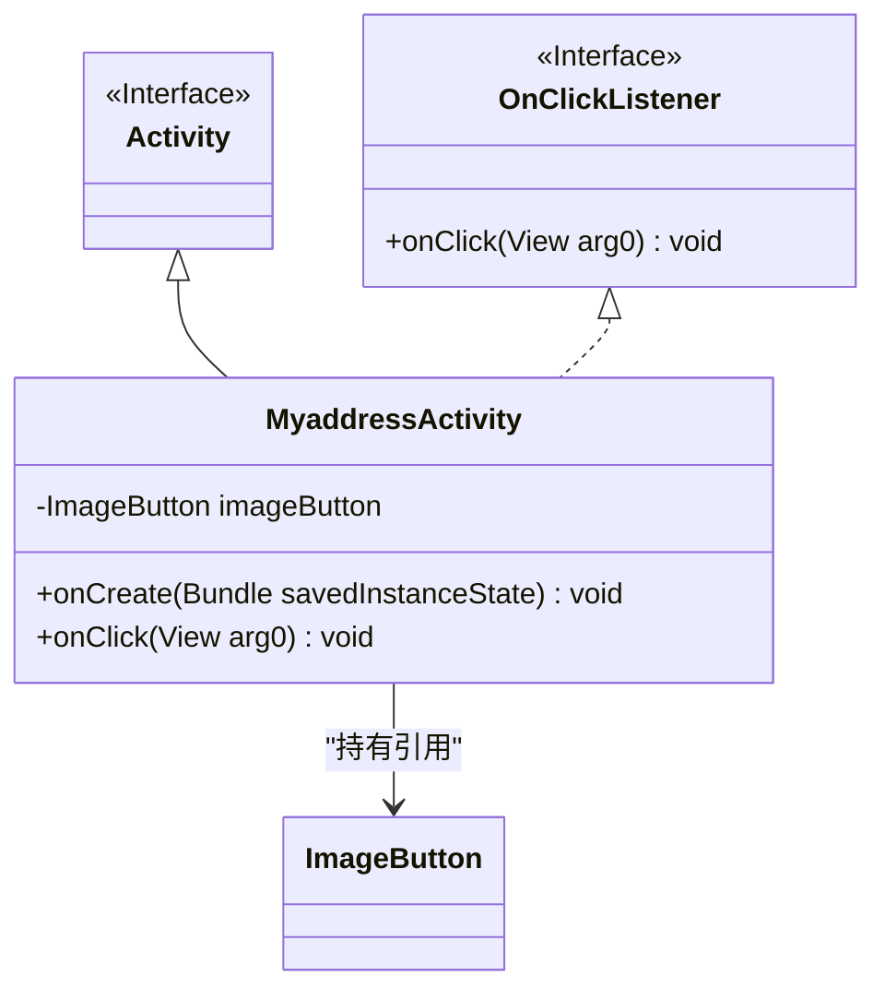
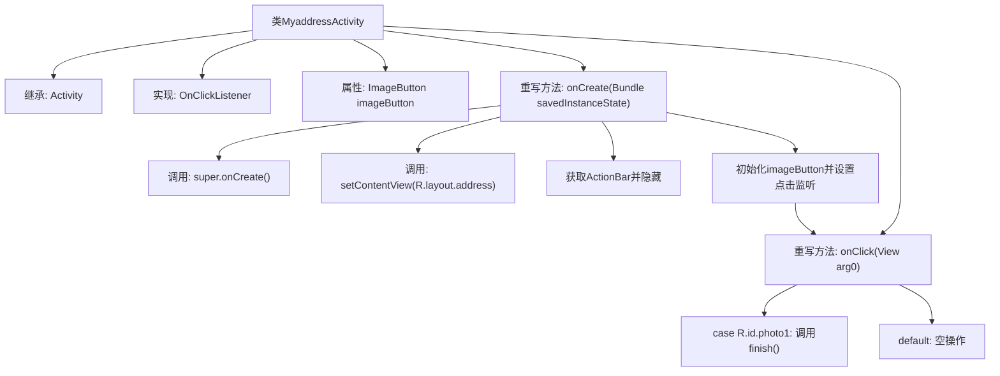

# 基础信息

|      |      |
|------|------|
| 名称 | MyaddressActivity |
| 编码语言 | .java |
| 代码路径 | happycat/src/com/happycat/MyaddressActivity.java |
| 包名 | com.happycat |
| 依赖项 | ['com.example.happucat.R', 'com.example.happucat.R.id', 'com.example.happucat.R.layout', 'android.os.Bundle', 'android.app.ActionBar', 'android.app.Activity', 'android.view.Menu', 'android.view.View', 'android.view.View.OnClickListener', 'android.widget.ImageButton'] |
| 概述说明 | MyaddressActivity继承Activity并实现点击监听，隐藏标题栏，设置ImageButton点击事件，点击后关闭当前界面。 |

# 说明

这段代码描述了一个名为MyaddressActivity的Android活动类，继承自Activity并实现了OnClickListener接口。该类包含一个ImageButton控件，在onCreate方法中初始化界面布局，隐藏了标题栏，并为imageButton设置了点击监听器。当点击imageButton时，会触发onClick方法，执行finish()关闭当前活动。整个类主要实现了简单的界面交互功能。

# 类列表 Class Summary

| 名称   | 类型  | 说明 |
|-------|------|-------------|
| MyaddressActivity | class | MyaddressActivity继承Activity并实现点击监听，隐藏标题栏，设置ImageButton点击事件，点击后关闭当前界面。 |

## 类 MyaddressActivity

|      |      |
|------|------|
| 访问范围 | public |
| 类型 | class |
| 名称 | MyaddressActivity |
| 说明 | MyaddressActivity继承Activity并实现点击监听，隐藏标题栏，设置ImageButton点击事件，点击后关闭当前界面。 |

### UML类图

类图描述：该图展示了一个Android活动类`MyaddressActivity`，它继承自`Activity`基类并实现了`OnClickListener`接口。类中包含一个私有`ImageButton`成员，通过`onCreate`方法初始化界面并设置点击监听器，`onClick`方法处理按钮点击事件。箭头表示继承、实现和依赖关系，清晰地呈现了组件间的交互结构。

### 内部方法调用关系图

这段代码展示了一个Android Activity类MyaddressActivity，主要功能是初始化界面并处理图片按钮点击事件。流程图清晰呈现了从Activity继承、接口实现到具体方法调用的完整逻辑链，包括界面初始化时隐藏ActionBar、绑定视图组件、设置点击监听器，以及点击事件触发后的页面关闭操作。核心交互是通过imageButton的点击监听触发finish()方法关闭当前Activity。

### 字段列表 Field List

| 名称  | 类型  | 说明 |
|-------|-------|------|
| imageButton | ImageButton | 图片按钮控件。 |

### 方法列表 Method List

| 名称  | 类型  | 说明 |
|-------|-------|------|
| onCreate | void | Android代码：隐藏标题栏，设置布局，绑定图片按钮点击事件。 |
| onClick | void | Android点击事件处理：当点击photo1时关闭当前活动，其他情况默认无操作。 |

