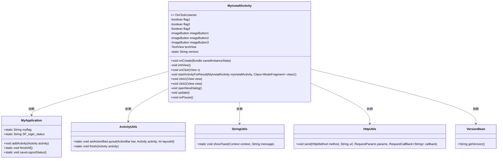
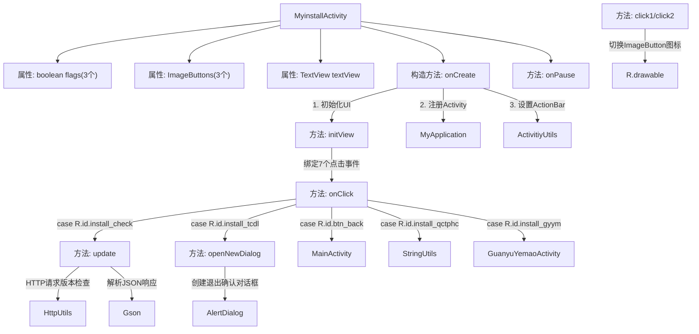

# 基础信息

|      |      |
|------|------|
| 名称 | MyinstallActivity |
| 编码语言 | .java |
| 代码路径 | happycat/src/com/happycat/MyinstallActivity.java |
| 包名 | com.happycat |
| 依赖项 | ['java.lang.reflect.Type', 'java.util.ArrayList', 'com.aps.v', 'com.example.happucat.R', 'com.google.gson.Gson', 'com.google.gson.reflect.TypeToken', 'com.happycat.Bean.User', 'com.happycat.Bean.VersionBean', 'com.happycat.global.GlobalContacts', 'com.happycat.util.ActivitiyUtils', 'com.happycat.util.MyApplication', 'com.happycat.util.StringUtils', 'com.happycay.fragments.WodeFragment', 'com.lidroid.xutils.HttpUtils', 'com.lidroid.xutils.exception.HttpException', 'com.lidroid.xutils.http.RequestParams', 'com.lidroid.xutils.http.ResponseInfo', 'com.lidroid.xutils.http.callback.RequestCallBack', 'com.lidroid.xutils.http.client.HttpRequest.HttpMethod', 'android.R.string', 'android.app.Activity', 'android.app.AlertDialog', 'android.content.DialogInterface', 'android.content.Intent', 'android.os.Bundle', 'android.view.View', 'android.view.View.OnClickListener', 'android.widget.ImageButton', 'android.widget.TextView'] |
| 概述说明 | MyinstallActivity是一个Android设置界面，包含流量模式切换、定位开关、版本检查、清除缓存、关于页面和退出登录功能，通过按钮点击和网络请求实现交互。 |

# 说明

MyinstallActivity是一个Android活动类，实现了点击监听接口。它包含三个布尔标志和三个图片按钮，用于控制非WiFi省流量模式和自动定位功能的图标切换。活动初始化时设置布局，绑定多个视图的点击事件。点击事件处理包括返回主界面、检查版本更新、清除图片缓存、查看关于信息和退出账号等功能。退出账号时会弹出确认对话框。版本更新通过HTTP请求与服务器比对版本号。活动暂停时会更新应用状态标志。类中还包含未实现的startActivityForResult方法和辅助方法如openNewDialog和update。

# 类列表 Class Summary

| 名称   | 类型  | 说明 |
|-------|------|-------------|
| MyinstallActivity | class | MyinstallActivity是一个Android活动类，实现点击监听器。包含初始化视图、处理按钮点击事件（返回、版本检查、清除缓存、关于应用、退出账号）、图标切换功能，以及版本更新检查和退出确认对话框。 |

## 类 MyinstallActivity

|      |      |
|------|------|
| 访问范围 | public |
| 类型 | class |
| 名称 | MyinstallActivity |
| 说明 | MyinstallActivity是一个Android活动类，实现点击监听器。包含初始化视图、处理按钮点击事件（返回、版本检查、清除缓存、关于应用、退出账号）、图标切换功能，以及版本更新检查和退出确认对话框。 |

### UML类图

这段代码展示了一个Android活动类`MyinstallActivity`，它实现了`OnClickListener`接口，用于处理用户界面交互。类中包含多个私有和公有方法，用于初始化视图、处理点击事件、更新版本信息、显示对话框等。`MyinstallActivity`依赖于`MyApplication`、`ActivityUtils`、`StringUtils`、`HttpUtils`和`VersionBean`等类来完成其功能。代码结构清晰，职责分明，适合用于Android应用的界面和逻辑处理。

### 内部方法调用关系图

这段代码实现了一个Android安装配置界面(MyinstallActivity)，主要功能包括：1) 初始化UI组件并绑定点击事件；2) 处理不同按钮的点击逻辑，包括返回主界面、版本检查、清除缓存、关于页面和退出登录；3) 实现省流量模式和自动定位的图标切换功能；4) 通过HTTP请求检查版本更新；5) 退出时显示确认对话框。核心流程从onCreate开始，通过initView初始化视图，onClick处理用户交互，update方法实现网络请求和版本比对，使用Gson解析JSON数据。

### 字段列表 Field List

| 名称  | 类型  | 说明 |
|-------|-------|------|
| version | String | 私有静态字符串变量version。 |
| imageButton3 | ImageButton | 包含三个图像按钮：imageButton1、imageButton2、imageButton3。 |
| flag3=false | boolean | 初始化三个布尔变量flag1、flag2、flag3，默认值均为false。 |
| textView | TextView | 声明一个私有TextView变量textView。 |

### 方法列表 Method List

| 名称  | 类型  | 说明 |
|-------|-------|------|
| onCreate | void | Android Activity初始化代码：继承父类onCreate，设置布局，获取应用实例并注册当前Activity，绑定两个ImageButton，设置标题栏布局，最后初始化视图。 |
| click1 | void | 点击切换图标：默认绿色，点击后变白色，通过flag1控制状态切换。 |
| onClick | void | 点击返回跳转主界面；点击版本检查更新；点击清除图片缓存提示成功；点击关于夜猫跳转页面；点击退出账号提示并弹窗。 |
| initView | void | 初始化视图，设置按钮点击监听器，包括返回、检查、安装等功能按钮，并获取文本视图实例。 |
| startActivityForResult | void | 私有方法startActivityForResult，参数为MyinstallActivity和Class<WodeFragment>，当前为空实现。 |
| click2 | void | 点击切换按钮图标：初始绿色，点击后变白色，状态取反。 |
| openNewDialog | void | 代码定义了一个私有方法`openNewDialog`，用于创建退出确认对话框。对话框标题为"您确定要退出吗？"，提供"是"和"否"两个按钮。点击"是"会调用`MyApplication.finishAll()`关闭所有活动，点击"否"则不做操作。 |
| update | void | 方法update通过POST请求检查版本更新，成功返回版本信息后对比当前版本，提示是否最新版或需下载新版本。失败则提示获取版本信息失败。 |
| onPause | void | Android生命周期方法onPause，调用父类方法后设置全局变量myflag为1。 |

