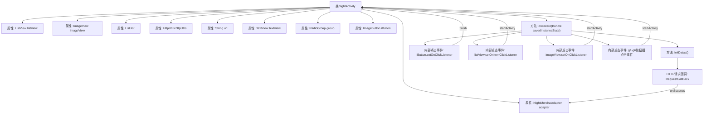

# 基础信息

|      |      |
|------|------|
| 名称 | NightActivity |
| 编码语言 | .java |
| 代码路径 | happycat/src/com/happycat/NightActivity.java |
| 包名 | com.happycat |
| 依赖项 | ['java.lang.reflect.Type', 'java.util.ArrayList', 'java.util.List', 'com.example.happucat.R', 'com.google.gson.Gson', 'com.google.gson.reflect.TypeToken', 'com.happycat.Bean.NightMerchatBean', 'com.happycat.adapter.NightMerchatadapter', 'com.happycat.util.MyApplication', 'com.lidroid.xutils.HttpUtils', 'com.lidroid.xutils.exception.HttpException', 'com.lidroid.xutils.http.ResponseInfo', 'com.lidroid.xutils.http.callback.RequestCallBack', 'com.lidroid.xutils.http.client.HttpRequest.HttpMethod', 'android.os.Bundle', 'android.app.ActionBar', 'android.app.Activity', 'android.content.Intent', 'android.util.Log', 'android.view.View', 'android.view.View.OnClickListener', 'android.widget.AdapterView', 'android.widget.ImageButton', 'android.widget.ImageView', 'android.widget.ListView', 'android.widget.RadioGroup', 'android.widget.TextView', 'android.widget.AdapterView.OnItemClickListener'] |
| 概述说明 | NightActivity类实现外卖功能，包含列表点击跳转、按钮事件处理及网络请求获取商家数据。 |

# 说明

NightActivity是一个Android活动类，主要实现夜间商家列表展示功能。界面包含列表视图、图片按钮和分类按钮组。列表项点击后跳转至商家详情页，传递商家ID、名称、配送费等信息。顶部图片按钮可关闭页面，通知图标跳转至其他活动。底部六个分类按钮分别对应不同URL参数，点击后跳转至外卖主页。初始化时通过HTTP请求获取商家数据，使用Gson解析JSON并填充列表。若适配器为空则显示错误提示。数据源来自指定URL，使用HttpUtils进行异步网络请求。

# 类列表 Class Summary

| 名称   | 类型  | 说明 |
|-------|------|-------------|
| NightActivity | class | NightActivity是一个Android活动类，包含列表视图、图片视图等控件，通过HTTP请求获取数据并展示。列表项点击跳转详情页，多个按钮点击跳转不同URL页面，使用Gson解析JSON数据。 |


## 类 NightActivity

|      |      |
|------|------|
| 访问范围 | public |
| 类型 | class |
| 名称 | NightActivity |
| 说明 | NightActivity是一个Android活动类，包含列表视图、图片视图等控件，通过HTTP请求获取数据并展示。列表项点击跳转详情页，多个按钮点击跳转不同URL页面，使用Gson解析JSON数据。 |


### UML类图

```mermaid
classDiagram
    class NightActivity {
        -ListView listView
        -ImageView imageView
        -List~NightMerchatBean~ list
        -NightMerchatadapter adapter
        -HttpUtils httpUtils
        -String url
        -TextView textView
        -RadioGroup group
        -ImageButton iButton
        +onCreate(Bundle savedInstanceState) void
        -initDatas() void
    }

    class NightMerchatBean {
        <<DataBean>>
        // 商户数据模型类
    }

    class NightMerchatadapter {
        <<Adapter>>
        +notifyDataSetChanged() void
    }

    class HttpUtils {
        +send(HttpMethod method, String url, RequestCallBack~String~ callback) void
    }

    class RequestCallBack~T~ {
        <<Interface>>
        +onFailure(HttpException e, String msg) void
        +onSuccess(ResponseInfo~T~ info) void
    }

    class Gson {
        +fromJson(String json, Type type) Object
    }

    class TypeToken~T~ {
        <<GenericType>>
        +getType() Type
    }

    NightActivity --> NightMerchatBean : 包含
    NightActivity --> NightMerchatadapter : 使用
    NightActivity --> HttpUtils : 使用
    HttpUtils --> RequestCallBack~String~ : 回调
    NightActivity --> Gson : 使用
    Gson --> TypeToken~List~NightMerchatBean~~ : 依赖
```

类图描述：
该图展示了Android应用中的NightActivity类结构及其关联关系。NightActivity继承自Activity，包含多个UI组件（ListView、ImageView等）和业务对象（适配器、网络工具等）。核心功能包括：通过HttpUtils发起网络请求获取商户数据，使用Gson解析JSON响应，通过NightMerchatadapter展示数据，并处理各种点击事件跳转到不同Activity。图中清晰呈现了数据流（从网络请求到界面渲染）和控制流（用户交互事件处理）涉及的主要组件及其协作关系。


### 内部方法调用关系图



这段代码是Android的NightActivity类实现，主要功能包括：初始化UI组件（列表视图、图片按钮等），设置多个点击事件监听器（包括列表项点击和按钮点击），通过HTTP请求获取商户数据并使用Gson解析，最后通过适配器更新UI。代码结构清晰展示了Activity生命周期管理、事件处理和网络请求的完整流程，特别注意处理了适配器为空时的异常情况。

### 字段列表 Field List

| 名称  | 类型  | 说明 |
|-------|-------|------|
| listView | ListView | ListView是一个用于显示列表数据的UI组件。 |
| adapter | NightMerchatadapter | NightMerchatadapter适配器实例声明。 |
| group | RadioGroup | 单选按钮组组件，用于创建一组互斥的单选选项。 |
| textView | TextView | 定义TextView对象textView。 |
| httpUtils | HttpUtils | 定义了一个HttpUtils类型的变量httpUtils。 |
| list = new ArrayList<NightMerchatBean>() | List<NightMerchatBean> | 创建一个NightMerchatBean类型的ArrayList对象list。 |
| imageView | ImageView | 显示图片视图控件。 |
| iButton | ImageButton | 这是一个名为iButton的图片按钮控件。 |
| url | String | 私有字符串变量url |

### 方法列表 Method List

| 名称  | 类型  | 说明 |
|-------|-------|------|
| onCreate | void | Android活动类NightActivity初始化，隐藏标题栏，设置布局。包含图片按钮点击关闭、列表项点击跳转详情、多个视图点击跳转不同URL功能，初始化数据并处理空视图。 |
| initDatas | void | 初始化数据方法：创建适配器并设置列表视图，通过HTTP GET请求获取服务器数据，使用Gson解析JSON结果并更新列表数据。 |


