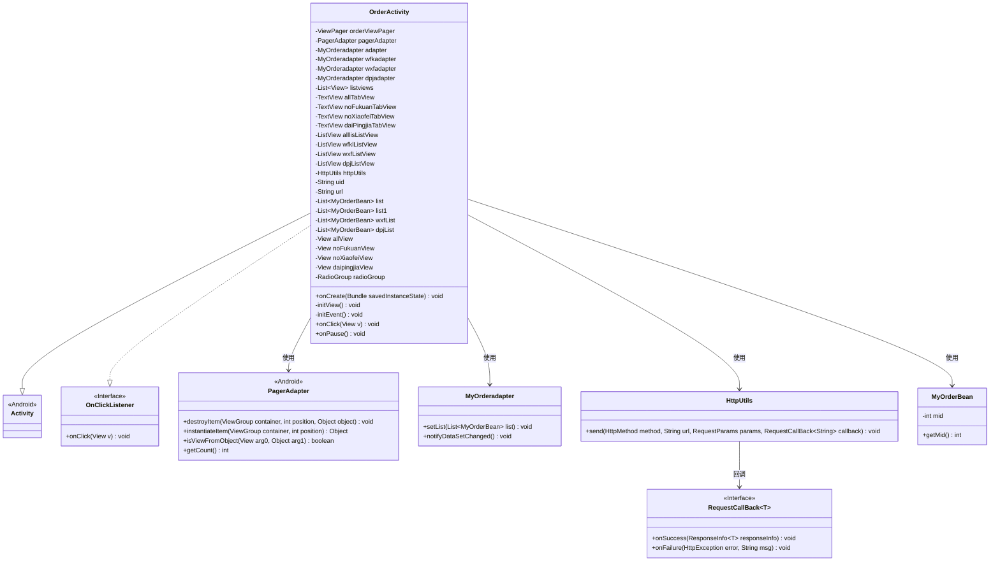
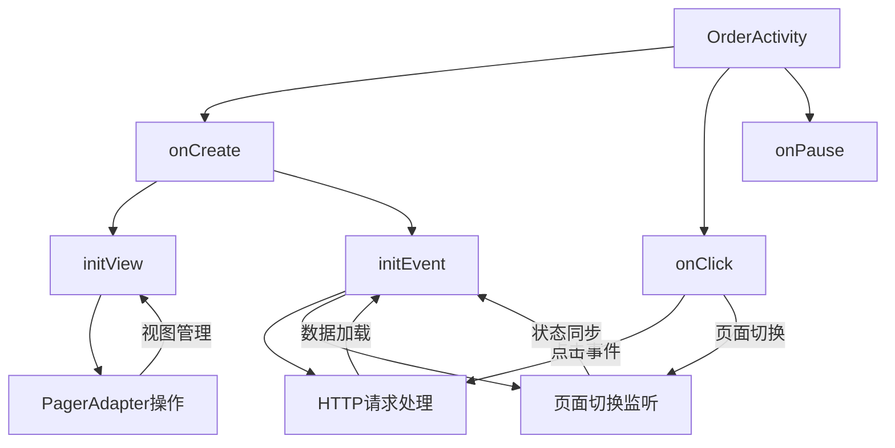
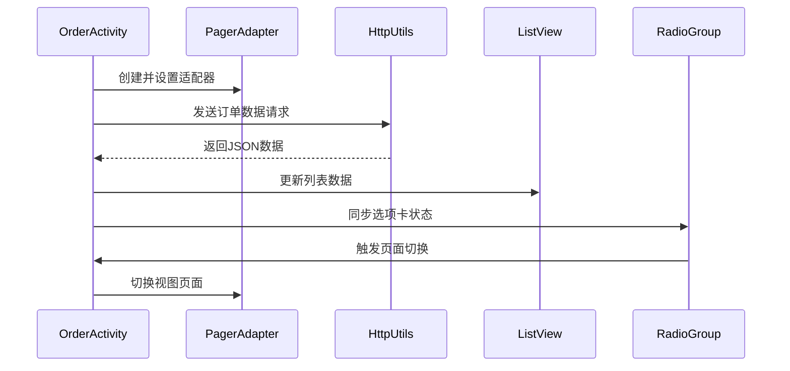

# 基础信息

|      |      |
|------|------|
| 名称 | OrderActivity |
| 编码语言 | .java |
| 代码路径 | happycat/src/com/happycat/OrderActivity.java |
| 包名 | com.happycat |
| 依赖项 | ['java.lang.reflect.Type', 'java.util.ArrayList', 'java.util.List', 'com.example.happucat.R', 'com.google.gson.Gson', 'com.google.gson.reflect.TypeToken', 'com.happycat.Bean.MyOrderBean', 'com.happycat.adapter.MyOrderadapter', 'com.happycat.global.GlobalContacts', 'com.happycat.util.ActivitiyUtils', 'com.happycat.util.MyApplication', 'com.happycat.util.StringUtils', 'com.lidroid.xutils.HttpUtils', 'com.lidroid.xutils.exception.HttpException', 'com.lidroid.xutils.http.RequestParams', 'com.lidroid.xutils.http.ResponseInfo', 'com.lidroid.xutils.http.callback.RequestCallBack', 'com.lidroid.xutils.http.client.HttpRequest.HttpMethod', 'android.app.Activity', 'android.content.Intent', 'android.os.Bundle', 'android.support.v4.view.PagerAdapter', 'android.support.v4.view.ViewPager', 'android.support.v4.view.ViewPager.OnPageChangeListener', 'android.util.Log', 'android.view.LayoutInflater', 'android.view.View', 'android.view.ViewGroup', 'android.view.View.OnClickListener', 'android.widget.AdapterView', 'android.widget.AdapterView.OnItemClickListener', 'android.widget.ListView', 'android.widget.RadioGroup', 'android.widget.TextView', 'android.widget.RadioGroup.OnCheckedChangeListener'] |
| 概述说明 | 订单管理Activity，包含全部、待支付、待消费、待评价四个标签页，使用ViewPager和ListView展示订单数据，通过HTTP请求获取数据并解析，支持页面切换和点击事件。 |

# 说明

该代码描述了一个Android订单管理活动OrderActivity，主要功能包括：通过ViewPager展示四种订单分类（全部/未付款/未消费/待评价），每个分类对应独立页面和ListView列表。使用HttpUtils发送POST请求获取订单数据，通过Gson解析JSON响应并更新适配器。实现页面滑动与顶部RadioGroup联动，点击事件处理页面切换及返回主界面操作。所有网络请求均包含成功/失败回调，失败时记录日志。待评价订单点击跳转至评价页面，传递商户ID参数。活动暂停时设置全局标志位。整体采用MVC架构，包含视图初始化、事件绑定、数据获取及界面更新等完整流程。

# 类列表 Class Summary

| 名称   | 类型  | 说明 |
|-------|------|-------------|
| OrderActivity | class | 订单管理Activity，包含四个订单分类页面（全部、待支付、待消费、待评价），使用ViewPager和ListView展示数据，通过HTTP请求获取订单数据并解析，支持页面切换和点击事件。 |

## 类 OrderActivity

|      |      |
|------|------|
| 访问范围 | public |
| 类型 | class |
| 名称 | OrderActivity |
| 说明 | 订单管理Activity，包含四个订单分类页面（全部、待支付、待消费、待评价），使用ViewPager和ListView展示数据，通过HTTP请求获取订单数据并解析，支持页面切换和点击事件。 |

### UML类图

类图描述：该图展示了一个Android订单管理模块的类结构，核心是继承Activity并实现点击监听器的OrderActivity。它通过ViewPager管理四个订单状态页面（全部/未支付/未消费/待评价），使用自定义适配器MyOrderadapter展示数据，通过HttpUtils与服务器交互获取订单数据。类图中清晰展示了组件间的依赖关系，包括PagerAdapter对页面视图的管理、HttpUtils的网络请求处理，以及通过RequestCallBack实现的异步回调机制。

### 内部方法调用关系图

这段代码实现了一个订单管理Activity，主要功能包括：1) 通过ViewPager展示四种订单类型(全部/待支付/待消费/待评价)；2) 使用HttpUtils异步加载不同状态的订单数据；3) 实现页面滑动与顶部选项卡的联动效果；4) 处理列表点击跳转和返回按钮事件。代码采用MVC架构，包含视图初始化、网络请求、数据解析和界面更新等完整流程，通过适配器模式实现列表数据绑定，并处理了各种用户交互场景。

### 字段列表 Field List

| 名称  | 类型  | 说明 |
|-------|-------|------|
| radioGroup | RadioGroup | 定义了一个名为radioGroup的单选按钮组变量。 |
| daipingjiaView | View | 声明私有视图变量daipingjiaView。 |
| dpjListView | ListView | 定义四个列表视图控件：alllisListView、wfklListView、wxfListView、dpjListView。 |
| noXiaofeiTabView | TextView | 无消费标签页视图控件 |
| noFukuanView | View | 私有视图未付款视图 |
| pagerAdapter | PagerAdapter | 定义了一个PagerAdapter类型的变量pagerAdapter。 |
| httpUtils | HttpUtils | 定义了一个HttpUtils类型的变量httpUtils。 |
| noXiaofeiView | View | 私有视图对象noXiaofeiView。 |
| uid=MyApplication.SP_user_id+"" | String | 代码片段定义字符串变量uid，值为应用全局变量SP_user_id转换为字符串的结果。 |
| url = "http://" + MyApplication.getIp() + ":8080/happycat/myServlet" | String | 代码拼接URL，使用应用IP和端口8080，路径为happycat/myServlet。 |
| allView | View | 私有视图变量allView。 |
| dpjadapter | MyOrderadapter | 定义了四个适配器变量：MyOrderadapter、wfkadapter、wxfadapter、dpjadapter。 |
| listviews = new ArrayList<View>() | List<View> | 创建名为listviews的ArrayList，存储View类型元素。 |
| dpjList | List<MyOrderBean> | 定义了四个订单列表变量：list、list1、wxfList、dpjList，类型为List<MyOrderBean>。 |
| allTabView | TextView | 文本视图全标签视图 |
| noFukuanTabView | TextView | 未付款标签页视图组件。 |
| daiPingjiaTabView | TextView | 控件TextView，变量名daiPingjiaTabView。 |
| orderViewPager | ViewPager | 视图分页组件orderViewPager |

### 方法列表 Method List

| 名称  | 类型  | 说明 |
|-------|-------|------|
| initView | void | 初始化视图：设置返回按钮点击事件，绑定ViewPager和四个订单标签页，加载对应布局到列表，自定义PagerAdapter管理页面切换。 |
| onCreate | void | Android Activity初始化代码：调用父类onCreate，设置布局文件activity_my_order和自定义标题栏title_bar_order，初始化视图和事件。 |
| initEvent | void | 代码实现订单页面功能，包括初始化四个订单标签点击事件，通过XUtils框架请求服务器数据，使用Gson解析返回的订单列表，并绑定适配器更新UI。同时监听页面滑动切换对应标签状态。 |
| onClick | void | 点击按钮处理逻辑：返回键跳转主界面并结束当前活动；其他按钮切换订单页面对应标签页。 |
| onPause | void | Android Activity的onPause方法重写，调用父类方法后将MyApplication的myflag设为"1"。 |

