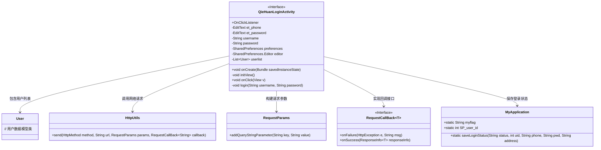
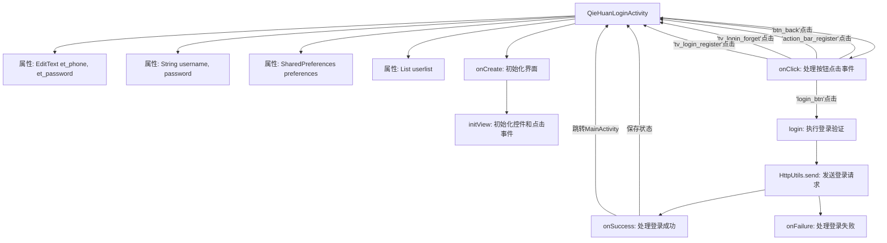

# 基础信息

|      |      |
|------|------|
| 名称 | QieHuanLoginActivity |
| 编码语言 | .java |
| 代码路径 | happycat/src/com/happycat/QieHuanLoginActivity.java |
| 包名 | com.happycat |
| 依赖项 | ['java.lang.reflect.Type', 'java.util.ArrayList', 'java.util.List', 'android.R.string', 'android.app.Activity', 'android.content.Intent', 'android.content.SharedPreferences', 'android.os.Bundle', 'android.util.Log', 'android.view.View', 'android.view.View.OnClickListener', 'android.widget.Button', 'android.widget.EditText', 'android.widget.Toast', 'com.example.happucat.R', 'com.google.gson.Gson', 'com.google.gson.reflect.TypeToken', 'com.happycat.Bean.User', 'com.happycat.Bean.goodsclassify', 'com.happycat.global.GlobalContacts', 'com.happycat.util.ActivitiyUtils', 'com.happycat.util.MyApplication', 'com.happycat.util.StringUtils', 'com.lidroid.xutils.HttpUtils', 'com.lidroid.xutils.exception.HttpException', 'com.lidroid.xutils.http.RequestParams', 'com.lidroid.xutils.http.ResponseInfo', 'com.lidroid.xutils.http.callback.RequestCallBack', 'com.lidroid.xutils.http.client.HttpRequest.HttpMethod'] |
| 概述说明 | 这是一个Android登录活动类，包含手机号和密码输入框，实现点击事件处理，包括返回、注册、忘记密码和登录功能。登录时验证用户信息，成功后跳转主界面并保存用户状态。 |

# 说明

该代码描述了一个登录活动类QieHuanLoginActivity，继承自Activity并实现点击监听接口。主要功能包括初始化登录界面视图，处理用户点击事件如返回、注册、忘记密码和登录操作。登录时验证用户名密码，通过HTTP POST请求与服务器交互，使用Gson解析返回的用户数据。验证成功后保存用户登录状态和基本信息，并跳转到主界面；失败则提示错误信息。整个过程涉及UI交互、数据验证、网络请求和本地数据存储。

# 类列表 Class Summary

| 名称   | 类型  | 说明 |
|-------|------|-------------|
| QieHuanLoginActivity | class | 这是一个Android登录活动类，包含手机号和密码输入框，实现点击事件处理，包括返回、注册、忘记密码和登录功能。登录时验证用户信息，成功则跳转主界面并保存用户状态。 |

## 类 QieHuanLoginActivity

|      |      |
|------|------|
| 访问范围 | public |
| 类型 | class |
| 名称 | QieHuanLoginActivity |
| 说明 | 这是一个Android登录活动类，包含手机号和密码输入框，实现点击事件处理，包括返回、注册、忘记密码和登录功能。登录时验证用户信息，成功则跳转主界面并保存用户状态。 |

### UML类图

这段代码描述了一个Android登录活动（QieHuanLoginActivity），主要功能包括：初始化登录界面视图、处理用户点击事件、验证登录信息、通过HTTP请求与服务器交互、解析返回的用户数据以及保存登录状态。类图中清晰地展示了该Activity与用户数据模型（User）、网络工具类（HttpUtils）、请求参数类（RequestParams）以及全局应用类（MyApplication）之间的依赖关系，同时体现了对OnClickListener接口的实现。整个流程涉及UI交互、数据验证、网络通信和状态管理等多个模块的协作。

### 内部方法调用关系图

这段代码是Android平台的一个登录活动类(QieHuanLoginActivity)，主要功能包括界面初始化、用户输入验证、网络请求处理和登录状态管理。流程图展示了从活动创建到用户交互的完整流程，包括5个按钮点击事件处理，特别是登录按钮会触发网络验证流程。登录成功后会将用户信息保存到全局应用类(MyApplication)并跳转到主界面(MainActivity)，失败则显示错误提示。整个流程采用事件驱动模式，通过实现OnClickListener接口处理用户交互。

### 字段列表 Field List

| 名称  | 类型  | 说明 |
|-------|-------|------|
| editor | SharedPreferences.Editor | SharedPreferences.Editor用于修改SharedPreferences数据，提供键值对存储的编辑操作。 |
| username | String | 声明字符串变量username。 |
| preferences | SharedPreferences | 声明一个SharedPreferences对象preferences，用于存储和读取轻量级键值对数据。 |
| userlist = new ArrayList<User>() | List<User> | 创建用户列表对象，使用ArrayList存储User类型数据。 |
| password | String | 声明字符串变量password。 |
| et_password | EditText | 定义两个私有EditText变量：et_phone和et_password。 |

### 方法列表 Method List

| 名称  | 类型  | 说明 |
|-------|-------|------|
| onCreate | void | Android登录Activity的onCreate方法，初始化视图并设置标题栏布局。 |
| onClick | void | 点击返回按钮显示提示并关闭当前页面；点击注册、忘记密码或登录页的注册按钮跳转对应页面；点击登录按钮验证输入后执行登录操作。 |
| initView | void | 初始化视图组件并设置点击监听器，包括电话、密码输入框及多个按钮。 |
| login | void | 登录功能：获取用户名密码，POST请求验证，成功保存用户信息跳转主页，失败提示用户不存在或登录失败。 |

