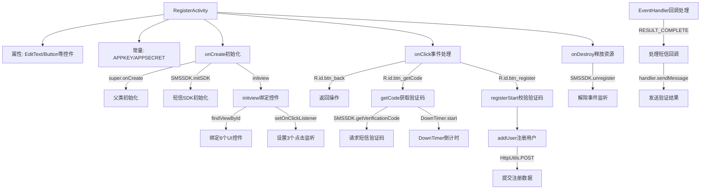

# 基础信息

|      |      |
|------|------|
| 名称 | RegisterActivity |
| 编码语言 | .java |
| 代码路径 | happycat/src/com/happycat/RegisterActivity.java |
| 包名 | com.happycat |
| 依赖项 | ['cn.smssdk.EventHandler', 'cn.smssdk.SMSSDK', 'com.example.happucat.R', 'com.happycat.global.GlobalContacts', 'com.happycat.util.ActivitiyUtils', 'com.happycat.util.StringUtils', 'com.lidroid.xutils.HttpUtils', 'com.lidroid.xutils.exception.HttpException', 'com.lidroid.xutils.http.RequestParams', 'com.lidroid.xutils.http.ResponseInfo', 'com.lidroid.xutils.http.callback.RequestCallBack', 'com.lidroid.xutils.http.client.HttpRequest.HttpMethod', 'android.annotation.SuppressLint', 'android.app.Activity', 'android.content.Intent', 'android.os.Bundle', 'android.os.CountDownTimer', 'android.os.Handler', 'android.os.Message', 'android.util.Log', 'android.view.View', 'android.view.View.OnClickListener', 'android.widget.Button', 'android.widget.EditText', 'android.widget.Toast'] |
| 概述说明 | 注册页面实现短信验证功能，包含获取验证码、提交验证、用户注册及数据库操作，使用SMSSDK处理短信回调，支持倒计时重发验证码。 |

# 说明

RegisterActivity是一个安卓注册页面，包含手机号、验证码和密码输入框，以及获取验证码和注册按钮。通过SMSSDK实现短信验证功能，包括验证码获取、提交校验及60秒倒计时。注册时校验输入合法性，成功后通过HTTP请求将用户数据提交至服务器。页面销毁时需注销短信回调防止内存泄漏。

# 类列表 Class Summary

| 名称   | 类型  | 说明 |
|-------|------|-------------|
| RegisterActivity | class | 注册页面实现短信验证功能，包含获取验证码、提交验证、用户注册及数据库操作，使用SMSSDK进行验证码发送与校验，支持倒计时重发，注册成功跳转至主页面。 |


## 类 RegisterActivity

|      |      |
|------|------|
| 访问范围 | public |
| 类型 | class |
| 名称 | RegisterActivity |
| 说明 | 注册页面实现短信验证功能，包含获取验证码、提交验证、用户注册及数据库操作，使用SMSSDK进行验证码发送与校验，支持倒计时重发，注册成功跳转至主页面。 |


### UML类图

```mermaid
classDiagram
    class RegisterActivity {
        -EditText et_phone
        -EditText et_code
        -EditText et_password
        -Button btn_getCode
        -Button registerButton
        -String username
        -String password
        -static String APPKEY
        -static String APPSECRET
        -Handler handler
        +RegisterActivity()
        -void initview()
        +void onClick(View v)
        -void registerStart()
        -void getCode()
        -void addUser()
        #void onDestroy()
    }

    class <<Interface>> OnClickListener {
        <<Interface>>
        +void onClick(View v)
    }

    class SMSSDK {
        +static void initSDK(Context ctx, String appkey, String appsecret)
        +static void getVerificationCode(String country, String phone)
        +static void registerEventHandler(EventHandler handler)
        +static void unregisterAllEventHandler()
    }

    class EventHandler {
        +void afterEvent(int event, int result, Object data)
    }

    class DownTimer {
        -Button btn_getCode
        +DownTimer(long millisInFuture, long countDownInterval)
        +void onFinish()
        +void onTick(long millisUntilFinished)
    }

    class HttpUtils {
        +void send(HttpMethod method, String url, RequestParams params, RequestCallBack~String~ callback)
    }

    class RequestParams {
        +void addQueryStringParameter(String key, String value)
        +void addBodyParameter(String key, String value)
    }

    class RequestCallBack~T~ {
        <<Interface>>
        +void onFailure(HttpException e, String msg)
        +void onSuccess(ResponseInfo~T~ response)
    }

    RegisterActivity --> OnClickListener : 实现
    RegisterActivity --> SMSSDK : 使用
    RegisterActivity --> EventHandler : 创建
    RegisterActivity --> DownTimer : 创建
    RegisterActivity --> HttpUtils : 使用
    SMSSDK --> EventHandler : 回调
    DownTimer --> Button : 控制
    HttpUtils --> RequestParams : 使用
    HttpUtils --> RequestCallBack~String~ : 回调
```

这段类图描述了安卓注册功能的核心结构。RegisterActivity作为主类，实现了OnClickListener接口处理按钮点击事件，通过SMSSDK进行短信验证码的获取与验证，使用DownTimer实现验证码倒计时功能，并通过HttpUtils与服务器交互完成用户注册。EventHandler处理短信SDK回调，RequestCallBack处理网络请求响应。整个系统涉及UI控制、短信验证、网络请求和定时器管理等多个模块的协作。


### 内部方法调用关系图



该流程图展示了安卓注册页面的核心逻辑：初始化时绑定UI控件和短信SDK，通过点击事件触发验证码获取和用户注册。包含短信回调处理、60秒倒计时控制、网络请求提交数据等关键流程，最后在页面销毁时释放资源。主要涉及5个核心交互：UI事件响应、短信SDK操作、倒计时控制、网络请求和回调处理。

### 字段列表 Field List

| 名称  | 类型  | 说明 |
|-------|-------|------|
| eh=new EventHandler(){	        @Override	        public void afterEvent(int event, int result, Object data) {	            if (result == SMSSDK.RESULT_COMPLETE) {	                //回调完成	                if (event == SMSSDK.EVENT_SUBMIT_VERIFICATION_CODE) {	                    //提交验证码成功	                    Log.e("event", "提交验证码成功");	                    Message message=new Message();	                    message.what=0;	                    message.obj="提交验证码成功";	                    handler.sendMessage(message);	                }else if (event == SMSSDK.EVENT_GET_VERIFICATION_CODE){	                    //获取验证码成功	                    Log.e("event", "获取验证码成功");	                    Message message=new Message();						Bundle bundle=new Bundle();						bundle.putString("msg", "验证码已发送至您的手机,有效时间5分钟，请及时填写！");						message.setData(bundle);						handler.sendMessage(message);	                }else if (event ==SMSSDK.EVENT_GET_SUPPORTED_COUNTRIES){	                    //返回支持发送验证码的国家列表	                }	            }else{	                ((Throwable)data).printStackTrace();	                System.err.println("------获取验证码出错---------");					Message message=new Message();					message.what=0;					Bundle bundle=new Bundle();					bundle.putString("msg", "验证码发送失败，请检查网络稍候重试！");					message.setData(bundle);					handler.sendMessage(message);	            }	        }	    } | EventHandler | 定义事件处理器，处理验证码提交、获取及国家列表返回的成功回调，失败时打印错误并发送失败消息。 |
| APPKEY="b6f91b24020b" | String | 私有静态字符串常量APPKEY，值为"b6f91b24020b"。 |
| handler | Handler | 私有Handler对象声明。 |
| registerButton | Button | 按钮包括btn_getCode和registerButton。 |
| username | String | 声明一个名为username的字符串变量。 |
| et_password | EditText | 定义三个编辑文本框：电话、验证码和密码输入框。 |
| password | String | 私有密码字符串变量。 |
| APPSECRET="b6d3d9b2908868d8e95d8728f45746a9" | String | 代码片段定义了一个私有静态字符串常量APPSECRET，值为"b6d3d9b2908868d8e95d8728f45746a9"。 |

### 方法列表 Method List

| 名称  | 类型  | 说明 |
|-------|-------|------|
| initview | void | 初始化界面控件：绑定手机号、密码、验证码输入框及注册、获取验证码、返回按钮，设置点击事件监听。 |
| onCreate | void | Android注册页面初始化：加载布局、启动短信SDK、设置标题栏、初始化视图，并处理消息回调。 |
| registerStart | void | 私有方法registerStart检查手机号和验证码，若未通过快速登录验证则直接返回。注释显示原计划获取输入框的验证码、手机号和密码。 |
| addUser | void | 方法addUser获取用户名和密码，通过POST请求发送到服务器，成功则跳转主页面，失败提示账号已注册。 |
| onClick | void | 点击返回按钮时提示并关闭页面；点击获取验证码按钮时执行获取验证码操作；点击注册按钮时校验验证码并添加用户。 |
| getCode | void | 获取验证码功能：检查手机号有效性，发送短信验证码，禁用按钮并启动60秒倒计时。 |
| onDestroy | void | 重写Android的onDestroy方法，调用父类方法并取消所有短信SDK事件监听。 |


