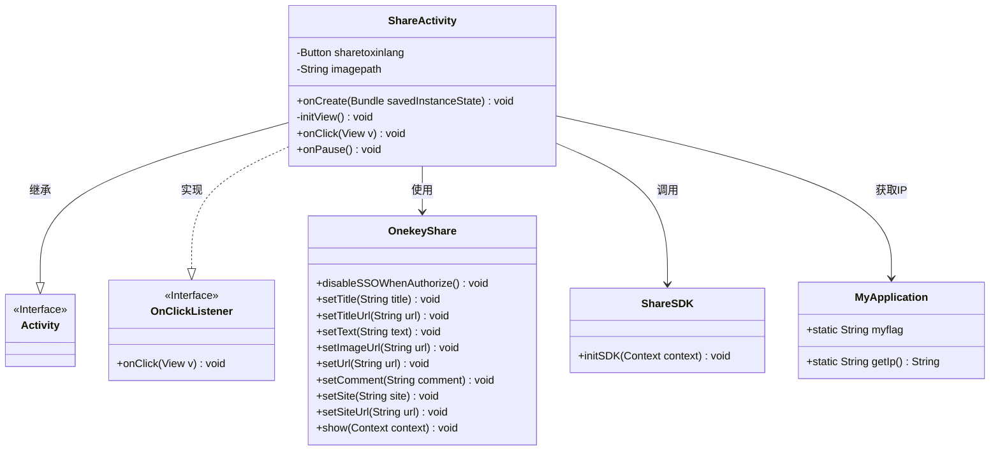
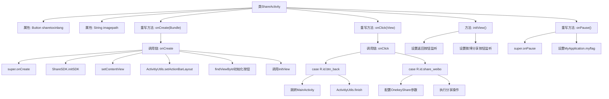

# 基础信息

|      |      |
|------|------|
| 名称 | ShareActivity |
| 编码语言 | .java |
| 代码路径 | happycat/src/com/happycat/ShareActivity.java |
| 包名 | com.happycat |
| 依赖项 | ['cn.sharesdk.framework.ShareSDK', 'cn.sharesdk.onekeyshare.OnekeyShare', 'com.example.happucat.R', 'com.happycat.util.ActivitiyUtils', 'com.happycat.util.MyApplication', 'com.happycat.util.StringUtils', 'android.app.Activity', 'android.content.Intent', 'android.os.Bundle', 'android.view.View', 'android.view.View.OnClickListener', 'android.widget.Button'] |
| 概述说明 | ShareActivity实现分享功能，包含返回按钮和微博分享按钮。微博分享使用ShareSDK，设置标题、文本、图片链接等参数，支持多平台分享。返回按钮跳转至MainActivity。 |

# 说明

ShareActivity是一个Android活动类，实现了点击监听接口。它包含分享到新浪微博的功能按钮和返回按钮。在onCreate中初始化ShareSDK和界面布局，设置标题栏。initView方法绑定按钮点击事件。点击返回按钮会跳转到MainActivity并结束当前活动。点击分享按钮会配置OnekeyShare对象，设置标题、文本、图片URL、链接等分享内容，然后调用ShareSDK显示分享界面。在onPause生命周期方法中更新应用标志位。

# 类列表 Class Summary

| 名称   | 类型  | 说明 |
|-------|------|-------------|
| ShareActivity | class | ShareActivity实现分享功能，包含返回按钮和微博分享按钮，使用ShareSDK进行微博内容分享，设置标题、文本、图片等参数，并在暂停时更新应用标志。 |

## 类 ShareActivity

|      |      |
|------|------|
| 访问范围 | public |
| 类型 | class |
| 名称 | ShareActivity |
| 说明 | ShareActivity实现分享功能，包含返回按钮和微博分享按钮，使用ShareSDK进行微博内容分享，设置标题、文本、图片等参数，并在暂停时更新应用标志。 |

### UML类图

这段代码描述了一个分享功能的Android活动类`ShareActivity`，它继承自`Activity`并实现了`OnClickListener`接口。主要功能包括初始化分享SDK、设置界面按钮点击事件，以及通过`OnekeyShare`类实现新浪微博分享功能。类图中展示了与`ShareSDK`、`MyApplication`的依赖关系，以及`OnekeyShare`的核心配置方法。该设计实现了分享功能的封装，支持标题、文本、图片等多媒体内容的社交平台分享。

### 内部方法调用关系图

这段代码展示了一个Android分享功能的实现流程。ShareActivity类继承自Activity，主要处理微博分享和界面导航功能。流程图清晰呈现了从初始化界面(onCreate)、设置监听(initView)到处理点击事件(onClick)的完整调用链，特别是详细拆解了分享功能的参数配置过程。代码通过OnekeyShare实现多平台分享功能，并在生命周期方法onPause中更新应用状态标志。整个流程包含界面初始化、事件监听绑定、分享参数配置和活动跳转等关键环节。

### 字段列表 Field List

| 名称  | 类型  | 说明 |
|-------|-------|------|
| sharetoxinlang | Button | 分享到XinLang |
| imagepath | String | 私有字符串变量imagepath，用于存储图像路径。 |

### 方法列表 Method List

| 名称  | 类型  | 说明 |
|-------|-------|------|
| onClick | void | 点击返回按钮跳转至主界面并关闭当前页；点击分享按钮配置并调用新浪微博分享功能，包含标题、文本、图片等参数。 |
| initView | void | 初始化视图，设置返回按钮和微博分享按钮的点击监听器。 |
| onCreate | void | Android Activity的onCreate方法初始化ShareSDK，设置布局和标题栏，绑定微博分享按钮并初始化视图。 |
| onPause | void | Android代码片段：重写onPause方法，调用父类方法后设置MyApplication.myflag为"1"。 |

