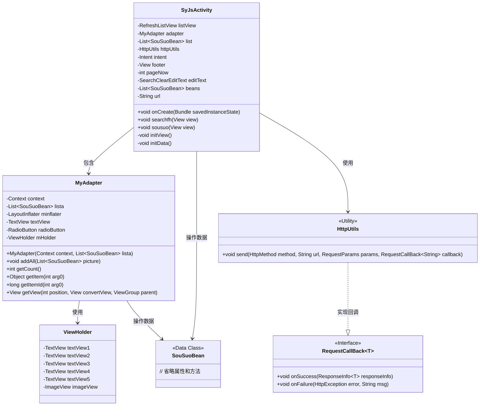
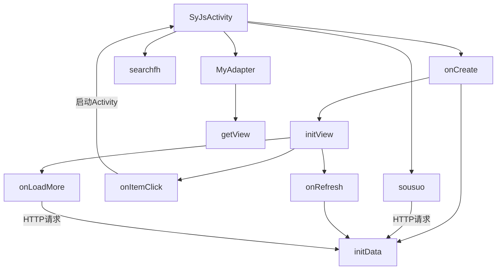
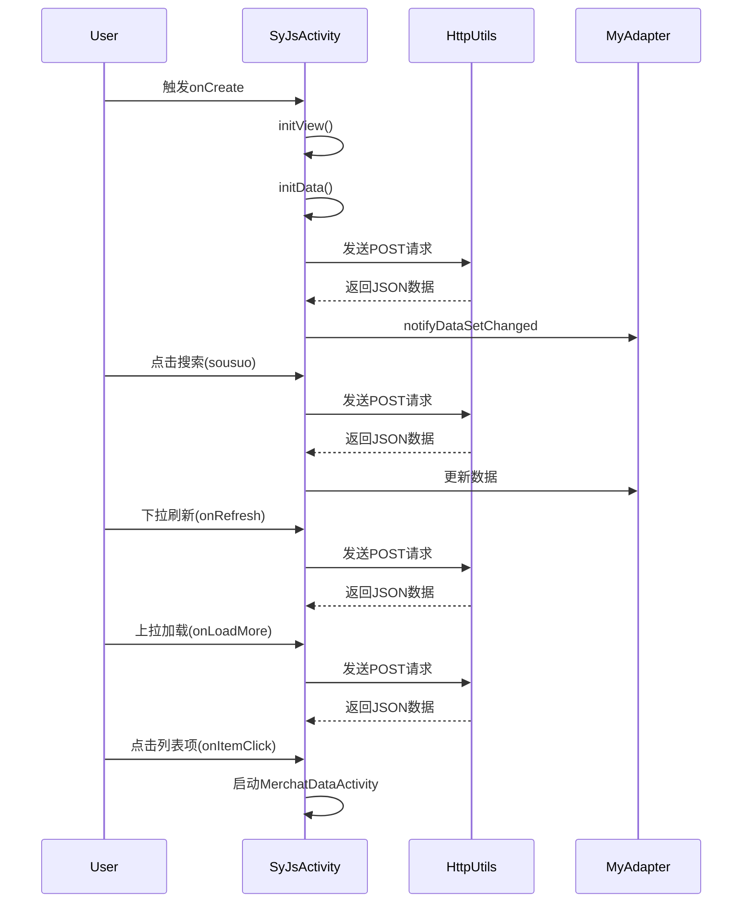

# 基础信息

|      |      |
|------|------|
| 名称 | SyJsActivity |
| 编码语言 | .java |
| 代码路径 | happycat/src/com/happycat/SyJsActivity.java |
| 包名 | com.happycat |
| 依赖项 | ['java.io.UnsupportedEncodingException', 'java.lang.reflect.Type', 'java.net.URLEncoder', 'java.util.ArrayList', 'java.util.List', 'org.json.JSONArray', 'org.json.JSONException', 'org.json.JSONObject', 'com.example.happucat.R', 'com.google.gson.Gson', 'com.google.gson.reflect.TypeToken', 'com.happycat.Bean.SouSuoBean', 'com.happycat.util.MyApplication', 'com.happycat.util.RefreshListView', 'com.happycat.util.RefreshListView.OnRefreshListener', 'com.happycat.util.SearchClearEditText', 'com.lidroid.xutils.HttpUtils', 'com.lidroid.xutils.exception.HttpException', 'com.lidroid.xutils.http.RequestParams', 'com.lidroid.xutils.http.ResponseInfo', 'com.lidroid.xutils.http.callback.RequestCallBack', 'com.lidroid.xutils.http.client.HttpRequest.HttpMethod', 'android.os.Bundle', 'android.R.integer', 'android.app.ActionBar', 'android.app.Activity', 'android.content.Context', 'android.content.Intent', 'android.util.Log', 'android.view.LayoutInflater', 'android.view.View', 'android.view.ViewGroup', 'android.widget.AdapterView', 'android.widget.AdapterView.OnItemClickListener', 'android.widget.BaseAdapter', 'android.widget.ImageView', 'android.widget.ListView', 'android.widget.RadioButton', 'android.widget.TextView', 'android.widget.Toast'] |
| 概述说明 | Android活动类实现搜索功能，包含列表展示、分页加载和点击跳转详情页，使用HTTP请求获取数据并JSON解析。 |

# 说明

这段代码描述了一个名为SyJsActivity的Android活动类，主要用于实现搜索功能。活动包含一个可刷新的列表视图，用于展示搜索结果。用户可以通过编辑框输入关键词进行搜索，搜索结果以列表形式显示，并支持分页加载。列表项点击后跳转到详情页面。活动使用HttpUtils进行网络请求，通过Gson解析返回的JSON数据。列表适配器MyAdapter负责将数据绑定到视图上，包括商家名称、配送时长、商品信息等。图片加载通过MyApplication中的bitmapUtils处理。整体实现了搜索、分页加载、列表展示和详情跳转的功能。

# 类列表 Class Summary

| 名称   | 类型  | 说明 |
|-------|------|-------------|
| SyJsActivity | class | SyJsActivity是一个Android活动类，实现搜索功能，包含列表展示、分页加载和点击跳转详情页逻辑。使用HttpUtils进行网络请求，Gson解析数据，RefreshListView实现下拉刷新和上拉加载。适配器MyAdapter负责列表项渲染，支持图片加载和文本显示。 |

## 类 SyJsActivity

|      |      |
|------|------|
| 访问范围 | public |
| 类型 | class |
| 名称 | SyJsActivity |
| 说明 | SyJsActivity是一个Android活动类，实现搜索功能，包含列表展示、分页加载和点击跳转详情页逻辑。使用HttpUtils进行网络请求，Gson解析数据，RefreshListView实现下拉刷新和上拉加载。适配器MyAdapter负责列表项渲染，支持图片加载和文本显示。 |

### UML类图

这段代码展示了一个Android活动类`SyJsActivity`，主要实现商品搜索和列表展示功能。类图中包含主活动类、自定义适配器`MyAdapter`、视图持有者`ViewHolder`、数据模型`SouSuoBean`以及网络工具类`HttpUtils`。主活动通过`HttpUtils`发起网络请求获取商品数据，使用`MyAdapter`展示在`RefreshListView`中，支持下拉刷新和上拉加载更多。适配器采用ViewHolder模式优化列表性能，通过Gson解析JSON数据。整体架构遵循Android MVC模式，数据层、视图层和控制层分离清晰。

### 内部方法调用关系图

这段代码实现了一个Android商品搜索界面，主要功能包括：初始化视图和数据、搜索商品、下拉刷新、上拉加载更多以及商品详情跳转。通过HttpUtils进行网络请求，使用Gson解析JSON数据，MyAdapter负责列表展示。流程图展示了类之间的调用关系，时序图描述了用户操作与系统响应的完整过程。代码结构清晰，但需要注意网络请求异常处理和编码转换的健壮性。

### 字段列表 Field List

| 名称  | 类型  | 说明 |
|-------|-------|------|
| url = "http://" + MyApplication.getIp()			+ ":8080/happycat/GetUpload" | String | 私有字符串url由应用IP和固定路径拼接而成，用于获取上传地址。 |
| pageNow = 1 | int | 当前页码为1。 |
| footer | View | 视图页脚部分。 |
| httpUtils | HttpUtils | 声明一个HttpUtils类型的变量httpUtils。 |
| adapter | MyAdapter | 声明一个名为adapter的MyAdapter类型变量。 |
| beans | List<SouSuoBean> | 定义了一个名为beans的列表，类型为SouSuoBean。 |
| list = new ArrayList<SouSuoBean>() | List<SouSuoBean> | 创建动态数组列表存储SouSuoBean对象。 |
| editText | SearchClearEditText | 搜索框编辑文本控件。 |
| listView | RefreshListView | 刷新列表视图控件。 |
| intent | Intent | 声明一个名为intent的Intent类型变量。 |

### 方法列表 Method List

| 名称  | 类型  | 说明 |
|-------|-------|------|
| searchfh | void | 方法searchfh结束当前活动。 |
| onCreate | void | Android Activity初始化代码：继承父类onCreate，设置布局，隐藏ActionBar，初始化视图和数据。 |
| initData | void | 方法initData获取输入文本，编码后发送POST请求，参数包括key、pageNow和goodsname。成功返回时解析JSON更新列表，失败则刷新列表失败。异常处理编码错误。 |
| sousuo | void | 方法sousuo处理搜索请求：获取输入文本，编码后通过POST请求发送，参数包括key、pageNow和goodsname。成功返回时解析JSON数据更新列表，失败时刷新列表失败。异常时打印错误。 |
| initView | void | 初始化视图，设置列表适配器和刷新监听。搜索时发送POST请求获取数据并更新列表。点击列表项跳转详情页，传递相关参数。 |

