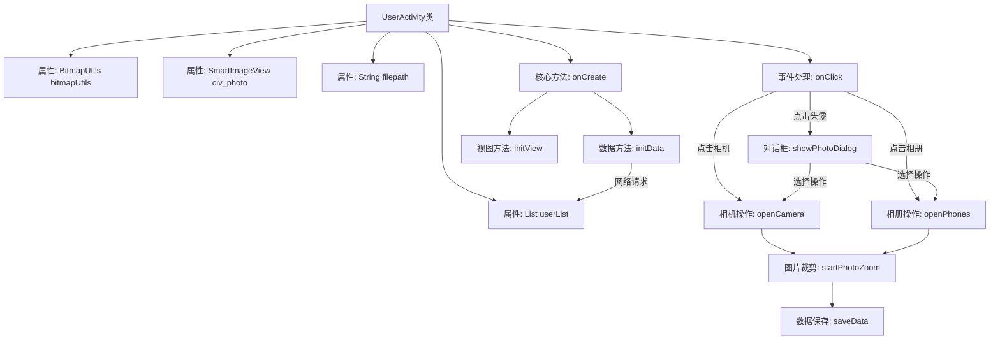
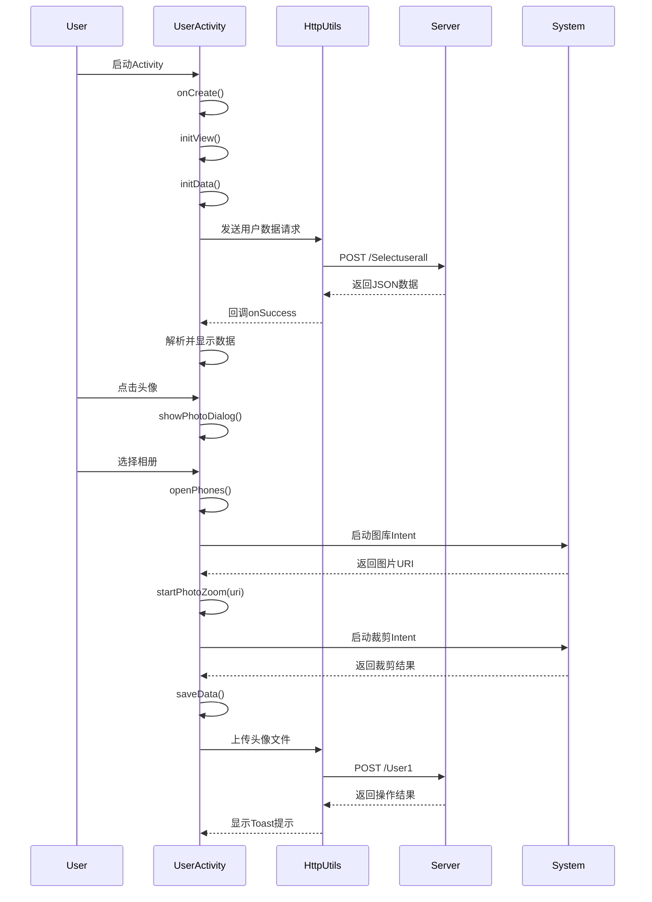

# 基础信息

|      |      |
|------|------|
| 名称 | UserActivity |
| 编码语言 | .java |
| 代码路径 | happycat/src/com/happycat/UserActivity.java |
| 包名 | com.happycat |
| 依赖项 | ['image.SmartImageView', 'java.io.File', 'java.lang.reflect.Type', 'java.util.ArrayList', 'java.util.List', 'com.example.happucat.R', 'com.google.gson.Gson', 'com.google.gson.reflect.TypeToken', 'com.happycat.Bean.User', 'com.happycat.util.ActivitiyUtils', 'com.happycat.util.MyApplication', 'com.happycat.util.StringUtils', 'com.happycat.view.Circleimage', 'com.lidroid.xutils.BitmapUtils', 'com.lidroid.xutils.HttpUtils', 'com.lidroid.xutils.exception.HttpException', 'com.lidroid.xutils.http.RequestParams', 'com.lidroid.xutils.http.ResponseInfo', 'com.lidroid.xutils.http.callback.RequestCallBack', 'com.lidroid.xutils.http.client.HttpRequest.HttpMethod', 'android.annotation.SuppressLint', 'android.app.Activity', 'android.app.Dialog', 'android.content.Intent', 'android.graphics.Bitmap', 'android.graphics.BitmapFactory', 'android.net.Uri', 'android.os.Bundle', 'android.os.Environment', 'android.provider.MediaStore', 'android.util.Log', 'android.view.LayoutInflater', 'android.view.View', 'android.view.ViewGroup', 'android.view.Window', 'android.view.WindowManager', 'android.view.View.OnClickListener', 'android.view.ViewGroup.LayoutParams', 'android.widget.ImageView', 'android.widget.RelativeLayout', 'android.widget.TextView', 'android.widget.Toast'] |
| 概述说明 | Android用户资料页面，包含头像上传、信息修改、密码修改功能，通过HTTP请求获取并更新用户数据。 |

# 说明

该代码描述了一个Android用户资料管理界面UserActivity，主要功能包括：1. 初始化用户信息视图并绑定点击事件；2. 通过HTTP请求获取用户数据并显示在界面上；3. 提供头像修改功能，支持拍照或从相册选择图片并进行裁剪；4. 实现资料修改、密码修改等跳转功能；5. 将修改后的头像上传至服务器。界面包含用户姓名、电话、性别、地址等信息的展示与编辑功能，通过对话框实现头像修改选项，并处理各种Activity返回结果。

# 类列表 Class Summary

| 名称   | 类型  | 说明 |
|-------|------|-------------|
| UserActivity | class | 这是一个Android用户信息管理类，主要功能包括：显示和编辑用户资料、修改头像（支持拍照或相册选择）、修改密码，并通过HTTP请求与服务器交互保存数据。 |


## 类 UserActivity

|      |      |
|------|------|
| 访问范围 | public |
| 类型 | class |
| 名称 | UserActivity |
| 说明 | 这是一个Android用户信息管理类，主要功能包括：显示和编辑用户资料、修改头像（支持拍照或相册选择）、修改密码，并通过HTTP请求与服务器交互保存数据。 |


### UML类图

```mermaid
classDiagram
    class Activity {
        <<Interface>>
    }
    class OnClickListener {
        <<Interface>>
        +onClick(View v) void
    }
    class UserActivity {
        -BitmapUtils bitmapUtils
        -SmartImageView civ_photo
        -LayoutInflater mInflater
        -Dialog dialog
        -String filepath
        -RelativeLayout my_password
        -String filename
        -Uri uri
        -List~User~ userList
        -String imagurl
        -TextView name, phone, sex, address
        -String province, city, district, detail
        +onCreate(Bundle savedInstanceState) void
        -initData() void
        -initView() void
        +onClick(View v) void
        -openPhones() void
        -openCamera() void
        +onActivityResult(int requestCode, int resultCode, Intent data) void
        -startPhotoZoom(Uri uri) void
        -showPhotoDialog() void
        -saveData() void
        +onPause() void
    }
    class User {
        +String uname
        +String sex
        +String uphone
        +String uprovince
        +String ucity
        +String ucountry
        +String udetail
        +String uimg
    }
    class MyApplication {
        +static String SP_user_phone
        +static String SP_user_id
        +static String myflag
        +static BitmapUtils bitmapUtils
        +static String getIp() String
    }
    class BitmapUtils {
        +BitmapUtils(Context context)
        +display(ImageView imageView, String uri) void
    }
    class HttpUtils {
        +send(HttpMethod method, String url, RequestParams params, RequestCallBack~String~ callBack) void
    }
    class RequestParams {
        +addBodyParameter(String key, String value) void
        +addBodyParameter(String key, File file) void
    }
    class RequestCallBack~T~ {
        <<Interface>>
        +onSuccess(ResponseInfo~T~ responseInfo) void
        +onFailure(HttpException error, String msg) void
    }
    class Gson {
        +fromJson(String json, Type typeOfT) ~T~
    }
    class TypeToken~T~ {
        +getType() Type
    }
    class SmartImageView {
        +setImageBitmap(Bitmap bitmap) void
        +setOnClickListener(OnClickListener listener) void
    }
    class Circleimage {
        +toRoundBitmap(Bitmap bitmap) Bitmap
    }

    UserActivity --|> Activity
    UserActivity ..|> OnClickListener
    UserActivity --> User : 包含
    UserActivity --> MyApplication : 依赖
    UserActivity --> BitmapUtils : 使用
    UserActivity --> HttpUtils : 使用
    UserActivity --> RequestParams : 使用
    UserActivity --> RequestCallBack~String~ : 实现
    UserActivity --> Gson : 使用
    UserActivity --> TypeToken~List~User~~ : 使用
    UserActivity --> SmartImageView : 包含
    UserActivity --> Circleimage : 使用
    HttpUtils --> RequestParams : 使用
    HttpUtils --> RequestCallBack~T~ : 调用
    Gson --> TypeToken~T~ : 使用
```

这段代码展示了一个Android用户活动界面(UserActivity)的类结构，该界面继承自Activity并实现了OnClickListener接口。主要功能包括用户资料展示、头像修改、个人信息更新等。类图中清晰地展示了UserActivity与多个工具类（如BitmapUtils、HttpUtils）和自定义类（如User、Circleimage）的交互关系，以及通过接口实现的回调机制。该设计采用MVC模式，通过HTTP请求与服务器交互，使用Gson解析JSON数据，并提供了完整的用户界面操作流程。


### 内部方法调用关系图





该流程图描述了UserActivity的核心生命周期和交互逻辑，主要包含用户资料展示和头像修改两大功能模块。类结构展示了Bitmap处理、网络请求、视图初始化等关键组件，时序图则详细呈现了从数据加载到头像修改的完整交互过程，包括网络请求、系统相册调用、图片裁剪和结果上传等关键步骤。整个流程涉及6个核心方法和4个系统交互环节，体现了Android典型的异步处理和数据绑定模式。

### 字段列表 Field List

| 名称  | 类型  | 说明 |
|-------|-------|------|
| address | TextView | 文本视图包含姓名、电话、性别、地址字段。 |
| my_password | RelativeLayout | 私有RelativeLayout组件，变量名为my_password。 |
| dialog | Dialog | 定义对话框对象。 |
| uri | Uri | 私有URI变量uri。 |
| mInflater | LayoutInflater | 声明一个私有LayoutInflater变量mInflater。 |
| filepath | String | 声明一个私有字符串变量filepath。 |
| imagurl = "http://" + MyApplication.getIp() + ":8080/happycat/img/" | String | 代码定义字符串变量imagurl，拼接服务器IP地址与路径，指向happycat/img目录。 |
| userList = new ArrayList<User>() | List<User> | 创建一个空的用户列表对象。 |
| civ_photo | SmartImageView | 私有SmartImageView控件，用于显示照片。 |
| detail | String | 中国行政区划信息，包含省、市、区及详细地址字段。 |
| bitmapUtils | BitmapUtils | 私有BitmapUtils工具类实例。 |
| filename = System.currentTimeMillis() + ".jpg" | String | 定义私有字符串变量filename，值为当前时间戳加.jpg后缀。 |

### 方法列表 Method List

| 名称  | 类型  | 说明 |
|-------|-------|------|
| openPhones | void | 关闭对话框后，创建并启动一个意图，从外部存储选择图片，请求码为2。 |
| openCamera | void | 该方法用于打开相机：关闭对话框，创建拍照意图，指定输出文件路径，并启动活动等待结果。 |
| onClick | void | 代码实现用户界面点击事件处理：返回主界面、头像选择（拍照或图库）、修改资料、修改密码等功能，通过Intent跳转不同Activity并关闭当前界面。 |
| onPause | void | Android生命周期方法onPause被重写，调用父类方法后将MyApplication.myflag设为"1"。 |
| initView | void | 初始化视图组件并设置点击监听，包括头像、用户名、性别、地址、密码修改按钮及显示用户信息的文本框。 |
| initData | void | 初始化数据方法：创建BitmapUtils和LayoutInflater实例，通过HttpUtils发送POST请求获取用户信息，解析JSON数据并更新UI显示用户名称、性别、电话、地址和照片。 |
| onActivityResult | void | 处理不同请求码的返回结果：0更新用户信息，1从相册获取并裁剪图片，2拍照并裁剪，3显示裁剪后图片并保存，4默认处理。 |
| startPhotoZoom | void | 启动图片裁剪功能，设置宽高比例1:1，输出尺寸500x500，结果保存至指定文件并返回数据。 |
| onCreate | void | Android代码片段：在UserDetailActivity的onCreate方法中，初始化视图和数据，设置布局和自定义标题栏。 |
| showPhotoDialog | void | 创建照片选择对话框，包含相机、相册和取消按钮，设置透明样式、显示动画、底部位置及点击外围解散功能。 |
| saveData | void | 私有方法saveData通过HttpUtils发送POST请求，上传用户ID和图片文件至服务器，成功或失败时显示对应Toast提示。 |


