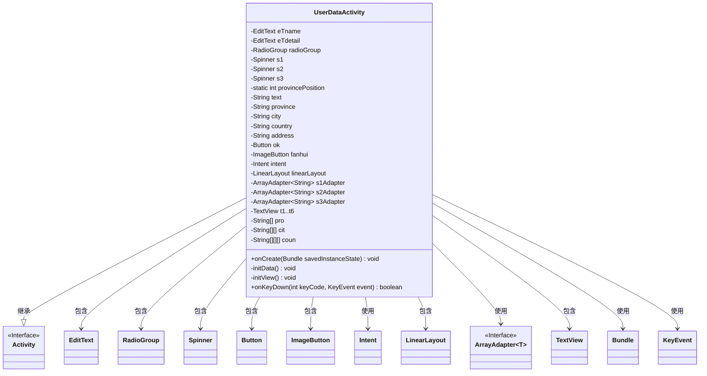
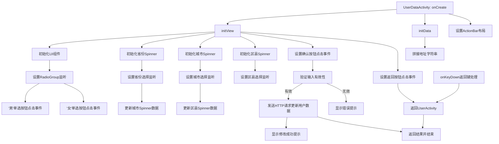

# 基础信息

|      |      |
|------|------|
| 名称 | UserDataActivity |
| 编码语言 | .java |
| 代码路径 | happycat/src/com/happycat/UserDataActivity.java |
| 包名 | com.happycat |
| 依赖项 | ['com.example.happucat.R', 'com.happycat.util.ActivitiyUtils', 'com.happycat.util.MyApplication', 'com.lidroid.xutils.HttpUtils', 'com.lidroid.xutils.exception.HttpException', 'com.lidroid.xutils.http.RequestParams', 'com.lidroid.xutils.http.ResponseInfo', 'com.lidroid.xutils.http.callback.RequestCallBack', 'com.lidroid.xutils.http.client.HttpRequest.HttpMethod', 'android.app.Activity', 'android.content.Intent', 'android.os.Bundle', 'android.util.Log', 'android.view.KeyEvent', 'android.view.View', 'android.view.View.OnClickListener', 'android.widget.AdapterView', 'android.widget.ArrayAdapter', 'android.widget.Button', 'android.widget.EditText', 'android.widget.ImageButton', 'android.widget.LinearLayout', 'android.widget.RadioButton', 'android.widget.RadioGroup', 'android.widget.Spinner', 'android.widget.TextView', 'android.widget.Toast', 'android.widget.AdapterView.OnItemSelectedListener'] |
| 概述说明 | Android用户数据编辑页面，包含昵称、性别选择、省市区三级联动及详细地址输入，数据通过HTTP提交至服务器。 |

# 说明

该代码描述了一个用户数据编辑界面Activity，包含以下功能：通过EditText输入昵称和详细地址，RadioGroup选择性别，三个Spinner联动选择省市区。界面初始化时设置默认值（男、江苏省南京市玄武区）。用户提交时验证输入长度，通过HTTP POST请求将数据发送至服务器，成功后返回结果并关闭页面。返回按钮和物理返回键均实现数据回传功能。地址数据由省市区和详细地址拼接而成。

# 类列表 Class Summary

| 名称   | 类型  | 说明 |
|-------|------|-------------|
| UserDataActivity | class | 这是一个用户数据修改的Android活动类，包含昵称、性别选择和省市区三级联动功能，最后提交数据到服务器。 |

## 类 UserDataActivity

|      |      |
|------|------|
| 访问范围 | public |
| 类型 | class |
| 名称 | UserDataActivity |
| 说明 | 这是一个用户数据修改的Android活动类，包含昵称、性别选择和省市区三级联动功能，最后提交数据到服务器。 |

### UML类图

这段类图展示了UserDataActivity的结构及其与Android组件的交互关系。作为继承自Activity的类，它管理着用户数据修改界面，包含多个UI控件（如EditText、Spinner、RadioGroup等）和数据处理逻辑。通过ArrayAdapter实现三级联动选择器，处理省份-城市-区县的级联选择，并封装了网络请求功能将修改后的用户数据提交到服务器。类图中清晰地呈现了成员变量、控件依赖关系以及核心方法，体现了Android活动中典型的视图控制与数据处理模式。

### 内部方法调用关系图

该流程图描述了UserDataActivity的核心逻辑流程。Activity启动后首先初始化视图和数据，包含三个级联Spinner(省-市-区)的联动逻辑，性别单选按钮处理，以及表单提交验证。当用户点击确认按钮时会验证昵称和地址长度，通过后发送HTTP请求更新数据，失败则提示错误。返回操作会携带当前表单数据跳转回UserActivity。整个流程完整展示了用户数据修改页面的所有交互路径和数据处理逻辑。

### 字段列表 Field List

| 名称  | 类型  | 说明 |
|-------|-------|------|
| intent | Intent | 定义意图变量intent。 |
| t6 | TextView | 定义了六个TextView变量：t1至t6。 |
| radioGroup | RadioGroup | 私有RadioGroup组件变量radioGroup。 |
| provincePosition = 0 | int | 静态整型变量provincePosition初始化为0。 |
| s3 | Spinner | 声明三个私有Spinner变量：s1、s2、s3。 |
| address | String | 男性，江苏省南京市玄武区 |
| pro = new String[] { "江苏省", "河南省", "北京市" } | String[] | 定义字符串数组pro，包含三个元素：江苏省、河南省、北京市。 |
| coun = new String[][][] {			{ { "玄武区", "白下区", "秦淮区", "建邺区", "鼓楼区", "下关区", "浦口区" },					{ "京口区 ", "润州区", "丹徒区" },					{ "武进区", "天宁区", "钟楼区", "新北区", "戚墅堰区" },					{ "崇安区", "南长区", "北塘区", "滨湖区", "无锡新区", "惠山区", "锡山区" },					{ "金阊区", "沧浪区", "平江区", "虎丘区", "吴中区", "相城区" },					{ "新浦区", "连云区", "海州区" }, { "亭湖区", "盐都区" },					{ "崇川区", "港闸区", "通州区" },					{ "云龙区", "鼓楼区", "九里区", "贾汪区", "泉山区" }, { "宿城区", "宿豫区" },					{ "清河区", "清浦区", "楚州区", "淮阴区" }, { "广陵区", "邗江区", "江都区" },					{ "海陵区", "高港区" } },			{					{ "管城回族区", "金水区", "二七区", "上街区", "中原区", "西北高新区", "东南高新区",							"郑东新区", "惠济区（邙山区）" },					{ "龙庭区", "金明区", "顺河区", "鼓楼区", "禹王台区" },					{ "涧西区 ", "西工区", "老城区", "瀍河回族区", "吉利区", "洛龙区" },					{ "新华区卫东区", "新城区", "高新区", "石龙区", "湛河区" },					{ "殷都区 ", "北关区", "文峰区", "龙安区 " },					{ "淇滨区", "山城区", "鹤山区" },					{ "卫滨区", "红旗区", "牧野区", "凤泉区", "高新技术产业开发区", "西工区", "小店工业区" },					{ "山阳区", "解放区", "中站区", "马村区" }, { "华龙区", "高新区" },					{ "郾城区", "源汇区", "召陵区" }, { "魏都区" }, { "湖滨区" },					{ "睢阳区", "梁园区", "开发区" }, { "驿城区" }, { "宛城区", "卧龙区" },					{ "浉河区", "平桥区" },					{ "克井镇", "五龙口镇", "轵城镇", "承留镇", "邵原镇", "坡头镇", "梨林镇", "大峪镇" } },			{ { "东城区", "西城区", "崇文区", "宣武区" }, { "朝阳区", "丰台区", "石景山区", "海淀区" },					{ "门头沟区", "房山区", "通州区", "顺义区" },					{ "昌平区 ", "大兴区", "怀柔区", "平谷区" } } } | String[][][] | 该代码定义了一个三维字符串数组，存储了中国多个城市（如南京、郑州、北京等）的市辖区名称。数组按省份分组，每个省份包含若干城市，每个城市下列出其辖区。例如南京包含玄武区、白下区等，北京包含东城区、西城区等。 |
| s3Adapter | ArrayAdapter<String> | 声明三个字符串数组适配器：s1Adapter、s2Adapter、s3Adapter。 |
| linearLayout | LinearLayout | 线性布局控件声明。 |
| cit = new String[][] {			{ "南京市", "镇江市", "常州市", "无锡市 ", "苏州市 ", "连云港市 ", "盐城市 ", "南通市 ",					"徐州市 ", "宿迁市 ", "淮安市 ", "扬州市 ", "泰州市 " },			{ "郑州市", "开封市", "洛阳市", "平顶山市", "安阳市", "鹤壁市", "新乡市", "焦作市", "濮阳市",					"漯河市", "许昌市", "三门峡市", "商丘市", "驻马店市", "南阳市", "信阳市", "济源市" },			{ "无", "无", "无", "无", "无", "无", "无", "无", "无" } } | String[][] | 江苏省13市、河南省17市及9个无数据项。 |
| eTdetail | EditText | 声明两个私有EditText变量：eTname和eTdetail。 |
| fanhui | ImageButton | 返回按钮图标 |
| ok | Button | 按钮确认。 |

### 方法列表 Method List

| 名称  | 类型  | 说明 |
|-------|-------|------|
| onCreate | void | Android Activity初始化：调用父类onCreate，设置布局R.layout.activity_my_xgzl，自定义标题栏R.layout.title_bar_xiugaiuser，初始化视图和数据。 |
| initData | void | 私有方法initData用于初始化地址数据，将省份、城市、县区和输入框文本拼接为完整地址。 |
| initView | void | 初始化用户数据编辑界面，包含返回按钮、文本显示、输入框、单选按钮、省市区三级联动下拉框及提交按钮，实现数据验证和网络请求提交功能。 |
| onKeyDown | boolean | 当按下返回键时，跳转到UserActivity并传递name、sex、address参数，然后结束当前Activity。 |

