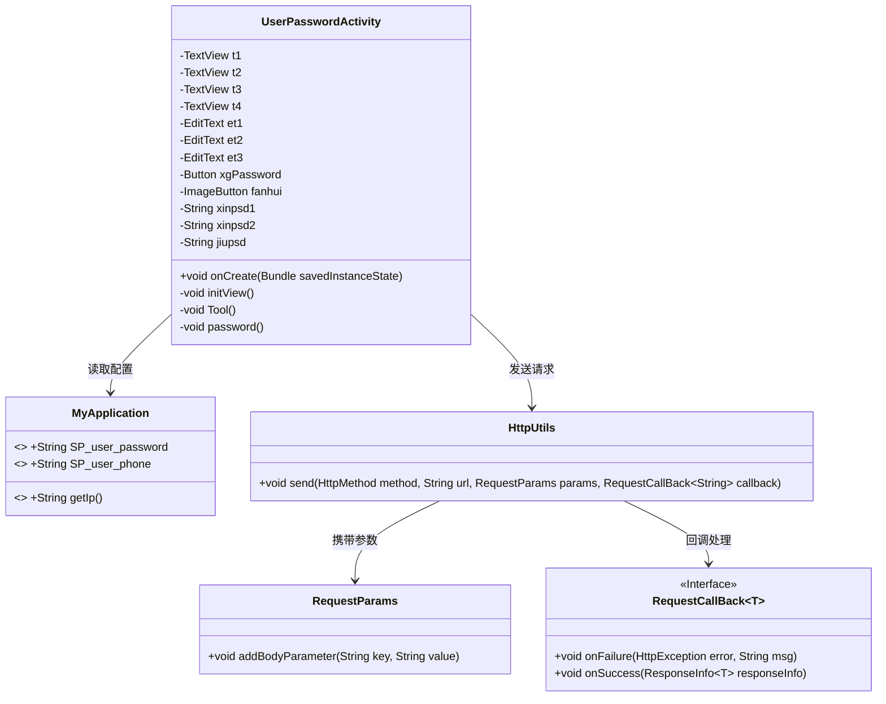
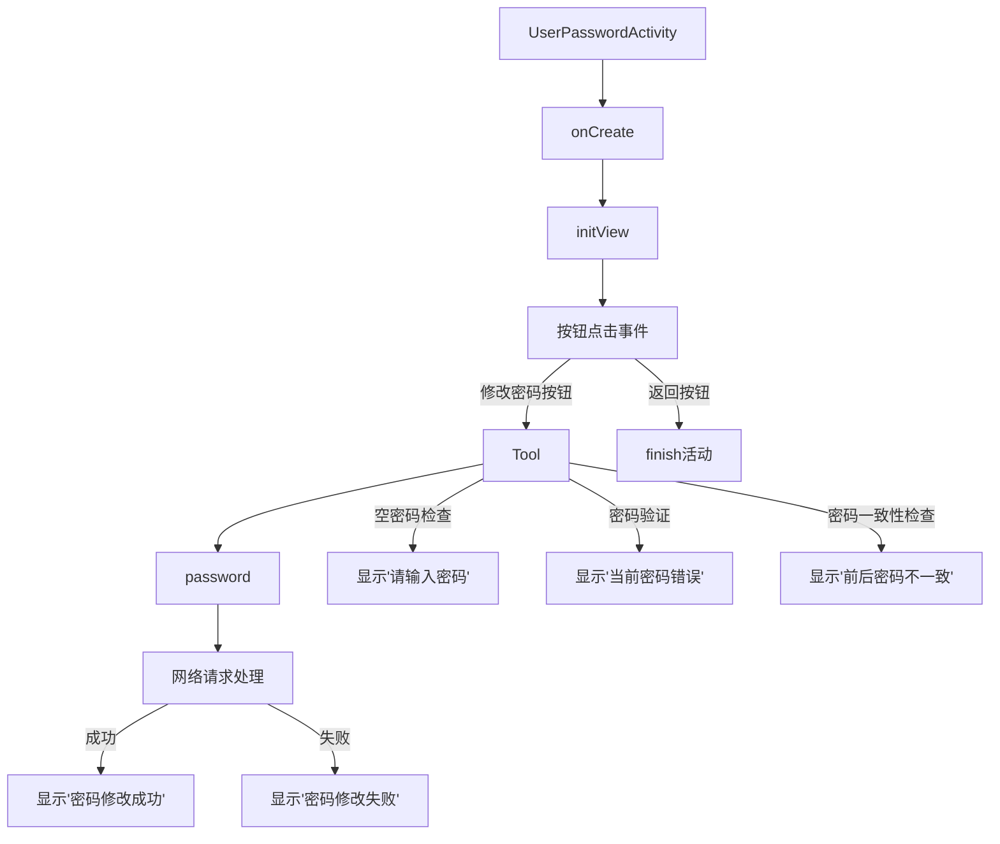

# 基础信息

|      |      |
|------|------|
| 名称 | UserPasswordActivity |
| 编码语言 | .java |
| 代码路径 | happycat/src/com/happycat/UserPasswordActivity.java |
| 包名 | com.happycat |
| 依赖项 | ['com.example.happucat.R', 'com.happycat.util.ActivitiyUtils', 'com.happycat.util.MyApplication', 'com.lidroid.xutils.HttpUtils', 'com.lidroid.xutils.exception.HttpException', 'com.lidroid.xutils.http.RequestParams', 'com.lidroid.xutils.http.ResponseInfo', 'com.lidroid.xutils.http.callback.RequestCallBack', 'com.lidroid.xutils.http.client.HttpRequest.HttpMethod', 'com.lidroid.xutils.http.client.entity.UploadEntity', 'android.app.Activity', 'android.content.Intent', 'android.os.Bundle', 'android.util.Log', 'android.view.View', 'android.view.View.OnClickListener', 'android.widget.Button', 'android.widget.EditText', 'android.widget.ImageButton', 'android.widget.TextView', 'android.widget.Toast'] |
| 概述说明 | 用户密码修改活动类，包含旧密码验证、新密码输入确认及网络请求功能，处理密码不一致和修改成功失败提示。 |

# 说明

该代码描述了一个用户密码修改活动UserPasswordActivity，继承自Activity类。界面包含三个文本输入框（旧密码、新密码、确认新密码）、四个文本标签、一个修改密码按钮和一个返回按钮。功能逻辑包括：验证旧密码是否正确、检查两次新密码是否一致，通过HTTP POST请求提交新密码到服务器。若修改成功显示提示信息并结束活动，失败则提示网络或密码错误。返回按钮点击后跳转至UserActivity。

# 类列表 Class Summary

| 名称   | 类型  | 说明 |
|-------|------|-------------|
| UserPasswordActivity | class | 用户密码修改活动类，包含界面初始化、密码验证、网络请求功能，处理旧密码校验、新密码一致性检查及修改结果反馈。 |

## 类 UserPasswordActivity

|      |      |
|------|------|
| 访问范围 | public |
| 类型 | class |
| 名称 | UserPasswordActivity |
| 说明 | 用户密码修改活动类，包含界面初始化、密码验证、网络请求功能，处理旧密码校验、新密码一致性检查及修改结果反馈。 |

### UML类图

这段代码描述了一个Android用户密码修改功能的活动类(UserPasswordActivity)，包含界面初始化、密码验证和网络请求逻辑。类图展示了它与MyApplication(存储用户信息)、HttpUtils(网络请求工具)、RequestParams(请求参数封装)以及RequestCallBack(回调接口)的交互关系。核心流程包括：验证旧密码、检查新密码一致性、通过HTTP POST请求提交新密码到服务器，并根据响应结果提示用户操作状态。

### 内部方法调用关系图

这段代码流程图展示了Android密码修改功能的完整流程。活动启动后初始化视图，处理两个按钮的点击事件：返回按钮直接退出活动，修改密码按钮会触发密码验证流程。该流程包含空值检查、旧密码验证、新密码一致性检查，最后通过HTTP POST请求提交新密码。网络请求成功后显示相应提示，失败时提示检查网络。整个流程包含完整的用户输入验证和错误处理机制。

### 字段列表 Field List

| 名称  | 类型  | 说明 |
|-------|-------|------|
| jiupsd | String | 三个字符串变量：xinpsd1、xinpsd2、jiupsd。 |
| fanhui | ImageButton | 返回按钮图片。 |
| et3 | EditText | 定义三个EditText变量：et1、et2、et3。 |
| t4 | TextView | 包含四个TextView组件：t1、t2、t3、t4。 |
| xgPassword | Button | 按钮组件xgPassword用于密码相关功能。 |

### 方法列表 Method List

| 名称  | 类型  | 说明 |
|-------|-------|------|
| password | void | 私有方法password()发送POST请求修改用户密码，参数包含手机号和新密码，成功返回提示修改成功，失败提示检查网络。 |
| Tool | void | 代码片段定义私有方法Tool，获取三个输入框文本并去除空格，分别赋值给变量xinpsd1、xinpsd2和jiupsd。 |
| onCreate | void | Android Activity的onCreate方法：调用父类方法、设置布局文件、初始化自定义标题栏和视图组件。 |
| initView | void | 初始化视图并设置点击事件：绑定文本框、输入框和按钮，处理密码修改逻辑，验证旧密码和新密码一致性，提示错误信息。 |

