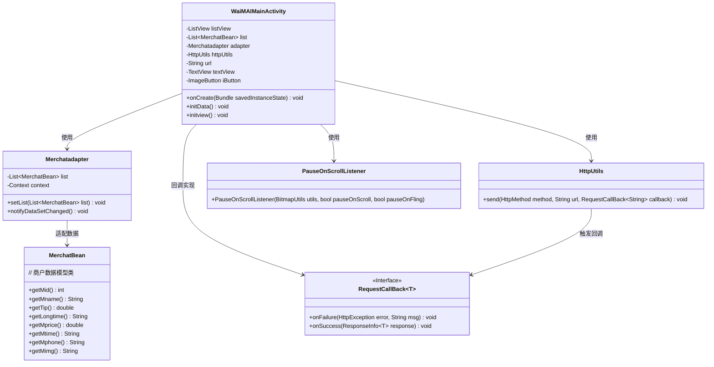
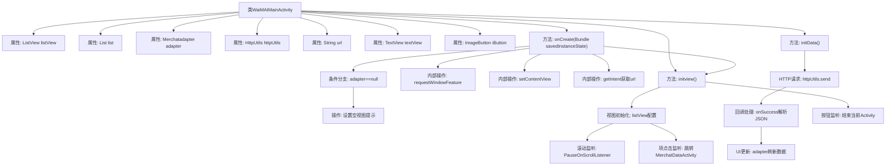

# 基础信息

|      |      |
|------|------|
| 名称 | WaiMAIMainActivity |
| 编码语言 | .java |
| 代码路径 | happycat/src/com/happycat/WaiMAIMainActivity.java |
| 包名 | com.happycat |
| 依赖项 | ['java.lang.reflect.Type', 'java.util.ArrayList', 'java.util.List', 'com.example.happucat.R', 'com.google.gson.Gson', 'com.google.gson.reflect.TypeToken', 'com.happycat.Bean.Goods', 'com.happycat.Bean.MerchatBean', 'com.happycat.adapter.Merchatadapter', 'com.happycat.adapter.Myadapter', 'com.happycat.util.MyApplication', 'com.lidroid.xutils.BitmapUtils', 'com.lidroid.xutils.HttpUtils', 'com.lidroid.xutils.ViewUtils', 'com.lidroid.xutils.bitmap.PauseOnScrollListener', 'com.lidroid.xutils.exception.HttpException', 'com.lidroid.xutils.http.ResponseInfo', 'com.lidroid.xutils.http.callback.RequestCallBack', 'com.lidroid.xutils.http.client.HttpRequest.HttpMethod', 'com.lidroid.xutils.view.annotation.event.OnScrollStateChanged', 'android.app.Activity', 'android.content.Intent', 'android.os.Bundle', 'android.util.Log', 'android.view.Menu', 'android.view.MenuItem', 'android.view.View', 'android.view.View.OnClickListener', 'android.view.Window', 'android.widget.AdapterView', 'android.widget.ImageButton', 'android.widget.TextView', 'android.widget.AdapterView.OnItemClickListener', 'android.widget.ListView', 'android.widget.Toast'] |
| 概述说明 | Android外卖应用主活动类，包含列表展示商家数据、网络请求获取JSON并解析、列表点击跳转详情及返回按钮功能。 |

# 说明

该代码描述了一个名为WaiMAIMainActivity的安卓活动类，主要用于展示外卖商家列表。活动初始化时隐藏标题栏并加载布局，通过HttpUtils发送GET请求获取商家数据，使用Gson解析JSON响应并填充到ListView中。列表适配器Merchatadapter管理数据展示，滑动时通过PauseOnScrollListener优化图片加载性能。点击列表项会跳转到MerchatDataActivity并传递商家详细信息（包括ID、名称、配送费、平均送达时间等）。顶部导航栏包含返回按钮，点击可关闭当前活动。若数据加载失败，会显示"访问网址不存在"的提示文本。

# 类列表 Class Summary

| 名称   | 类型  | 说明 |
|-------|------|-------------|
| WaiMAIMainActivity | class | 外卖应用主活动类，包含列表视图初始化、网络请求数据解析、列表项点击事件处理及返回按钮功能。 |

## 类 WaiMAIMainActivity

|      |      |
|------|------|
| 访问范围 | public |
| 类型 | class |
| 名称 | WaiMAIMainActivity |
| 说明 | 外卖应用主活动类，包含列表视图初始化、网络请求数据解析、列表项点击事件处理及返回按钮功能。 |

### UML类图

该图展示了一个外卖应用主活动(WaiMAIMainActivity)的核心结构，包含商户列表展示、网络请求和交互逻辑。活动通过HttpUtils发起网络请求，使用Gson解析JSON数据到MerchatBean列表，通过Merchatadapter适配器绑定到ListView。包含滚动优化(PauseOnScrollListener)和点击事件处理，能跳转到详情页(MerchatDataActivity)。类间通过依赖和接口回调实现数据流动，整体采用典型的Android MVC模式。

### 内部方法调用关系图

该流程图描述了外卖应用主活动WaiMAIMainActivity的核心逻辑，包含视图初始化、网络数据加载和用户交互处理三大模块。从onCreate生命周期开始，依次执行窗口设置、布局加载、视图初始化，并通过Intent获取URL参数。网络请求成功后使用Gson解析数据并更新列表适配器，同时配置了列表滚动优化和项点击跳转逻辑，顶部返回按钮则直接结束当前活动。整个流程体现了Android活动中典型的初始化-数据加载-事件绑定模式。

### 字段列表 Field List

| 名称  | 类型  | 说明 |
|-------|-------|------|
| adapter | Merchatadapter | 商户适配器实例。 |
| httpUtils | HttpUtils | 声明一个HttpUtils类型的变量httpUtils。 |
| listView | ListView | 定义ListView控件实例listView。 |
| url | String | 定义私有字符串变量url。 |
| list = new ArrayList<MerchatBean>() | List<MerchatBean> | 创建一个MerchatBean类型的动态数组列表。 |
| iButton | ImageButton | 图像按钮控件iButton。 |
| textView | TextView | 定义TextView对象textView。 |

### 方法列表 Method List

| 名称  | 类型  | 说明 |
|-------|-------|------|
| initData | void | 方法initData通过HTTP GET请求获取数据，使用Gson解析JSON并更新列表适配器。成功时处理数据，失败时未处理。 |
| onCreate | void | Android Activity初始化代码：隐藏标题栏、加载布局、初始化视图和数据。检查Intent传递的URL，若适配器为空则显示错误提示"访问网址不存在"。 |
| initview | void | 初始化ListView，设置适配器和滚动监听，优化图片加载。点击item跳转详情页并传递数据。顶部返回按钮结束当前活动。 |

