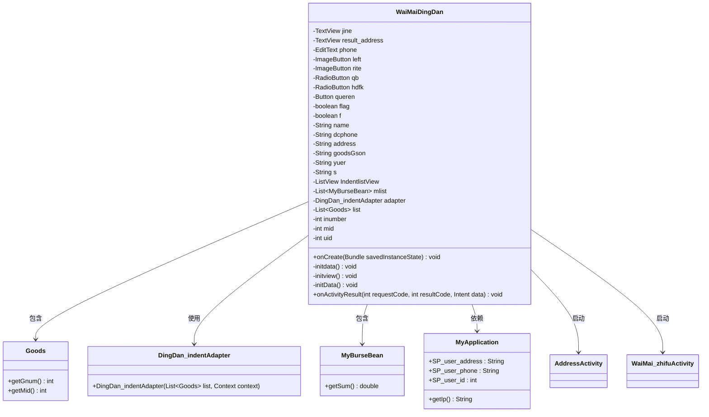
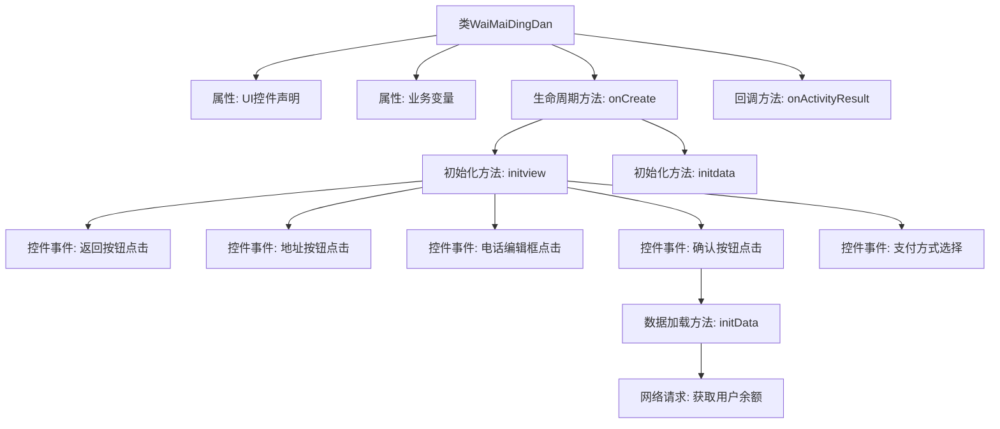

# 基础信息

|      |      |
|------|------|
| 名称 | WaiMaiDingDan |
| 编码语言 | .java |
| 代码路径 | happycat/src/com/happycat/WaiMaiDingDan.java |
| 包名 | com.happycat |
| 依赖项 | ['java.lang.reflect.Type', 'java.util.ArrayList', 'java.util.LinkedList', 'java.util.List', 'com.example.happucat.R', 'com.example.happucat.R.id', 'com.google.gson.Gson', 'com.google.gson.reflect.TypeToken', 'com.happycat.Bean.Goods', 'com.happycat.Bean.MyBurseBean', 'com.happycat.adapter.DingDan_indentAdapter', 'com.happycat.util.MyApplication', 'com.lidroid.xutils.HttpUtils', 'com.lidroid.xutils.exception.HttpException', 'com.lidroid.xutils.http.RequestParams', 'com.lidroid.xutils.http.ResponseInfo', 'com.lidroid.xutils.http.callback.RequestCallBack', 'com.lidroid.xutils.http.client.HttpRequest.HttpMethod', 'android.R.string', 'android.app.Activity', 'android.app.AlertDialog', 'android.content.DialogInterface', 'android.content.Intent', 'android.os.Bundle', 'android.util.Log', 'android.view.LayoutInflater', 'android.view.Menu', 'android.view.MenuItem', 'android.view.View', 'android.view.View.OnClickListener', 'android.view.Window', 'android.widget.Button', 'android.widget.EditText', 'android.widget.ImageButton', 'android.widget.ListView', 'android.widget.RadioButton', 'android.widget.TextView', 'android.widget.Toast'] |
| 概述说明 | 外卖订单Activity类，包含订单信息展示、地址选择、支付方式选择及确认功能，使用Gson解析商品数据，支持余额和货到付款两种支付方式，最终跳转至支付页面。 |

# 说明

该代码描述了一个外卖订单活动类WaiMaiDingDan，继承自Activity。主要功能包括初始化订单界面视图，处理用户地址、商品信息和支付方式选择。界面包含返回按钮、商品列表、应付金额显示、联系电话输入框及确认按钮。用户可选择钱包或货到付款两种支付方式，确认订单后跳转至支付页面。代码还涉及从服务器获取用户余额数据，并通过Gson解析商品和用户信息。整体实现了外卖订单的展示、支付方式选择及订单确认流程。

# 类列表 Class Summary

| 名称   | 类型  | 说明 |
|-------|------|-------------|
| WaiMaiDingDan | class | 外卖订单Activity类，包含地址显示、商品列表、支付方式选择和确认功能，支持余额支付和货到付款，数据通过Gson解析，最终跳转至支付页面。 |

## 类 WaiMaiDingDan

|      |      |
|------|------|
| 访问范围 | public |
| 类型 | class |
| 名称 | WaiMaiDingDan |
| 说明 | 外卖订单Activity类，包含地址显示、商品列表、支付方式选择和确认功能，支持余额支付和货到付款，数据通过Gson解析，最终跳转至支付页面。 |

### UML类图

这段代码描述了一个外卖订单Activity类(WaiMaiDingDan)，主要功能包括：初始化订单界面(initview)、处理支付方式选择、地址管理、商品信息展示和金额计算。该类通过DingDan_indentAdapter展示商品列表，使用MyApplication获取用户信息，并能跳转到AddressActivity修改地址或WaiMai_zhifuActivity进行支付。关键业务逻辑包括：从Intent解析商品数据、计算总金额、处理支付方式选择(RadioButton)以及通过网络请求获取用户余额信息(initData)。类中使用了多种Android组件(TextView、EditText等)和自定义数据模型(Goods、MyBurseBean)。

### 内部方法调用关系图

这段代码是一个外卖订单Activity的实现，主要功能包括：初始化界面控件、处理用户地址信息、展示商品列表、计算订单金额、选择支付方式以及确认订单跳转支付页面。流程图展示了从Activity创建到用户交互的完整流程，包括UI初始化、事件处理和网络请求等关键步骤，特别突出了支付方式选择和订单确认这两个核心业务流程。代码通过多个监听器实现用户交互，并使用Gson处理JSON数据，最后通过Intent进行页面跳转和数据传递。

### 字段列表 Field List

| 名称  | 类型  | 说明 |
|-------|-------|------|
| queren | Button | 按钮确认 |
| IndentlistView | ListView | 列表视图缩进列表视图 |
| rite | ImageButton | 左右图像按钮 |
| adapter | DingDan_indentAdapter | 定义订单缩进适配器实例adapter。 |
| list | List<Goods> | 定义了一个名为list的列表变量，用于存储Goods类型的对象。 |
| f | boolean | 定义布尔标志变量f。 |
| mlist | List<MyBurseBean> | 定义了一个名为mlist的列表变量，类型为List<MyBurseBean>，用于存储MyBurseBean对象集合。 |
| uid=0 | int | 声明三个整型变量：inumber、mid、uid，初始值均为0。 |
| phone | EditText | 编辑电话号码 |
| s | String | 字符串变量包括名称、电话、地址、商品数据、余额和其他信息。 |
| result_address | TextView | 显示金额和结果地址的文本视图。 |
| hdfk | RadioButton | 单选按钮选项：qb和hdfk。 |

### 方法列表 Method List

| 名称  | 类型  | 说明 |
|-------|-------|------|
| onCreate | void | Android Activity初始化代码：继承父类onCreate，隐藏标题栏，设置布局文件为waimai_dingdan，初始化视图和数据。 |
| initdata | void | 这是一个空的私有方法initdata，用于初始化数据，目前未实现具体功能。 |
| initview | void | 初始化视图，设置订单列表、地址显示、金额计算及支付方式选择。包含返回按钮、地址跳转、电话编辑及确认订单功能，数据通过Intent传递。 |
| onActivityResult | void | 重写Android活动结果处理方法，检查结果码为OK时获取地址数据并更新UI显示。 |
| initData | void | 私有方法initData使用XUtils框架向服务器发送POST请求，获取JSON数据并解析为链表，提取余额信息。成功打印结果，失败记录错误日志。 |

