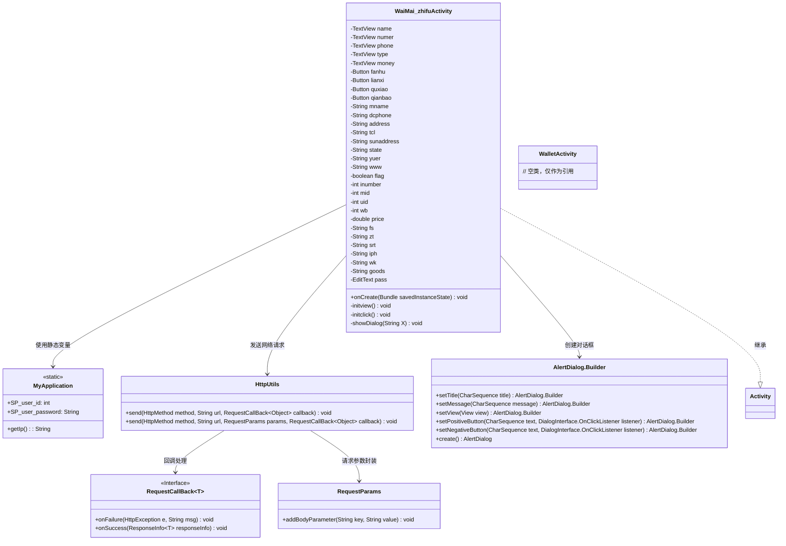
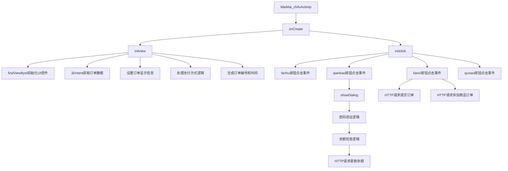

# 基础信息

|      |      |
|------|------|
| 名称 | WaiMai_zhifuActivity |
| 编码语言 | .java |
| 代码路径 | happycat/src/com/happycat/WaiMai_zhifuActivity.java |
| 包名 | com.happycat |
| 依赖项 | ['java.lang.reflect.Type', 'java.text.SimpleDateFormat', 'java.util.Date', 'java.util.LinkedList', 'java.util.List', 'com.example.happucat.R', 'com.google.gson.Gson', 'com.google.gson.reflect.TypeToken', 'com.happycat.Bean.MyBurseBean', 'com.happycat.util.MyApplication', 'com.happycay.fragments.XiaoxiFragment', 'com.lidroid.xutils.HttpUtils', 'com.lidroid.xutils.exception.HttpException', 'com.lidroid.xutils.http.RequestParams', 'com.lidroid.xutils.http.ResponseInfo', 'com.lidroid.xutils.http.callback.RequestCallBack', 'com.lidroid.xutils.http.client.HttpRequest.HttpMethod', 'android.R.integer', 'android.R.string', 'android.app.Activity', 'android.app.AlertDialog', 'android.content.DialogInterface', 'android.content.Intent', 'android.opengl.Visibility', 'android.os.Bundle', 'android.util.Log', 'android.view.LayoutInflater', 'android.view.Menu', 'android.view.MenuItem', 'android.view.View', 'android.view.View.OnClickListener', 'android.view.Window', 'android.widget.Button', 'android.widget.EditText', 'android.widget.TextView', 'android.widget.Toast'] |
| 概述说明 | 外卖支付活动类，包含订单信息展示、支付方式选择、钱包支付及订单提交功能。 |

# 说明

该代码描述了一个外卖支付活动的Android应用界面，主要功能包括订单信息展示、支付方式选择和订单提交。界面包含订单名称、编号、金额、支付方式、联系电话等显示组件，以及返回、联系商家、取消订单和钱包支付等按钮。根据订单状态（待支付或待评价）显示不同支付方式，支持货到付款或钱包支付。钱包支付需验证密码，余额不足会提示充值。订单提交后会上传至服务器，包括订单详情和商品信息。支付成功后更新余额并提示用户。整体实现了外卖订单的支付流程管理。

# 类列表 Class Summary

| 名称   | 类型  | 说明 |
|-------|------|-------------|
| WaiMai_zhifuActivity | class | 外卖支付活动类，包含订单信息展示、支付方式选择、钱包支付逻辑及订单提交功能。 |

## 类 WaiMai_zhifuActivity

|      |      |
|------|------|
| 访问范围 | public |
| 类型 | class |
| 名称 | WaiMai_zhifuActivity |
| 说明 | 外卖支付活动类，包含订单信息展示、支付方式选择、钱包支付逻辑及订单提交功能。 |

### UML类图

这段代码描述了一个外卖支付活动的Android实现，主要功能包括订单信息展示、支付方式选择（钱包支付或货到付款）、订单提交和余额支付验证。类图中展示了WaiMai_zhifuActivity与多个辅助类的关系，包括用于网络请求的HttpUtils、存储全局数据的MyApplication、构建对话框的AlertDialog.Builder等。该活动通过初始化视图、处理点击事件和显示支付对话框来完成整个支付流程，同时与后端服务器交互提交订单数据。

### 内部方法调用关系图

这段代码是一个外卖支付Activity的Android实现，主要功能包括：初始化订单信息界面、处理不同支付方式（钱包支付/货到付款）、实现订单提交功能。流程图展示了从Activity创建到各功能调用的完整流程，包括UI初始化、数据获取、支付逻辑处理、网络请求等关键步骤，特别突出了支付验证和余额检查的安全流程。

### 字段列表 Field List

| 名称  | 类型  | 说明 |
|-------|-------|------|
| pass | EditText | {{EditText pass;}} 的概要描述：编辑文本通过。 |
| goods | String | 声明多个字符串变量：fs、zt、srt、iph、wk、goods。 |
| qianbao | Button | 按钮功能：返回、联系、取消、钱包。 |
| price=0 | double | 声明一个双精度浮点变量price并初始化为0。 |
| money | TextView | 文本框控件，包含名称、数字、电话、类型、金额字段。 |
| wb=0 | int | 声明四个整型变量：inumber、mid、uid、wb，初始值均为0。 |
| www | String | 变量定义：字符串类型mname、dcphone、address、tcl、sunaddress、state、yuer、www。 |
| flag | boolean | 声明布尔变量flag。 |

### 方法列表 Method List

| 名称  | 类型  | 说明 |
|-------|-------|------|
| onCreate | void | Android Activity的onCreate方法：调用父类方法、隐藏标题栏、设置布局文件、初始化视图和点击事件。 |
| initview | void | 初始化视图方法，设置订单界面控件及数据，包括按钮、订单信息、支付方式、联系电话等，处理支付状态和订单编号生成。 |
| initclick | void | 代码实现外卖支付页面按钮点击事件：返回按钮跳转主页面；联系按钮提交订单数据到服务器；钱包按钮显示余额对话框；取消按钮关闭当前页面。 |
| showDialog | void | 该方法显示支付确认对话框，包含余额信息。用户输入密码后验证，若正确且余额足够则发送支付请求，成功或失败均有提示；取消支付则显示取消提示。 |

