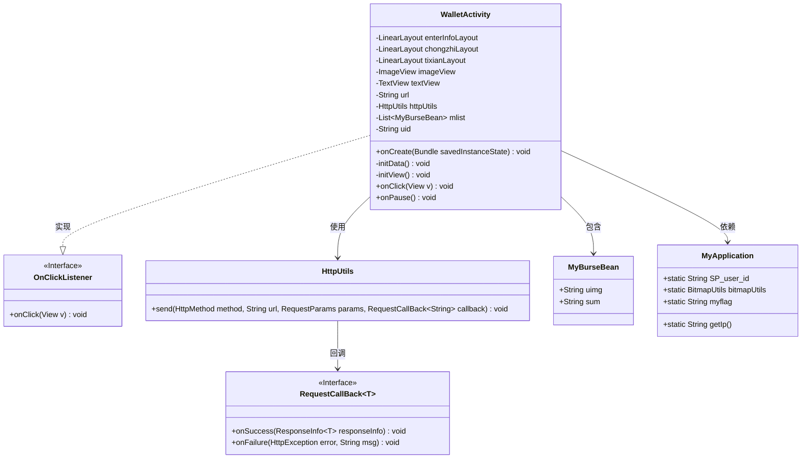
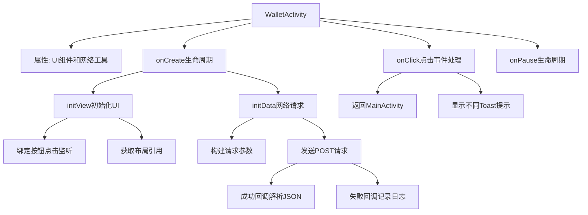

# 基础信息

|      |      |
|------|------|
| 名称 | WalletActivity |
| 编码语言 | .java |
| 代码路径 | happycat/src/com/happycat/WalletActivity.java |
| 包名 | com.happycat |
| 依赖项 | ['java.lang.reflect.Type', 'java.util.LinkedList', 'java.util.List', 'com.example.happucat.R', 'com.google.gson.Gson', 'com.google.gson.reflect.TypeToken', 'com.happycat.Bean.MerchatXqBean', 'com.happycat.Bean.MyBurseBean', 'com.happycat.util.ActivitiyUtils', 'com.happycat.util.MyApplication', 'com.happycat.util.StringUtils', 'com.lidroid.xutils.HttpUtils', 'com.lidroid.xutils.exception.HttpException', 'com.lidroid.xutils.http.RequestParams', 'com.lidroid.xutils.http.ResponseInfo', 'com.lidroid.xutils.http.callback.RequestCallBack', 'com.lidroid.xutils.http.client.HttpRequest.HttpMethod', 'android.app.Activity', 'android.content.Intent', 'android.os.Bundle', 'android.util.Log', 'android.view.View', 'android.view.View.OnClickListener', 'android.widget.ImageView', 'android.widget.LinearLayout', 'android.widget.TextView'] |
| 概述说明 | 钱包活动类，包含充值、提现功能，通过HTTP请求获取用户余额和头像，点击事件处理返回、账单详情等操作。 |

# 说明

该代码描述了一个名为WalletActivity的Android活动类，主要用于钱包功能。活动包含余额信息、充值和提现三个主要功能模块。在onCreate方法中初始化视图和数据，通过HttpUtils发送POST请求获取服务器数据，使用Gson解析返回的JSON数据并显示用户头像和余额。点击事件处理包括返回主页面、查看账单详情、充值和提现操作。活动暂停时设置全局标志位为1。整体实现了钱包功能的基本交互和数据展示。

# 类列表 Class Summary

| 名称   | 类型  | 说明 |
|-------|------|-------------|
| WalletActivity | class | WalletActivity是Android钱包功能界面，包含余额显示、充值和提现操作。通过HTTP请求获取用户数据并展示，使用XUtils框架处理网络请求和图片加载，支持点击事件跳转。 |

## 类 WalletActivity

|      |      |
|------|------|
| 访问范围 | public |
| 类型 | class |
| 名称 | WalletActivity |
| 说明 | WalletActivity是Android钱包功能界面，包含余额显示、充值和提现操作。通过HTTP请求获取用户数据并展示，使用XUtils框架处理网络请求和图片加载，支持点击事件跳转。 |

### UML类图

这段代码描述了一个Android钱包活动(WalletActivity)的类结构，它继承自Activity并实现了OnClickListener接口。主要功能包括初始化视图、处理用户点击事件、通过网络请求获取钱包数据并显示。类图中展示了WalletActivity与HttpUtils网络工具类、MyBurseBean数据模型、MyApplication全局应用类以及回调接口RequestCallBack之间的关系。该活动通过HttpUtils发送POST请求获取服务器数据，使用Gson解析JSON响应，并通过回调接口处理成功/失败情况。

### 内部方法调用关系图

该流程图描述了WalletActivity的核心生命周期和功能逻辑。Activity启动时依次执行onCreate、initView和initData方法，其中initView负责初始化界面元素并设置点击监听，initData通过HttpUtils发起网络请求获取钱包数据并更新UI。用户交互通过onClick处理不同按钮的跳转和提示，最后onPause会更新应用状态标志。整个过程展示了从界面初始化到数据加载再到用户交互的完整链条。

### 字段列表 Field List

| 名称  | 类型  | 说明 |
|-------|-------|------|
| url | String | 私有字符串变量url。 |
| imageView | ImageView | 图片视图控件 |
| tixianLayout | LinearLayout | 线性布局控件tixianLayout |
| enterInfoLayout | LinearLayout | 线性布局组件enterInfoLayout |
| chongzhiLayout | LinearLayout | 线性布局控件chongzhiLayout |
| uid=MyApplication.SP_user_id+"" | String | 用户ID字符串赋值，组合应用用户ID与空字符串。 |
| textView | TextView | 定义TextView控件变量textView。 |
| mlist | List<MyBurseBean> | 变量mlist是MyBurseBean类型的列表。 |
| httpUtils | HttpUtils | 声明了一个HttpUtils类型的变量httpUtils。 |

### 方法列表 Method List

| 名称  | 类型  | 说明 |
|-------|-------|------|
| onPause | void | Android生命周期方法onPause中设置全局变量myflag为1，调用父类方法。 |
| initView | void | 初始化视图：设置返回按钮、余额信息、充值、提现布局及图片视图的点击监听。 |
| onCreate | void | 安卓Activity的onCreate方法：初始化视图，设置布局，根据uid判断是否加载数据。 |
| initData | void | 方法initData使用XUtils框架发送POST请求到服务器，获取JSON数据并解析为MyBurseBean列表，显示图片和金额。失败时记录错误日志。 |
| onClick | void | 代码重写onClick方法，处理按钮点击事件：返回跳转主界面并关闭当前页，点击余额、充值、提现分别显示对应提示。 |

