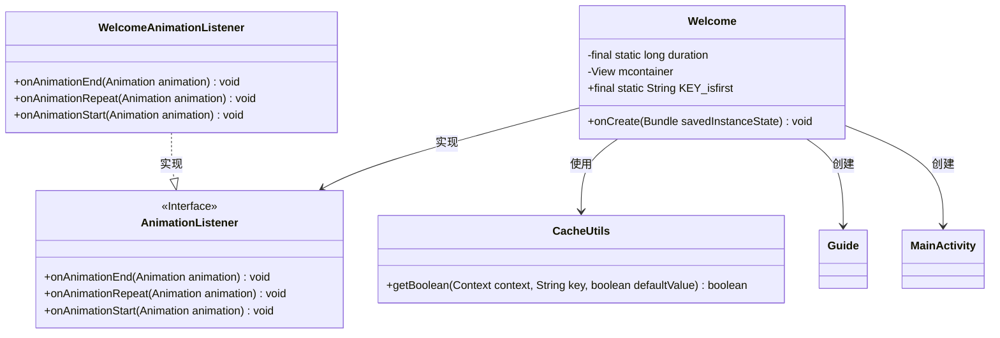
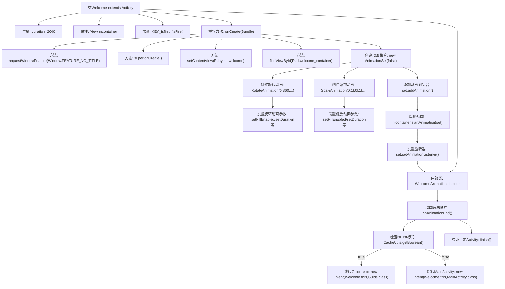

# 基础信息

|      |      |
|------|------|
| 名称 | Welcome |
| 编码语言 | .java |
| 代码路径 | happycat/src/com/happycat/Welcome.java |
| 包名 | com.happycat |
| 依赖项 | ['com.example.happucat.R', 'com.happycat.util.CacheUtils', 'android.os.Bundle', 'android.app.Activity', 'android.content.Intent', 'android.view.View', 'android.view.Window', 'android.view.animation.Animation', 'android.view.animation.Animation.AnimationListener', 'android.view.animation.AnimationSet', 'android.view.animation.RotateAnimation', 'android.view.animation.ScaleAnimation'] |
| 概述说明 | 欢迎页Activity，含旋转缩放动画，首次登录跳引导页，否则进主页，动画时长2000毫秒。 |

# 说明

这是一个Android欢迎页面的实现代码。Activity类Welcome继承自Activity，在onCreate方法中设置了无标题窗口，加载了欢迎页面布局。通过AnimationSet组合了旋转和缩放动画，持续时间为2000毫秒。动画监听器在动画结束时根据是否是首次登录（通过KEY_isfirst标记判断）决定跳转到引导页Guide或主页面MainActivity，最后关闭当前Activity。动画保持最终状态，旋转360度同时从0缩放到1。

# 类列表 Class Summary

| 名称   | 类型  | 说明 |
|-------|------|-------------|
| Welcome | class | 欢迎页Activity，含旋转缩放动画，首次登录跳引导页，否则进主页，动画时长2秒。 |

## 类 Welcome

|      |      |
|------|------|
| 访问范围 | public |
| 类型 | class |
| 名称 | Welcome |
| 说明 | 欢迎页Activity，含旋转缩放动画，首次登录跳引导页，否则进主页，动画时长2秒。 |

### UML类图

这段代码描述了一个Android欢迎页面的实现，主要包含Welcome类及其内部类WelcomeAnimationListener。Welcome类继承自Activity，负责展示欢迎动画并根据缓存标记决定跳转到引导页或主页。类图展示了Welcome与动画监听接口、缓存工具类以及两个Activity（Guide和MainActivity）之间的关系，体现了Android组件间的典型交互模式。

### 内部方法调用关系图

流程图描述：该流程图描述了Android欢迎页Activity的完整生命周期控制流程。从初始化窗口特征和布局开始，创建包含旋转和缩放效果的复合动画，并设置动画监听器。当动画结束时，根据首次启动标志决定跳转到引导页或主页，最后关闭当前Activity。流程清晰展示了UI初始化、动画配置、状态判断和页面导航的全过程，体现了Android组件和动画系统的典型交互模式。

### 字段列表 Field List

| 名称  | 类型  | 说明 |
|-------|-------|------|
| duration = 2000 | long | 私有静态长整型常量duration，值为2000。 |
| mcontainer | View | 私有视图容器变量mcontainer。 |
| KEY_isfirst="isFirst" | String | 定义静态常量KEY_isfirst，值为"isFirst"。 |

### 方法列表 Method List

| 名称  | 类型  | 说明 |
|-------|-------|------|
| onCreate | void | Android欢迎页动画实现：去除标题，加载布局，创建旋转和缩放动画组合，设置动画监听。 |

