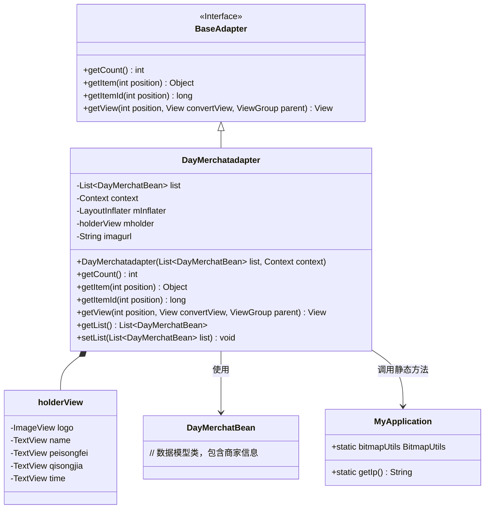

# 基础信息

|      |      |
|------|------|
| 名称 | DayMerchatadapter |
| 编码语言 | .java |
| 代码路径 | happycat/src/com/happycat/adapter/DayMerchatadapter.java |
| 包名 | com.happycat.adapter |
| 依赖项 | ['java.util.List', 'com.example.happucat.R', 'com.happycat.Bean.DayMerchatBean', 'com.happycat.Bean.Goods', 'com.happycat.util.MyApplication', 'android.R.integer', 'android.content.Context', 'android.util.Log', 'android.view.LayoutInflater', 'android.view.View', 'android.view.ViewGroup', 'android.widget.BaseAdapter', 'android.widget.ImageView', 'android.widget.TextView'] |
| 概述说明 | DayMerchatadapter是Android适配器类，用于展示商家列表，包含名称、配送费、起送价和送达时间等信息，使用ViewHolder优化性能。 |

# 说明

DayMerchatadapter是一个继承自BaseAdapter的适配器类，用于管理DayMerchatBean数据列表的展示。它包含一个内部类holderView，用于缓存列表项的视图组件，如ImageView和多个TextView。适配器通过getView方法动态加载布局并绑定数据，包括商家名称、配送费、起送价和送达时间等信息，同时使用MyApplication.bitmapUtils加载远程图片到logo视图。适配器还提供了获取和设置数据列表的方法。

# 类列表 Class Summary

| 名称   | 类型  | 说明 |
|-------|------|-------------|
| DayMerchatadapter | class | DayMerchatadapter是Android适配器类，用于展示商家列表，包含名称、配送费、起送价和送达时间，通过holderView优化视图性能。 |


## 类 DayMerchatadapter

|      |      |
|------|------|
| 访问范围 | public |
| 类型 | class |
| 名称 | DayMerchatadapter |
| 说明 | DayMerchatadapter是Android适配器类，用于展示商家列表，包含名称、配送费、起送价和送达时间，通过holderView优化视图性能。 |


### UML类图



类图描述：该图展示了一个Android适配器DayMerchatadapter的结构，它继承自BaseAdapter接口，用于在ListView中显示商家列表数据。适配器内部使用holderView类实现视图缓存优化，通过DayMerchatBean获取商家数据，并依赖MyApplication类获取网络图片地址和图片加载工具。主要功能包括数据绑定(getView)、列表项计数(getCount)和视图复用机制。


### 内部方法调用关系图

```mermaid
graph TD
    A["类DayMerchatadapter"]
    B["继承: BaseAdapter"]
    C["属性: List<DayMerchatBean> list"]
    D["属性: Context context"]
    E["属性: LayoutInflater mInflater"]
    F["属性: holderView mholder"]
    G["属性: String imagurl"]
    H["构造方法: DayMerchatadapter(List<DayMerchatBean>, Context)"]
    I["方法: int getCount()"]
    J["方法: Object getItem(int)"]
    K["方法: long getItemId(int)"]
    L["内部类: holderView"]
    M["方法: View getView(int, View, ViewGroup)"]
    N["方法: List<DayMerchatBean> getList()"]
    O["方法: void setList(List<DayMerchatBean>)"]
    P["holderView属性: ImageView logo"]
    Q["holderView属性: TextView name"]
    R["holderView属性: TextView peisongfei"]
    S["holderView属性: TextView qisongjia"]
    T["holderView属性: TextView time"]

    A --> B
    A --> C
    A --> D
    A --> E
    A --> F
    A --> G
    A --> H
    A --> I
    A --> J
    A --> K
    A --> L
    A --> M
    A --> N
    A --> O
    L --> P
    L --> Q
    L --> R
    L --> S
    L --> T
    H -->|初始化| C
    H -->|初始化| D
    H -->|初始化| E
    M -->|条件判断| "convertView == null"
    M -->|创建视图| "mInflater.inflate"
    M -->|设置控件| "findViewById"
    M -->|数据绑定| "setText/display"
```

这段代码定义了一个继承自BaseAdapter的DayMerchatadapter类，主要用于列表数据适配。包含构造方法初始化数据源和上下文，核心getView方法处理视图复用和数据绑定，内部holderView类缓存视图控件。流程图清晰展示了类结构、属性关系和方法调用链，特别是getView方法的条件判断和视图处理流程。适配器通过imagurl拼接图片地址，并使用bitmapUtils显示图片。

### 字段列表 Field List

| 名称  | 类型  | 说明 |
|-------|-------|------|
| context | Context | Context是一个上下文对象，用于存储和管理程序运行时的状态和数据。 |
| list | List<DayMerchatBean> | 这是一个DayMerchatBean类型的列表变量，用于存储多个DayMerchatBean对象。 |
| mholder | holderView | 视图持有者对象mholder。 |
| imagurl=" http://" + MyApplication.getIp()			+ ":8080//happycat/upimage/" | String | 代码片段定义了一个字符串变量imagurl，其值为通过拼接基础URL、IP地址和路径形成的完整图片上传地址。 |
| mInflater | LayoutInflater | 声明一个LayoutInflater类型的变量mInflater。 |

### 方法列表 Method List

| 名称  | 类型  | 说明 |
|-------|-------|------|
| getItemId | long | 重写getItemId方法，返回传入的position值作为项ID。 |
| getCount | int | 重写getCount方法，返回list的大小。 |
| getItem | Object | 重写getItem方法，返回列表中指定位置的元素。 |
| getView | View | Android适配器getView方法，复用convertView优化性能，绑定商家名称、配送费、起送价、送达时间和Logo图片数据到列表项视图。 |
| getList | List<DayMerchatBean> | 方法getList返回DayMerchatBean类型的列表list。 |
| setList | void | 这是一个Java方法，用于设置类中的列表属性，接收一个DayMerchatBean类型的List参数。 |


