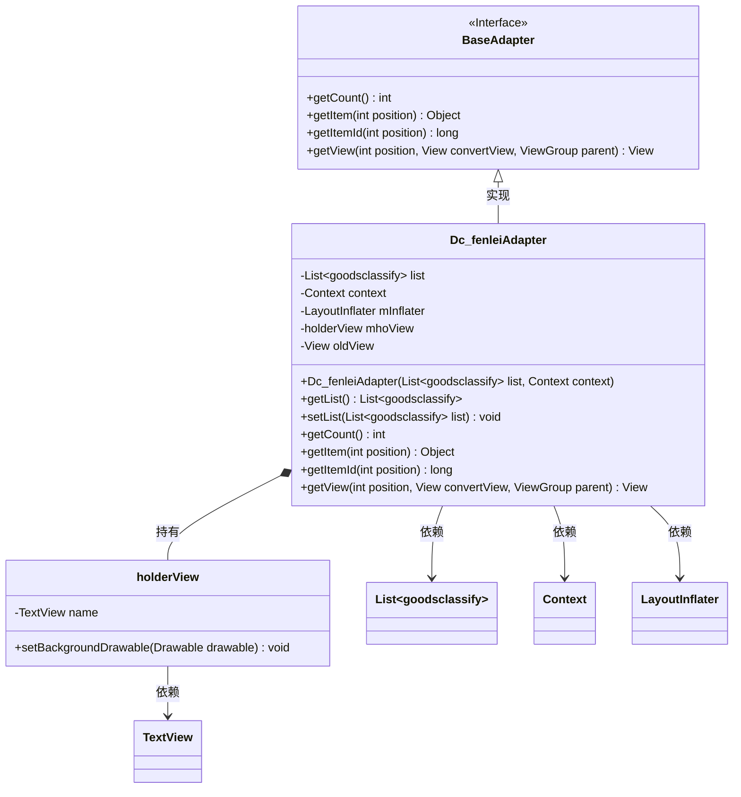

# 基础信息

|      |      |
|------|------|
| 名称 | Dc_fenleiAdapter |
| 编码语言 | .java |
| 代码路径 | happycat/src/com/happycat/adapter/Dc_fenleiAdapter.java |
| 包名 | com.happycat.adapter |
| 依赖项 | ['java.util.List', 'com.example.happucat.R', 'com.happycat.Bean.goodsclassify', 'android.content.Context', 'android.graphics.drawable.Drawable', 'android.view.LayoutInflater', 'android.view.View', 'android.view.View.OnClickListener', 'android.view.ViewGroup', 'android.widget.BaseAdapter', 'android.widget.TextView'] |
| 概述说明 | Dc_fenleiAdapter是Android适配器类，用于展示商品分类列表，包含列表数据管理、视图复用及分类名称显示功能。 |

# 说明

Dc_fenleiAdapter是一个继承自BaseAdapter的自定义适配器，用于在Android应用中展示商品分类列表。它接收一个goodsclassify对象列表和上下文Context作为构造参数，并通过LayoutInflater加载布局。适配器内部定义了一个holderView类来缓存视图控件，优化列表性能。getView方法实现了视图复用逻辑，根据位置设置对应的分类名称。适配器还提供了获取和设置列表数据的方法，以及标准的getCount、getItem和getItemId实现。注释部分显示曾尝试实现点击高亮功能，但当前版本未启用该代码。

# 类列表 Class Summary

| 名称   | 类型  | 说明 |
|-------|------|-------------|
| Dc_fenleiAdapter | class | Dc_fenleiAdapter是Android适配器类，用于商品分类列表展示，包含数据绑定和视图复用逻辑。 |

## 类 Dc_fenleiAdapter

|      |      |
|------|------|
| 访问范围 | public |
| 类型 | class |
| 名称 | Dc_fenleiAdapter |
| 说明 | Dc_fenleiAdapter是Android适配器类，用于商品分类列表展示，包含数据绑定和视图复用逻辑。 |

### UML类图

这段代码展示了一个Android自定义适配器`Dc_fenleiAdapter`，它继承自`BaseAdapter`接口，用于管理商品分类列表的显示。适配器包含内部类`holderView`用于视图缓存优化，通过`getView()`方法实现列表项的复用逻辑。类图清晰地呈现了适配器与数据源(List)、Android组件(Context/TextView)的依赖关系，以及视图持有模式的结构设计。

### 内部方法调用关系图

```mermaid
graph TD
    A["类Dc_fenleiAdapter"]
    B["继承: BaseAdapter"]
    C["属性: List<goodsclassify> list"]
    D["属性: Context context"]
    E["属性: LayoutInflater mInflater"]
    F["属性: holderView mhoView"]
    G["属性: View oldView"]
    H["构造方法: Dc_fenleiAdapter(List<goodsclassify>, Context)"]
    I["方法: getList()"]
    J["方法: setList(List<goodsclassify>)"]
    K["重写方法: getCount()"]
    L["重写方法: getItem(int)"]
    M["重写方法: getItemId(int)"]
    N["内部类: holderView"]
    O["holderView属性: TextView name"]
    P["holderView方法: setBackgroundDrawable(Drawable)"]
    Q["重写方法: getView(int, View, ViewGroup)"]
    R["流程: inflate布局或复用convertView"]
    S["流程: 设置TextView文本"]

    A --> B
    A --> C
    A --> D
    A --> E
    A --> F
    A --> G
    A --> H
    A --> I
    A --> J
    A --> K
    A --> L
    A --> M
    A --> N
    N --> O
    N --> P
    A --> Q
    Q --> R
    Q --> S
```

该流程图展示了Dc_fenleiAdapter类的完整结构，包括其继承关系、属性定义、构造方法、常规方法和重写方法。特别突出了getView()方法的内部处理流程：先判断convertView是否为空来决定复用或新建视图，然后通过holderView模式优化视图操作，最后设置列表项文本内容。内部类holderView负责管理列表项视图组件，体现了Android适配器的典型设计模式。

### 字段列表 Field List

| 名称  | 类型  | 说明 |
|-------|-------|------|
| list | List<goodsclassify> | 定义了一个名为list的变量，类型为List<goodsclassify>，用于存储goodsclassify对象的集合。 |
| oldView = null | View | 声明一个名为oldView的视图变量并初始化为null。 |
| mInflater | LayoutInflater | 声明一个LayoutInflater类型的变量mInflater。 |
| context | Context | Context context; 表示声明一个Context类型的变量context，用于存储上下文信息。 |
| mhoView | holderView | 声明一个名为mhoView的holderView类型变量。 |

### 方法列表 Method List

| 名称  | 类型  | 说明 |
|-------|-------|------|
| getItem | Object | 重写getItem方法，返回列表中指定位置的元素。 |
| getList | List<goodsclassify> | 这是一个Java方法，返回名为list的商品分类列表。方法名为getList，返回类型为List<goodsclassify>。 |
| setList | void | 这是一个Java方法，用于设置类中的list属性，参数为GoodsClassify类型的List集合。 |
| getCount | int | 重写getCount方法，返回列表大小。 |
| getItemId | long | 重写getItemId方法，返回传入的position值作为项ID。 |
| getView | View | 重写getView方法，复用convertView优化列表性能，通过ViewHolder模式设置分类名称文本，注释部分为未实现的点击效果逻辑。 |

