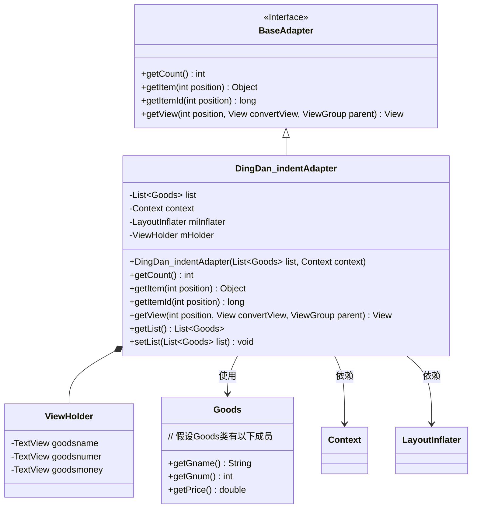
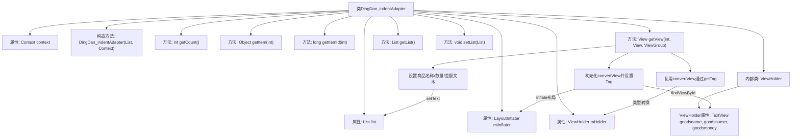

# 基础信息

|      |      |
|------|------|
| 名称 | DingDan_indentAdapter |
| 编码语言 | .java |
| 代码路径 | happycat/src/com/happycat/adapter/DingDan_indentAdapter.java |
| 包名 | com.happycat.adapter |
| 依赖项 | ['java.util.List', 'com.example.happucat.R', 'com.example.happucat.R.string', 'com.happycat.Bean.Goods', 'com.happycat.Bean.PingjiaBean', 'com.happycat.util.MyApplication', 'android.content.Context', 'android.view.LayoutInflater', 'android.view.View', 'android.view.ViewGroup', 'android.widget.BaseAdapter', 'android.widget.ImageView', 'android.widget.RadioButton', 'android.widget.TextView'] |
| 概述说明 | DingDan_indentAdapter继承BaseAdapter，用于显示订单商品列表，包含商品名称、数量和价格，使用ViewHolder优化性能。 |

# 说明

这是一个名为DingDan_indentAdapter的自定义适配器类，继承自BaseAdapter，用于在Android应用中显示订单商品列表。适配器接收商品列表和上下文对象作为参数，通过getView方法将数据绑定到列表项的视图上。内部类ViewHolder用于缓存视图控件，提高列表滚动性能。适配器实现了获取列表项数量、位置和ID的方法，并提供了获取和设置商品列表的方法。列表项显示商品名称、数量和总价。

# 类列表 Class Summary

| 名称   | 类型  | 说明 |
|-------|------|-------------|
| DingDan_indentAdapter | class | 订单适配器类，继承BaseAdapter，管理商品列表展示，包含视图复用逻辑，显示商品名称、数量和总价。 |

## 类 DingDan_indentAdapter

|      |      |
|------|------|
| 访问范围 | public |
| 类型 | class |
| 名称 | DingDan_indentAdapter |
| 说明 | 订单适配器类，继承BaseAdapter，管理商品列表展示，包含视图复用逻辑，显示商品名称、数量和总价。 |

### UML类图

这段代码展示了一个Android自定义适配器`DingDan_indentAdapter`，它继承自`BaseAdapter`接口，用于在ListView中显示商品订单数据。适配器内部使用`ViewHolder`模式优化性能，通过复用convertView减少布局加载开销。主要功能包括获取商品列表大小、根据位置获取商品对象、绑定商品数据到视图等。类图清晰地反映了适配器与数据模型(Goods)、Android组件(Context/LayoutInflater)以及视图缓存结构(ViewHolder)之间的关系。

### 内部方法调用关系图

该流程图展示了Android订单列表适配器的核心结构。适配器继承BaseAdapter，通过ViewHolder模式优化列表性能，包含数据绑定、视图复用和布局初始化等关键流程。构造方法接收商品列表和上下文，getView方法处理视图复用逻辑：首次创建时初始化视图组件并设置Tag，复用视图时直接获取Tag，最后更新商品名称、数量和总价显示。整个过程实现了列表数据与视图的高效绑定。

### 字段列表 Field List

| 名称  | 类型  | 说明 |
|-------|-------|------|
| list | List<Goods> | 定义了一个Goods类型的列表变量list。 |
| miInflater | LayoutInflater | 定义布局填充器变量miInflater。 |
| mHolder | ViewHolder | 定义ViewHolder变量mHolder。 |
| context | Context | 上下文对象，用于存储和管理程序运行时的环境信息。 |

### 方法列表 Method List

| 名称  | 类型  | 说明 |
|-------|-------|------|
| setList | void | Java方法：设置商品列表，参数为Goods类型的List。 |
| getItem | Object | 重写getItem方法，返回列表中指定位置的元素。 |
| getItemId | long | 重写getItemId方法，返回传入的position参数值。 |
| getCount | int | 重写getCount方法，返回list的大小。 |
| getList | List<Goods> | 方法getList返回一个Goods类型的列表list。 |
| getView | View | 重写getView方法，初始化或复用列表项布局，设置商品名称、数量和价格，返回视图。 |

