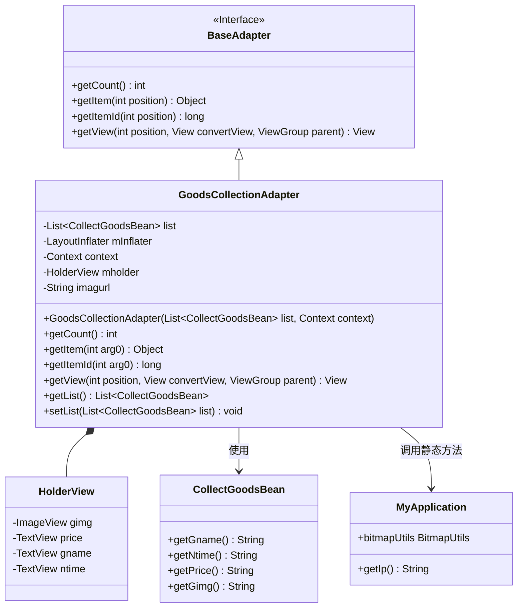
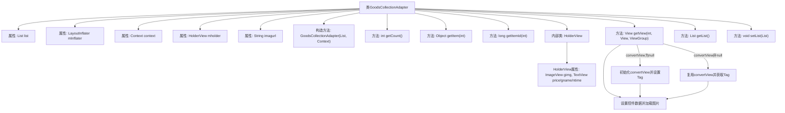

# 基础信息

|      |      |
|------|------|
| 名称 | GoodsCollectionAdapter |
| 编码语言 | .java |
| 代码路径 | happycat/src/com/happycat/adapter/GoodsCollectionAdapter.java |
| 包名 | com.happycat.adapter |
| 依赖项 | ['java.util.List', 'com.example.happucat.R', 'com.happycat.Bean.CollectBean', 'com.happycat.Bean.CollectGoodsBean', 'com.happycat.util.MyApplication', 'android.content.Context', 'android.util.Log', 'android.view.LayoutInflater', 'android.view.View', 'android.view.ViewGroup', 'android.widget.BaseAdapter', 'android.widget.ImageView', 'android.widget.TextView'] |
| 概述说明 | GoodsCollectionAdapter是Android适配器，用于展示收藏商品列表，包含图片、名称、价格和时间，通过HolderView优化性能。 |

# 说明

GoodsCollectionAdapter是一个继承自BaseAdapter的适配器类，用于管理CollectGoodsBean数据列表的展示。它包含一个内部类HolderView，用于缓存视图组件如ImageView和TextView。适配器通过getView方法将数据绑定到视图，包括美食名称、收藏时间、价格和图片（图片URL由MyApplication.getIp()拼接而成）。提供了获取和设置数据列表的方法。注释显示部分视图组件和店家名称相关代码被禁用。

# 类列表 Class Summary

| 名称   | 类型  | 说明 |
|-------|------|-------------|
| GoodsCollectionAdapter | class | 这是一个商品收藏适配器类，继承BaseAdapter，用于展示收藏商品列表。包含列表数据、视图填充器和图片URL，实现获取数据、绑定视图功能，显示商品名称、价格、收藏时间和图片。 |

## 类 GoodsCollectionAdapter

|      |      |
|------|------|
| 访问范围 | public |
| 类型 | class |
| 名称 | GoodsCollectionAdapter |
| 说明 | 这是一个商品收藏适配器类，继承BaseAdapter，用于展示收藏商品列表。包含列表数据、视图填充器和图片URL，实现获取数据、绑定视图功能，显示商品名称、价格、收藏时间和图片。 |

### UML类图

这段代码展示了一个Android适配器类`GoodsCollectionAdapter`，它继承自`BaseAdapter`接口，用于管理商品收藏列表的显示。适配器通过`HolderView`内部类实现视图缓存优化，包含商品图片、名称、价格和收藏时间等视图组件。数据来源于`CollectGoodsBean`实体类列表，图片通过`MyApplication`工具类加载。类图清晰地呈现了适配器模式的结构和组件间的协作关系，体现了Android列表控件数据绑定的典型实现方式。

### 内部方法调用关系图

该流程图展示了GoodsCollectionAdapter类的完整结构，重点描述了ListView适配器的核心工作流程。类包含数据列表管理、视图缓存复用机制(Holder模式)、图片异步加载等功能。关键路径展示了getView方法中根据convertView是否为空分别进行视图初始化或复用，最后统一设置数据并加载网络图片的过程，体现了Android适配器的高效视图处理方式。

### 字段列表 Field List

| 名称  | 类型  | 说明 |
|-------|-------|------|
| list | List<CollectGoodsBean> | 私有列表变量list，存储CollectGoodsBean类型元素。 |
| imagurl = " http://" + MyApplication.getIp() + ":8080/happycat/img/" | String | 代码定义字符串变量imagurl，拼接HTTP协议、IP地址和路径，指向happycat/img目录。 |
| mholder | HolderView | HolderView对象mholder |
| mInflater | LayoutInflater | 声明一个私有的LayoutInflater类型变量mInflater。 |
| context | Context | {{Context context;}} 是一个代码片段，表示声明了一个名为 context 的 Context 类型变量。Context 通常用于存储请求或程序运行时的上下文信息。 |

### 方法列表 Method List

| 名称  | 类型  | 说明 |
|-------|-------|------|
| getItemId | long | 这是一个Java方法重写，返回传入参数arg0作为项目ID。方法功能简单直接。 |
| getItem | Object | 重写getItem方法，返回列表中指定位置的元素。 |
| getCount | int | 重写getCount方法，返回list的大小。 |
| getView | View | 自定义适配器getView方法，复用视图并绑定商品收藏项数据，包括图片、名称、价格和收藏时间。 |
| getList | List<CollectGoodsBean> | 获取商品列表的方法，返回类型为CollectGoodsBean的集合。 |
| setList | void | 设置列表属性，接收CollectGoodsBean类型的列表参数。 |

