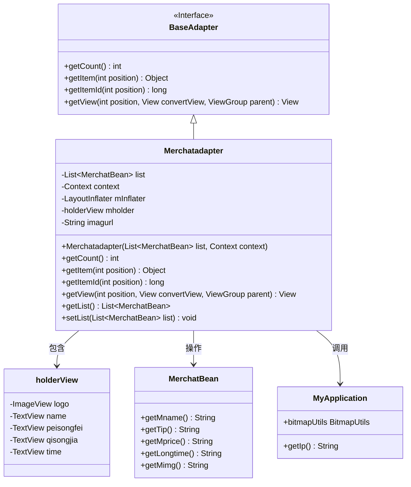

# 基础信息

|      |      |
|------|------|
| 名称 | Merchatadapter |
| 编码语言 | .java |
| 代码路径 | happycat/src/com/happycat/adapter/Merchatadapter.java |
| 包名 | com.happycat.adapter |
| 依赖项 | ['java.util.List', 'com.example.happucat.R', 'com.happycat.Bean.Goods', 'com.happycat.Bean.MerchatBean', 'com.happycat.util.MyApplication', 'android.R.integer', 'android.content.Context', 'android.util.Log', 'android.view.LayoutInflater', 'android.view.View', 'android.view.ViewGroup', 'android.widget.BaseAdapter', 'android.widget.ImageView', 'android.widget.TextView'] |
| 概述说明 | Merchatadapter是一个Android适配器类，用于展示商家列表，包含商家名称、配送费、起送价和送达时间等信息，并支持图片加载。 |

# 说明

该代码定义了一个名为Merchatadapter的自定义适配器类，继承自BaseAdapter，用于在Android应用中展示商家列表。适配器接收一个MerchatBean对象列表和上下文对象作为参数，通过LayoutInflater加载布局。内部类holderView用于缓存视图组件，包含商家的logo、名称、配送费、起送价和送达时间等控件。getView方法负责填充列表项数据，包括设置文本和加载远程图片。适配器还提供了获取和设置列表数据的方法。图片URL由固定前缀和服务器IP地址拼接而成。

# 类列表 Class Summary

| 名称   | 类型  | 说明 |
|-------|------|-------------|
| Merchatadapter | class | Merchatadapter是Android适配器类，用于展示商家列表，包含商家名称、配送费、起送价和送达时间等信息，支持图片加载和列表项复用。 |

## 类 Merchatadapter

|      |      |
|------|------|
| 访问范围 | public |
| 类型 | class |
| 名称 | Merchatadapter |
| 说明 | Merchatadapter是Android适配器类，用于展示商家列表，包含商家名称、配送费、起送价和送达时间等信息，支持图片加载和列表项复用。 |

### UML类图

该图展示了一个Android适配器类Merchatadapter的结构，它继承自BaseAdapter接口，用于在ListView中显示商家数据。适配器包含一个内部类holderView用于视图缓存，操作MerchatBean数据模型，并依赖MyApplication获取网络配置。主要功能包括数据绑定、视图复用和图片加载，实现了列表项的高效渲染。

### 内部方法调用关系图

```mermaid
graph TD
    A["类Merchatadapter"]
    B["属性: List<MerchatBean> list"]
    C["属性: Context context"]
    D["属性: LayoutInflater mInflater"]
    E["属性: holderView mholder"]
    F["属性: String imagurl"]
    G["构造方法: Merchatadapter(List<MerchatBean>, Context)"]
    H["方法: int getCount()"]
    I["方法: Object getItem(int)"]
    J["方法: long getItemId(int)"]
    K["内部类: holderView"]
    L["方法: View getView(int, View, ViewGroup)"]
    M["方法: List<MerchatBean> getList()"]
    N["方法: void setList(List<MerchatBean>)"]
    O["holderView属性: ImageView logo"]
    P["holderView属性: TextView name"]
    Q["holderView属性: TextView peisongfei"]
    R["holderView属性: TextView qisongjia"]
    S["holderView属性: TextView time"]

    A --> B
    A --> C
    A --> D
    A --> E
    A --> F
    A --> G
    A --> H
    A --> I
    A --> J
    A --> K
    A --> L
    A --> M
    A --> N
    K --> O
    K --> P
    K --> Q
    K --> R
    K --> S
    G --> D
    L --> E
    L --> B
    L --> F
```

该流程图展示了Merchatadapter类的完整结构，包括5个主要属性、1个内部类和7个核心方法。关键流程体现在getView方法中，该方法通过holderView模式实现列表项的高效复用，包含视图初始化、数据绑定和图片加载逻辑。构造方法初始化布局填充器，getCount/getItem等方法提供基础数据访问功能，setList/getList用于管理数据源。holderView内部类封装了列表项的5个UI组件，优化了findViewById性能。

### 字段列表 Field List

| 名称  | 类型  | 说明 |
|-------|-------|------|
| mInflater | LayoutInflater | 定义LayoutInflater变量mInflater，用于动态加载布局。 |
| mholder | holderView | 这是一个视图持有者的声明，用于管理视图实例。 |
| list | List<MerchatBean> | 存储商户信息的列表对象。 |
| imagurl=" http://" + MyApplication.getIp()			+ ":8080//happycat/upimage/" | String | 代码片段定义了一个字符串变量imagurl，其值为拼接的HTTP URL，包含基础地址和路径"happycat/upimage/"，端口8080，IP来自MyApplication.getIp()方法。 |
| context | Context | Context context; 表示定义了一个Context类型的变量context，用于存储上下文信息。 |

### 方法列表 Method List

| 名称  | 类型  | 说明 |
|-------|-------|------|
| getItem | Object | 重写getItem方法，返回列表中指定位置的元素。 |
| getCount | int | 重写getCount方法，返回list大小并打印日志。 |
| getItemId | long | 重写getItemId方法，直接返回传入的position参数。 |
| getView | View | Android适配器getView方法，复用convertView优化性能，设置列表项视图数据，包括名称、配送费、起送价、送达时间和图片。 |
| getList | List<MerchatBean> | 获取商户列表的方法，返回类型为MerchatBean的集合。 |
| setList | void | 这是一个Java方法，用于设置类中的list属性，接收一个MerchatBean类型的List参数。 |

