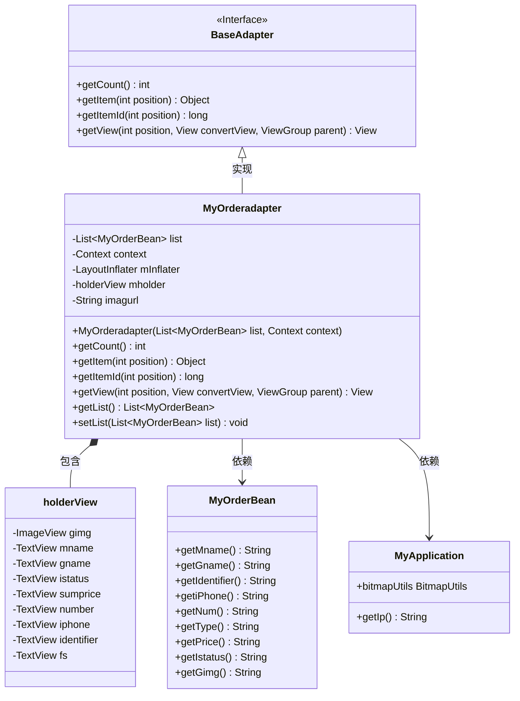
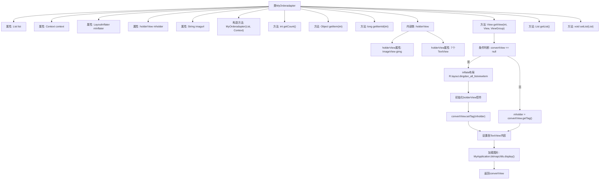

# 基础信息

|      |      |
|------|------|
| 名称 | MyOrderadapter |
| 编码语言 | .java |
| 代码路径 | happycat/src/com/happycat/adapter/MyOrderadapter.java |
| 包名 | com.happycat.adapter |
| 依赖项 | ['java.util.List', 'com.example.happucat.R', 'com.happycat.Bean.MyOrderBean', 'com.happycat.util.MyApplication', 'android.content.Context', 'android.view.LayoutInflater', 'android.view.View', 'android.view.ViewGroup', 'android.widget.BaseAdapter', 'android.widget.ImageView', 'android.widget.TextView'] |
| 概述说明 | MyOrderadapter是Android订单列表适配器，继承BaseAdapter，包含列表数据绑定、视图复用及图片加载功能，通过holderView优化性能。 |

# 说明

这是一个名为MyOrderadapter的自定义适配器类，继承自BaseAdapter，用于在Android应用中显示订单列表。它接收一个MyOrderBean对象列表和上下文作为构造参数，使用LayoutInflater加载布局。适配器内部定义了一个holderView类来缓存视图组件，包含ImageView和多个TextView用于显示订单名称、商品信息、订单号、电话、数量、支付方式、总价和状态等。通过getView方法填充数据到视图，并利用MyApplication类加载商品图片。适配器还提供了获取和设置列表数据的方法。图片URL由基础地址和商品图片路径拼接而成。

# 类列表 Class Summary

| 名称   | 类型  | 说明 |
|-------|------|-------------|
| MyOrderadapter | class | MyOrderadapter是一个Android订单列表适配器，继承BaseAdapter，用于展示订单信息，包含图片、名称、价格等字段，支持列表数据更新。 |

## 类 MyOrderadapter

|      |      |
|------|------|
| 访问范围 | public |
| 类型 | class |
| 名称 | MyOrderadapter |
| 说明 | MyOrderadapter是一个Android订单列表适配器，继承BaseAdapter，用于展示订单信息，包含图片、名称、价格等字段，支持列表数据更新。 |

### UML类图

这段代码展示了一个Android自定义适配器`MyOrderadapter`，它继承自`BaseAdapter`用于在列表视图中显示订单数据。适配器内部使用`holderView`作为视图缓存，通过`MyOrderBean`获取订单数据，并依赖`MyApplication`获取服务器IP和图片加载工具。类图清晰地展示了各组件间的继承、包含和依赖关系，体现了Android适配器模式的典型实现方式。

### 内部方法调用关系图

这段代码是一个Android自定义适配器类，继承自BaseAdapter，用于在ListView中显示订单数据。主要功能包括：初始化视图布局、重用convertView优化性能、通过holderView模式缓存控件引用、动态设置订单各项数据（包括文字和图片）。适配器通过构造方法接收数据源和上下文，提供getView()方法实现视图与数据的绑定，并包含获取/设置数据源的方法。流程图清晰展示了从视图初始化到数据填充的完整流程，特别突出了视图重用的优化机制。

### 字段列表 Field List

| 名称  | 类型  | 说明 |
|-------|-------|------|
| context | Context | 上下文对象，用于存储和管理程序运行时的环境信息。 |
| mInflater | LayoutInflater | 声明一个LayoutInflater类型的变量mInflater。 |
| list | List<MyOrderBean> | 订单列表数据对象。 |
| imagurl = " http://" + MyApplication.getIp() + ":8080/happycat/img/" | String | 代码定义字符串变量imagurl，拼接基础URL与路径，用于构建图片访问地址。 |
| mholder | holderView | 视图持有者对象。 |

### 方法列表 Method List

| 名称  | 类型  | 说明 |
|-------|-------|------|
| getView | View | Android适配器getView方法实现订单列表项视图复用，初始化控件并绑定数据到holder，包括订单名称、商品、编号、电话、数量、支付方式、价格和状态，最后加载商品图片。 |
| getItem | Object | 重写getItem方法，返回列表中指定位置的元素。 |
| getItemId | long | 重写getItemId方法，返回传入的position参数值。 |
| getList | List<MyOrderBean> | 方法getList返回类型为List<MyOrderBean>的列表对象list。 |
| setList | void | 方法setList接收一个MyOrderBean类型的List参数，并将其赋值给当前对象的list成员变量。 |
| getCount | int | 重写getCount方法，返回list的大小。 |

