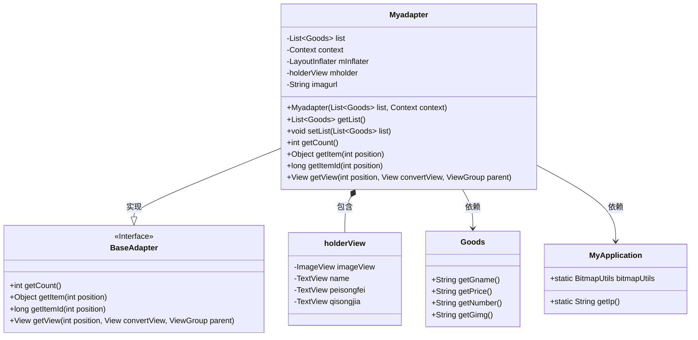
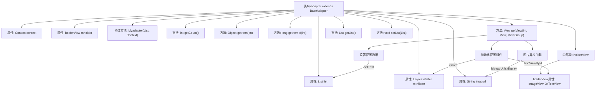

# 基础信息

|      |      |
|------|------|
| 名称 | Myadapter |
| 编码语言 | .java |
| 代码路径 | happycat/src/com/happycat/adapter/Myadapter.java |
| 包名 | com.happycat.adapter |
| 依赖项 | ['java.util.List', 'com.example.happucat.R', 'com.happycat.Bean.Goods', 'com.happycat.util.MyApplication', 'android.R.integer', 'android.content.Context', 'android.view.LayoutInflater', 'android.view.View', 'android.view.ViewGroup', 'android.widget.BaseAdapter', 'android.widget.ImageView', 'android.widget.TextView'] |
| 概述说明 | Myadapter继承BaseAdapter，用于展示商品列表，包含商品图片、名称、配送费和起送价，使用ViewHolder优化性能。 |

# 说明

这是一个名为Myadapter的自定义适配器类，继承自BaseAdapter，用于在Android应用中显示商品列表。适配器接收商品列表和上下文作为构造参数，使用LayoutInflater加载布局。内部类holderView用于缓存视图组件以提高性能。getView方法处理列表项的视图复用，设置商品名称、配送费、起送价和图片。图片通过拼接基础URL和商品图片路径加载。适配器还提供了获取和设置商品列表的方法。

# 类列表 Class Summary

| 名称   | 类型  | 说明 |
|-------|------|-------------|
| Myadapter | class | 自定义适配器Myadapter继承BaseAdapter，用于展示商品列表，包含图片、名称、配送费和起送价，通过ViewHolder优化性能。 |

## 类 Myadapter

|      |      |
|------|------|
| 访问范围 | public |
| 类型 | class |
| 名称 | Myadapter |
| 说明 | 自定义适配器Myadapter继承BaseAdapter，用于展示商品列表，包含图片、名称、配送费和起送价，通过ViewHolder优化性能。 |

### UML类图

这段代码展示了一个Android自定义适配器`Myadapter`，继承自`BaseAdapter`，用于在ListView中显示商品列表。适配器内部使用`holderView`实现视图缓存优化，通过`LayoutInflater`加载布局，并通过`MyApplication`获取网络图片地址和图片加载工具。商品数据通过`Goods`类提供具体属性，适配器实现了列表项渲染、数据绑定和性能优化等核心功能。

### 内部方法调用关系图

这段代码实现了一个自定义的BaseAdapter适配器，主要用于在Android中展示商品列表。流程图展示了类结构、属性关系和方法调用链，重点描述了getView方法中视图初始化、数据绑定和图片加载三个关键流程。适配器通过holderView模式优化性能，使用LayoutInflater创建列表项视图，并通过MyApplication的bitmapUtils实现网络图片异步加载。

### 字段列表 Field List

| 名称  | 类型  | 说明 |
|-------|-------|------|
| imagurl="http://" + MyApplication.getIp()			+ ":8080/happycat/upimage/" | String | 代码片段定义了一个字符串变量imagurl，其值为拼接的HTTP URL，包含MyApplication.getIp()获取的IP地址和固定路径":8080/happycat/upimage/"。 |
| context | Context | Context context; 表示声明一个Context类型的变量context，用于存储上下文信息。 |
| mholder | holderView | 视图持有者mholder。 |
| mInflater | LayoutInflater | 布局填充器变量声明。 |
| list | List<Goods> | 这是一个商品列表的变量声明，类型为List<Goods>，变量名为list。 |

### 方法列表 Method List

| 名称  | 类型  | 说明 |
|-------|-------|------|
| getItemId | long | 重写getItemId方法，返回传入的position参数值。 |
| getItem | Object | 方法重写，返回列表中指定位置的元素。 |
| getView | View | 重写Android列表项视图适配方法，复用convertView优化性能，动态设置商家名称、配送费、起送价及图片。使用ViewHolder模式减少findViewById调用。 |
| getCount | int | 重写getCount方法，返回list的大小。 |
| getList | List<Goods> | 这是一个Java方法，返回名为list的Goods对象列表。方法名为getList，无参数。 |
| setList | void | Java方法：设置商品列表属性，参数为Goods类型的List集合。 |

