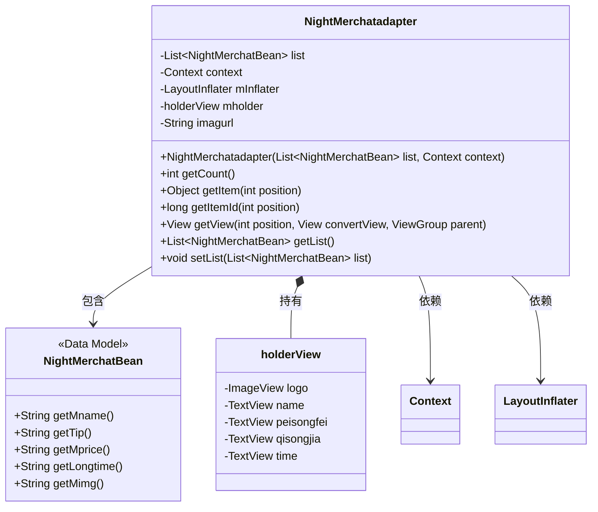

# 基础信息

|      |      |
|------|------|
| 名称 | NightMerchatadapter |
| 编码语言 | .java |
| 代码路径 | happycat/src/com/happycat/adapter/NightMerchatadapter.java |
| 包名 | com.happycat.adapter |
| 依赖项 | ['java.util.List', 'com.example.happucat.R', 'com.happycat.Bean.DayMerchatBean', 'com.happycat.Bean.Goods', 'com.happycat.Bean.NightMerchatBean', 'com.happycat.adapter.DayMerchatadapter.holderView', 'com.happycat.util.MyApplication', 'android.R.integer', 'android.content.Context', 'android.util.Log', 'android.view.LayoutInflater', 'android.view.View', 'android.view.ViewGroup', 'android.widget.BaseAdapter', 'android.widget.ImageView', 'android.widget.TextView'] |
| 概述说明 | NightMerchatadapter是Android适配器类，继承BaseAdapter，用于展示夜间商家列表。包含列表数据、上下文和布局填充器，通过holderView优化视图性能，绑定商家名称、配送费、起送价和送达时间等数据，并加载商家logo图片。 |

# 说明

NightMerchatadapter是一个继承自BaseAdapter的自定义适配器，用于在Android应用中展示夜间商家列表。它接收一个NightMerchatBean列表和上下文Context作为构造参数，通过LayoutInflater加载布局。适配器内部定义了holderView类来缓存视图控件，包括商家的logo、名称、配送费、起送价和送达时间。在getView方法中，它实现了视图的复用逻辑，并设置各项数据，其中logo图片通过拼接URL从服务器加载。适配器还提供了获取和设置列表数据的方法。

# 类列表 Class Summary

| 名称   | 类型  | 说明 |
|-------|------|-------------|
| NightMerchatadapter | class | NightMerchatadapter是Android适配器类，用于展示夜间商家列表，包含商家名称、配送费、起送价和送达时间等信息，使用ViewHolder优化性能。 |

## 类 NightMerchatadapter

|      |      |
|------|------|
| 访问范围 | public |
| 类型 | class |
| 名称 | NightMerchatadapter |
| 说明 | NightMerchatadapter是Android适配器类，用于展示夜间商家列表，包含商家名称、配送费、起送价和送达时间等信息，使用ViewHolder优化性能。 |

### UML类图

这段代码展示了一个Android自定义适配器`NightMerchatadapter`，继承自`BaseAdapter`，用于在列表视图中展示夜间商家数据。适配器内部使用`holderView`实现视图缓存优化，通过`NightMerchatBean`数据模型获取商家名称、配送费、起送价等信息，并利用`LayoutInflater`动态加载布局。类图清晰地呈现了适配器与数据模型、视图组件之间的关联关系，体现了典型的Android列表优化模式。

### 内部方法调用关系图

```mermaid
graph TD
    A["类NightMerchatadapter"]
    B["属性: List<NightMerchatBean> list"]
    C["属性: Context context"]
    D["属性: LayoutInflater mInflater"]
    E["属性: holderView mholder"]
    F["属性: String imagurl"]
    G["构造方法: NightMerchatadapter(List, Context)"]
    H["方法: int getCount()"]
    I["方法: Object getItem(int)"]
    J["方法: long getItemId(int)"]
    K["内部类: holderView"]
    L["方法: View getView(int, View, ViewGroup)"]
    M["方法: List<NightMerchatBean> getList()"]
    N["方法: void setList(List)"]
    O["holderView属性: ImageView logo"]
    P["holderView属性: TextView name"]
    Q["holderView属性: TextView peisongfei"]
    R["holderView属性: TextView qisongjia"]
    S["holderView属性: TextView time"]
    T["初始化imagurl"]
    U["inflate布局R.layout.waimai_listitem"]
    V["findViewById获取控件"]
    W["设置文本和图片"]

    A --> B
    A --> C
    A --> D
    A --> E
    A --> F
    A --> G
    A --> H
    A --> I
    A --> J
    A --> K
    A --> L
    A --> M
    A --> N
    K --> O
    K --> P
    K --> Q
    K --> R
    K --> S
    G --> T
    L --> U
    L --> V
    L --> W
```

这段代码是一个Android自定义适配器类，继承自BaseAdapter，用于在ListView中显示夜间商家列表。主要功能包括初始化布局、绑定数据到视图、重用视图优化性能等。通过holderView模式缓存视图组件，提高列表滚动性能。适配器处理商家名称、配送费、起送价、送达时间等信息的显示，并使用MyApplication.bitmapUtils加载商家logo图片。构造方法接收数据列表和上下文，提供get/set方法操作数据源。

### 字段列表 Field List

| 名称  | 类型  | 说明 |
|-------|-------|------|
| mInflater | LayoutInflater | 布局填充器变量声明。 |
| imagurl=" http://" + MyApplication.getIp()			+ ":8080//happycat/upimage/" | String | 代码片段定义字符串变量imagurl，拼接基础URL、IP地址和路径，用于构建图片上传地址。 |
| list | List<NightMerchatBean> | 列表存储夜间商户数据。 |
| context | Context | Context是Android中的上下文对象，用于访问应用资源和系统服务，如启动活动、获取布局等。 |
| mholder | holderView | 视图持有者变量mholder |

### 方法列表 Method List

| 名称  | 类型  | 说明 |
|-------|-------|------|
| getItemId | long | 重写getItemId方法，返回传入的position参数值。 |
| getView | View | 该方法重写getView，用于列表项视图复用。若convertView为空则初始化视图及holder，设置控件引用并缓存；否则复用holder。最后更新控件数据并返回视图。 |
| getItem | Object | 重写getItem方法，返回列表中指定位置的元素。 |
| getCount | int | 重写getCount方法，返回list的大小。 |
| getList | List<NightMerchatBean> | 方法getList返回NightMerchatBean类型的列表list。 |
| setList | void | 这是一个Java方法，用于设置类中的列表属性，接收一个NightMerchatBean类型的List参数。 |

