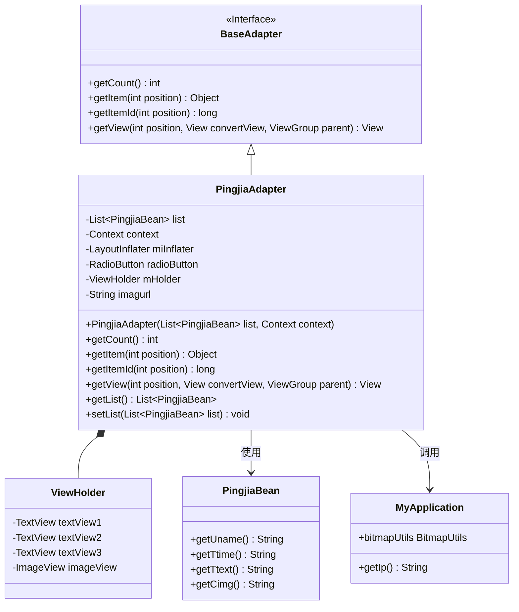
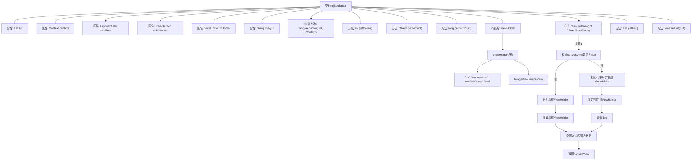

# 基础信息

|      |      |
|------|------|
| 名称 | PingjiaAdapter |
| 编码语言 | .java |
| 代码路径 | happycat/src/com/happycat/adapter/PingjiaAdapter.java |
| 包名 | com.happycat.adapter |
| 依赖项 | ['java.util.List', 'com.example.happucat.R', 'com.happycat.Bean.PingjiaBean', 'com.happycat.util.MyApplication', 'android.content.Context', 'android.view.LayoutInflater', 'android.view.View', 'android.view.ViewGroup', 'android.widget.BaseAdapter', 'android.widget.ImageView', 'android.widget.RadioButton', 'android.widget.TextView'] |
| 概述说明 | PingjiaAdapter是Android适配器类，用于展示评价列表，包含用户名、时间、内容和图片，使用ViewHolder优化性能。 |

# 说明

PingjiaAdapter是一个继承自BaseAdapter的Android适配器类，用于在ListView中展示评价数据列表。它接收一个PingjiaBean对象列表和Context上下文作为构造参数，通过LayoutInflater加载布局R.layout.pingjiaitem。适配器内部定义了ViewHolder模式来优化性能，包含三个TextView和一个ImageView用于显示用户名、时间、评价内容和图片。图片通过MyApplication.bitmapUtils从指定URL加载，URL由基础地址和图片名拼接而成。适配器实现了getCount、getItem等必要方法，并提供了获取和设置列表数据的方法。

# 类列表 Class Summary

| 名称   | 类型  | 说明 |
|-------|------|-------------|
| PingjiaAdapter | class | PingjiaAdapter是Android适配器类，用于展示评价列表，包含用户名、时间、内容和图片，使用ViewHolder优化性能。 |

## 类 PingjiaAdapter

|      |      |
|------|------|
| 访问范围 | public |
| 类型 | class |
| 名称 | PingjiaAdapter |
| 说明 | PingjiaAdapter是Android适配器类，用于展示评价列表，包含用户名、时间、内容和图片，使用ViewHolder优化性能。 |

### UML类图

这段代码展示了一个Android自定义适配器PingjiaAdapter，它继承自BaseAdapter用于在ListView中显示评价数据。适配器内部使用ViewHolder模式优化性能，通过PingjiaBean获取数据项，并利用MyApplication工具类加载网络图片。类图清晰地呈现了适配器与数据模型、工具类之间的协作关系，以及内部ViewHolder的结构设计，体现了典型的Android列表视图优化实践。

### 内部方法调用关系图

该流程图展示了PingjiaAdapter类的完整结构，重点描述了getView方法的执行逻辑。适配器通过ViewHolder模式优化列表性能，当convertView为空时初始化布局并创建视图持有者，否则复用现有视图。流程包含数据绑定、图片加载（通过MyApplication.bitmapUtils）和视图复用机制，体现了Android列表适配器的典型实现方式。

### 字段列表 Field List

| 名称  | 类型  | 说明 |
|-------|-------|------|
| list | List<PingjiaBean> | 一个存储PingjiaBean对象的列表变量。 |
| mHolder | ViewHolder | 定义ViewHolder变量mHolder。 |
| miInflater | LayoutInflater | 声明一个LayoutInflater类型的变量miInflater。 |
| imagurl="http://" + MyApplication.getIp()			+ ":8080/happycat/upimage/" | String | 代码片段定义了一个字符串变量imagurl，其值为拼接的HTTP URL，包含IP地址和路径"/happycat/upimage/"，端口8080。 |
| context | Context | 上下文对象，用于存储和管理程序运行时的相关信息。 |
| radioButton | RadioButton | 单选按钮组件，用于用户从多个选项中选择一个。 |

### 方法列表 Method List

| 名称  | 类型  | 说明 |
|-------|-------|------|
| getItem | Object | 重写getItem方法，返回列表中指定位置的元素。 |
| getCount | int | 重写getCount方法，返回list的大小。 |
| getItemId | long | 重写getItemId方法，返回传入的position参数值。 |
| getView | View | 重写getView方法，初始化或复用列表项布局，设置文本和图片内容后返回视图。 |
| getList | List<PingjiaBean> | 方法getList返回类型为List<PingjiaBean>的list对象。 |
| setList | void | 设置列表方法，接收PingjiaBean类型的List参数并赋值给成员变量list。 |

