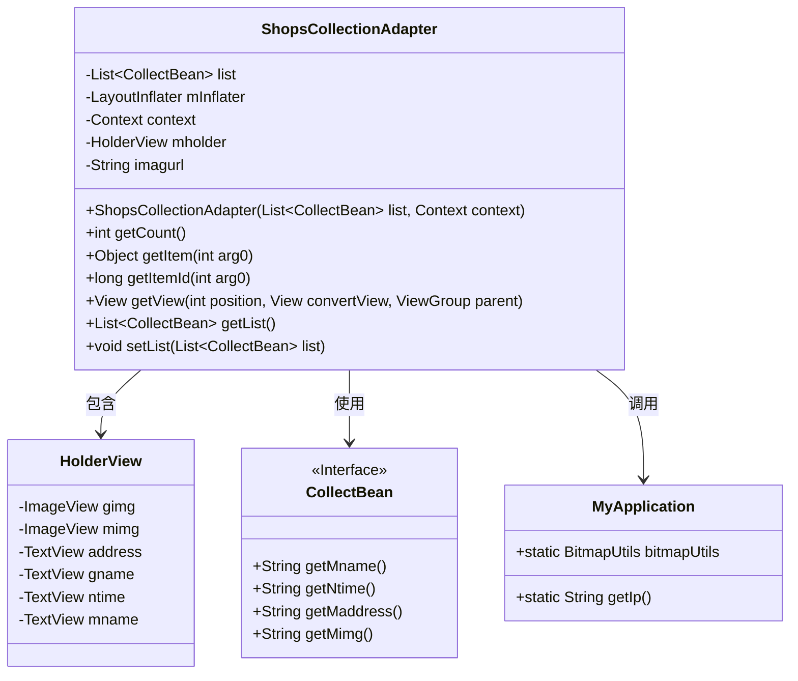

# 基础信息

|      |      |
|------|------|
| 名称 | ShopsCollectionAdapter |
| 编码语言 | .java |
| 代码路径 | happycat/src/com/happycat/adapter/ShopsCollectionAdapter.java |
| 包名 | com.happycat.adapter |
| 依赖项 | ['java.util.List', 'com.example.happucat.R', 'com.happycat.Bean.CollectBean', 'com.happycat.util.MyApplication', 'android.content.Context', 'android.util.Log', 'android.view.LayoutInflater', 'android.view.View', 'android.view.ViewGroup', 'android.widget.BaseAdapter', 'android.widget.ImageView', 'android.widget.TextView'] |
| 概述说明 | ShopsCollectionAdapter是Android适配器类，用于展示店铺收藏列表，包含图片、名称、地址和时间等视图组件，通过BaseAdapter实现数据绑定和视图复用。 |

# 说明

ShopsCollectionAdapter是一个继承自BaseAdapter的自定义适配器类，用于管理店铺收藏列表的数据展示。它包含一个CollectBean类型的列表数据、上下文对象和布局填充器。适配器实现了getCount、getItem、getItemId等基本方法，并通过内部类HolderView管理列表项的视图组件，包括图片、地址、名称和时间等。getView方法负责视图的复用和数据绑定，使用MyApplication中的bitmapUtils加载远程图片。适配器还提供了获取和设置列表数据的方法。图片URL由固定前缀和MyApplication中的IP地址拼接而成。

# 类列表 Class Summary

| 名称   | 类型  | 说明 |
|-------|------|-------------|
| ShopsCollectionAdapter | class | ShopsCollectionAdapter是Android适配器类，用于展示店铺收藏列表，包含图片、名称、地址和时间等数据，使用ViewHolder优化性能。 |

## 类 ShopsCollectionAdapter

|      |      |
|------|------|
| 访问范围 | public |
| 类型 | class |
| 名称 | ShopsCollectionAdapter |
| 说明 | ShopsCollectionAdapter是Android适配器类，用于展示店铺收藏列表，包含图片、名称、地址和时间等数据，使用ViewHolder优化性能。 |

### UML类图

这段代码展示了一个Android适配器类`ShopsCollectionAdapter`，用于在列表视图中显示店铺收藏数据。适配器继承自`BaseAdapter`，通过`HolderView`内部类实现视图缓存优化，使用`CollectBean`接口获取数据，并依赖`MyApplication`获取网络图片地址和图片加载工具。主要功能包括数据绑定、视图复用和动态图片加载，适用于电商类应用的收藏列表展示场景。

### 内部方法调用关系图

```mermaid
graph TD
    A["类ShopsCollectionAdapter"]
    B["属性: List<CollectBean> list"]
    C["属性: LayoutInflater mInflater"]
    D["属性: Context context"]
    E["属性: HolderView mholder"]
    F["属性: String imagurl"]
    G["构造方法: ShopsCollectionAdapter(List<CollectBean>, Context)"]
    H["方法: int getCount()"]
    I["方法: Object getItem(int)"]
    J["方法: long getItemId(int)"]
    K["内部类: HolderView"]
    L["方法: View getView(int, View, ViewGroup)"]
    M["方法: List<CollectBean> getList()"]
    N["方法: void setList(List<CollectBean>)"]
    O["HolderView属性: ImageView gimg,mimg"]
    P["HolderView属性: TextView address,gname,ntime,mname"]
    Q["操作: inflate布局"]
    R["操作: findViewById绑定控件"]
    S["操作: setText设置文本"]
    T["操作: bitmapUtils.display加载图片"]

    A --> B
    A --> C
    A --> D
    A --> E
    A --> F
    A --> G
    A --> H
    A --> I
    A --> J
    A --> K
    A --> L
    A --> M
    A --> N
    K --> O
    K --> P
    L --> Q
    L --> R
    L --> S
    L --> T
```

该流程图展示了ShopsCollectionAdapter类的完整结构，这是一个Android自定义适配器类，继承自BaseAdapter。主要功能包括管理商品收藏列表数据、通过ViewHolder模式优化列表项视图复用、动态加载网络图片等核心逻辑。类中包含4个成员变量、7个主要方法和1个内部ViewHolder类，其中getView()方法实现了视图初始化、数据绑定和图片异步加载等关键操作，构成适配器的核心功能链路。

### 字段列表 Field List

| 名称  | 类型  | 说明 |
|-------|-------|------|
| mInflater | LayoutInflater | 私有布局填充器变量mInflater。 |
| imagurl = " http://" + MyApplication.getIp() + ":8080/happycat/img/" | String | 代码定义字符串变量imagurl，拼接HTTP协议、应用IP地址及路径，用于构建图片URL。 |
| list | List<CollectBean> | 私有列表变量，存储CollectBean对象集合。 |
| context | Context | 上下文对象，用于存储和管理程序运行时的环境信息。 |
| mholder | HolderView | 定义HolderView类型的变量mholder。 |

### 方法列表 Method List

| 名称  | 类型  | 说明 |
|-------|-------|------|
| getItem | Object | 重写getItem方法，返回列表中指定索引的元素。 |
| getCount | int | 重写getCount方法，返回list的大小。 |
| getList | List<CollectBean> | 方法getList返回CollectBean类型的列表list。 |
| setList | void | 设置列表方法，接收CollectBean类型的List参数并赋值给当前对象的list属性。 |
| getItemId | long | 方法重写，返回输入参数arg0作为项目ID。 |
| getView | View | 重写getView方法，复用convertView优化性能，初始化视图组件并绑定数据，显示商品图片、名称、价格和时间。 |

