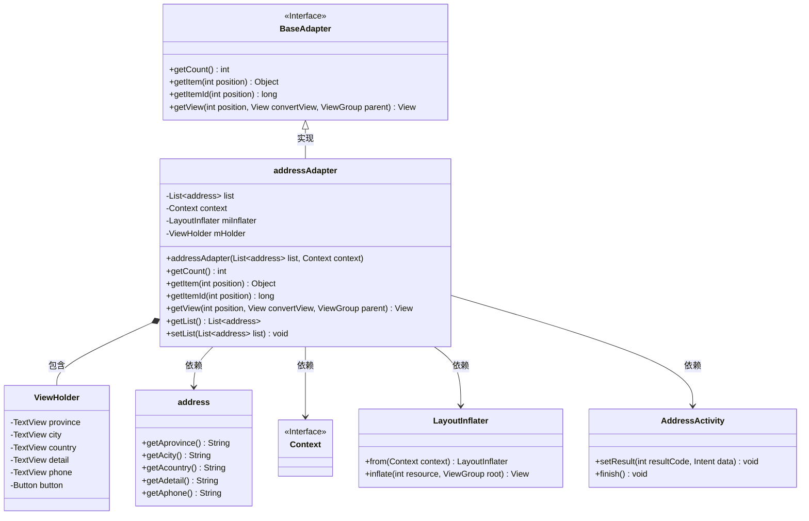
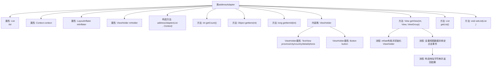

# 基础信息

|      |      |
|------|------|
| 名称 | addressAdapter |
| 编码语言 | .java |
| 代码路径 | happycat/src/com/happycat/adapter/addressAdapter.java |
| 包名 | com.happycat.adapter |
| 依赖项 | ['java.util.List', 'com.example.happucat.R', 'com.happycat.AddressActivity', 'com.happycat.Bean.address', 'com.happycat.adapter.PingjiaAdapter.ViewHolder', 'android.app.Activity', 'android.content.Context', 'android.content.Intent', 'android.view.LayoutInflater', 'android.view.View', 'android.view.View.OnClickListener', 'android.view.ViewGroup', 'android.widget.BaseAdapter', 'android.widget.Button', 'android.widget.LinearLayout', 'android.widget.TextView'] |
| 概述说明 | 这是一个Android自定义适配器类，用于显示地址列表。它继承BaseAdapter，包含列表数据初始化、视图复用逻辑，以及按钮点击返回完整地址的功能。 |

# 说明

这是一个名为addressAdapter的自定义适配器类，继承自BaseAdapter，用于在Android应用中展示地址列表。适配器接收一个地址列表和上下文对象，通过ViewHolder模式优化列表项视图性能。每个列表项显示省份、城市、区县、详细地址和联系电话信息，并包含一个确认按钮。点击按钮会将选中地址信息打包返回给调用Activity，并结束当前界面。适配器还提供了获取和设置地址列表的方法。

# 类列表 Class Summary

| 名称   | 类型  | 说明 |
|-------|------|-------------|
| addressAdapter | class | 这是一个Android地址适配器类，继承BaseAdapter，用于展示地址列表。包含列表初始化、视图绑定和按钮点击事件处理，点击后返回完整地址信息。 |

## 类 addressAdapter

|      |      |
|------|------|
| 访问范围 | public |
| 类型 | class |
| 名称 | addressAdapter |
| 说明 | 这是一个Android地址适配器类，继承BaseAdapter，用于展示地址列表。包含列表初始化、视图绑定和按钮点击事件处理，点击后返回完整地址信息。 |

### UML类图

这段代码展示了一个Android自定义适配器addressAdapter，它继承自BaseAdapter用于管理地址列表的显示。类图清晰地呈现了适配器与ViewHolder模式的关系，以及它与address数据模型、Android系统组件(Context/LayoutInflater)和AddressActivity的交互。ViewHolder内部类用于优化列表项视图重用，address类封装了省市区等地址信息，适配器通过getView()方法实现数据绑定和点击事件处理。整个设计体现了Android列表控件的典型架构模式。

### 内部方法调用关系图

该流程图展示了addressAdapter类的完整结构，它是一个Android自定义适配器，用于管理地址列表的显示。类包含4个成员变量、7个方法和1个内部类ViewHolder。核心方法getView()实现了视图复用机制，当convertView为空时初始化视图组件并设置Tag，否则复用已有视图。该方法还设置了地址数据的显示格式，并为确认按钮添加了点击事件处理，点击后会组装完整地址信息并通过Intent返回给调用方。适配器还提供了基础的列表数据访问方法getList()和setList()。

### 字段列表 Field List

| 名称  | 类型  | 说明 |
|-------|-------|------|
| list | List<address> | 声明一个名为list的地址列表变量。 |
| mHolder | ViewHolder | 定义ViewHolder变量mHolder，用于优化列表项视图复用。 |
| miInflater | LayoutInflater | 定义布局填充器变量miInflater。 |
| context | Context | 上下文环境对象，用于存储和管理程序运行时的相关数据和状态信息。 |

### 方法列表 Method List

| 名称  | 类型  | 说明 |
|-------|-------|------|
| getList | List<address> | 方法返回地址列表。 |
| getView | View | 自定义列表适配器方法，初始化视图并绑定数据，点击按钮返回地址信息。 |
| getItemId | long | 重写getItemId方法，返回传入的position参数值。 |
| getItem | Object | 重写getItem方法，返回列表中指定位置的元素。 |
| getCount | int | 重写getCount方法，返回list的大小。 |
| setList | void | Java方法：设置地址列表。将输入参数list赋值给类的成员变量list。 |

