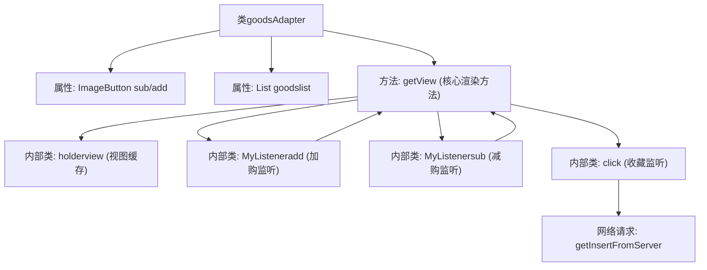
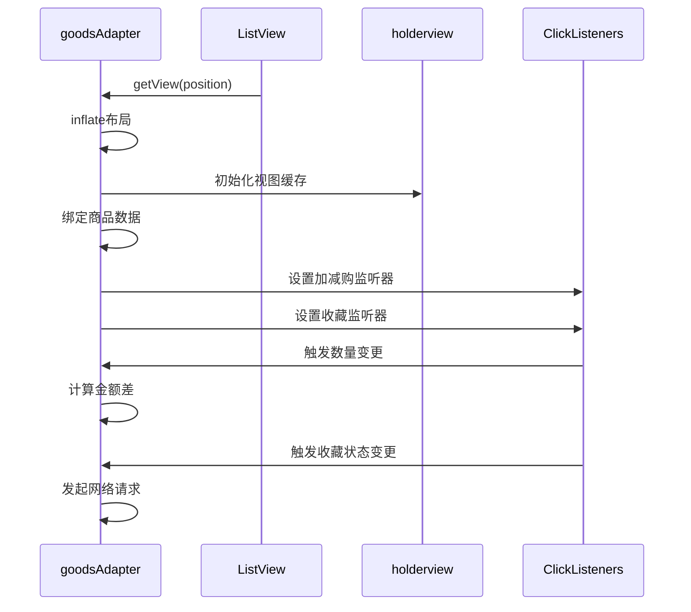

# 基础信息

|      |      |
|------|------|
| 名称 | goodsAdapter |
| 编码语言 | .java |
| 代码路径 | happycat/src/com/happycat/adapter/goodsAdapter.java |
| 包名 | com.happycat.adapter |
| 依赖项 | ['java.util.ArrayList', 'java.util.List', 'com.example.happucat.R', 'com.happycat.MerchatDataActivity', 'com.happycat.Bean.Goods', 'com.happycat.global.GlobalContacts', 'com.happycat.util.MyApplication', 'com.lidroid.xutils.HttpUtils', 'com.lidroid.xutils.exception.HttpException', 'com.lidroid.xutils.http.RequestParams', 'com.lidroid.xutils.http.ResponseInfo', 'com.lidroid.xutils.http.callback.RequestCallBack', 'com.lidroid.xutils.http.client.HttpRequest.HttpMethod', 'android.annotation.SuppressLint', 'android.content.Context', 'android.util.Log', 'android.view.LayoutInflater', 'android.view.View', 'android.view.View.OnClickListener', 'android.view.ViewGroup', 'android.widget.BaseAdapter', 'android.widget.ImageButton', 'android.widget.TextView', 'android.widget.Toast'] |
| 概述说明 | 商品适配器类，管理商品列表显示，包含加减按钮、收藏功能及购物车金额计算。 |

# 说明

这是一个商品列表适配器类，继承自BaseAdapter，用于管理商品数据的展示和交互。主要功能包括：显示商品名称、价格、销量和购买数量；提供加减按钮调整购买数量并实时计算总金额和起送差额；支持收藏功能，通过点击星星图标切换收藏状态并与服务器同步；根据用户登录状态控制操作权限。适配器从Activity获取上下文和购物车数据，通过自定义ViewHolder优化列表性能，包含多个内部类处理按钮点击事件和网络请求。

# 类列表 Class Summary

| 名称   | 类型  | 说明 |
|-------|------|-------------|
| goodsAdapter | class | 商品适配器类，管理商品列表显示，包含加减按钮、收藏功能及购物车金额计算。 |


## 类 goodsAdapter

|      |      |
|------|------|
| 访问范围 | public |
| 类型 | class |
| 名称 | goodsAdapter |
| 说明 | 商品适配器类，管理商品列表显示，包含加减按钮、收藏功能及购物车金额计算。 |


### UML类图

```mermaid
classDiagram
    class BaseAdapter {
        <<Interface>>
        +getCount() int
        +getItem(int position) Object
        +getItemId(int position) long
        +getView(int position, View convertView, ViewGroup parent) View
    }

    class goodsAdapter {
        -ImageButton sub
        -ImageButton add
        -List~Goods~ goodslist
        -holderview mholder
        -Context context
        -LayoutInflater mInflater
        -double chae
        -TextView buycat_jine
        -TextView buycat_chae
        -TextView geshu
        -TextView gname
        -TextView gprice
        -TextView nume
        -ImageButton imaggood
        -List~Goods~ gList
        -int count
        -int collection
        -String url1
        -HttpUtils httpUtils
        -MerchatDataActivity merchatDataActivity
        -List~Integer~ collectionList
        +goodsAdapter(List~Goods~ goodslist, Context context)
        +getCount() int
        +getItem(int position) Object
        +getItemId(int position) long
        +getView(int position, View convertView, ViewGroup parent) View
        +getGoodslist() List~Goods~
        +setGoodslist(List~Goods~ goodslist)
        +setgList(List~Goods~ gList)
        +setCollectionList(List~Integer~ collectionList)
    }

    class holderview {
        -TextView buycat_jine
        -TextView buycat_chae
    }

    class MyListeneradd {
        -int mPosition
        -TextView textView
        +MyListeneradd(int inPosition, TextView t)
        +onClick(View v) void
    }

    class MyListenersub {
        -int mPosition
        -TextView textView
        +MyListenersub(int inPosition, TextView t)
        +onClick(View v) void
    }

    class click {
        -int mPosition
        -ImageButton imageButton
        +click(int inPosition, ImageButton image)
        +onClick(View arg0) void
        -getInsertFromServer(int id, int collection) void
    }

    class Goods {
        +String gname
        +double price
        +int number
        +int gnum
        +int id
        +getGname() String
        +getPrice() double
        +getNumber() int
        +getGnum() int
        +setGnum(int count) void
        +getId() int
    }

    class MerchatDataActivity {
        +getBuycat_chae() TextView
        +getBuycat_jine() TextView
        +getMqsf() double
    }

    class HttpUtils {
        +send(HttpMethod method, String url, RequestParams params, RequestCallBack~String~ callBack) void
    }

    goodsAdapter --|> BaseAdapter : 实现
    goodsAdapter --> holderview : 包含
    goodsAdapter --> MyListeneradd : 创建
    goodsAdapter --> MyListenersub : 创建
    goodsAdapter --> click : 创建
    goodsAdapter --> Goods : 操作
    goodsAdapter --> MerchatDataActivity : 依赖
    goodsAdapter --> HttpUtils : 使用
    click --> HttpUtils : 调用
    MyListeneradd --> Goods : 修改
    MyListenersub --> Goods : 修改
```

这段代码描述了一个Android的商品列表适配器`goodsAdapter`，继承自`BaseAdapter`，主要用于管理商品列表的显示和交互。适配器包含内部类`holderview`用于视图缓存，以及`MyListeneradd`、`MyListenersub`和`click`三个监听器类分别处理增加商品数量、减少商品数量和收藏操作。适配器与`Goods`数据类交互，通过`MerchatDataActivity`获取界面控件，并使用`HttpUtils`进行网络请求。整体设计实现了商品列表的展示、购物车金额计算、收藏状态管理等功能，通过多种监听器处理用户交互事件。


### 内部方法调用关系图





该流程图展示了Android商品列表适配器的核心结构，主要包含四个关键交互：1) 视图渲染时初始化布局和缓存；2) 通过内部监听器处理加减购操作并实时计算金额差额；3) 收藏状态切换及网络请求；4) 所有操作都通过getView方法协调。时序图则详细描述了ListView与适配器之间的调用关系，特别是用户交互事件如何通过监听器触发数据更新和UI刷新，最终可能引发网络请求的完整流程。

### 字段列表 Field List

| 名称  | 类型  | 说明 |
|-------|-------|------|
| url1 | String | URL变量声明 |
| collectionList = new ArrayList<Integer>() | List<Integer> | 创建整数类型的动态数组集合。 |
| gList | List<Goods> | 定义了一个商品列表变量gList。 |
| add | ImageButton | 图像按钮包含两个子按钮：sub（减）和add（加）。 |
| mholder | holderview | 持有者视图：mholder。 |
| context | Context | Context是一个用于存储和管理程序运行环境信息的对象，包含配置、状态等关键数据。 |
| imaggood | ImageButton | 图片按钮（imaggood） |
| mInflater | LayoutInflater | 声明一个LayoutInflater类型的变量mInflater。 |
| collection | int | 私有整型变量count和collection。 |
| gname | TextView | 显示文本内容的视图组件。 |
| gprice | TextView | 显示价格文本视图。 |
| goodslist | List<Goods> | 商品列表变量定义 |
| merchatDataActivity | MerchatDataActivity | 私有成员变量merchatDataActivity，类型为MerchatDataActivity。 |
| buycat_chae | TextView | 购买金额和购买差额的文本视图。 |
| nume | TextView | 显示文本的视图组件。 |
| httpUtils | HttpUtils | 声明一个HttpUtils类型的变量httpUtils。 |
| geshu | TextView | 文本视图计数 |
| chae | double | 无效代码片段，缺少完整语法结构。 |

### 方法列表 Method List

| 名称  | 类型  | 说明 |
|-------|-------|------|
| getItem | Object | 重写getItem方法，返回goodslist中指定位置的元素。 |
| getCount | int | 方法重写getCount，返回goodslist的大小。 |
| getItemId | long | 重写getItemId方法，返回传入的position参数值。 |
| getView | View | 适配器getView方法，初始化视图组件并设置数据，处理收藏状态和购买按钮点击事件。 |
| getGoodslist | List<Goods> | 获取商品列表的方法，返回类型为Goods对象列表。 |
| setGoodslist | void | 这是一个Java方法，用于设置商品列表。方法名为setGoodslist，接收一个Goods类型的List参数，并将其赋值给当前对象的goodslist属性。 |
| setgList | void | 这是一个Java方法，用于设置类中的商品列表属性gList。方法接收一个Goods类型的List参数，并将其赋值给类的成员变量gList。 |
| setCollectionList | void | Java方法：设置整数列表collectionList的值。 |


